# TACACS+ Server

[](https://github.com/SaschaSchwarzK/tacacs_server/actions/workflows/quality_checks.yml)

A modern, enterprise-grade TACACS+/RADIUS appliance implemented in Python. Designed for network administrators who need reliable AAA services with comprehensive management capabilities, real-time monitoring, and enterprise integrations.

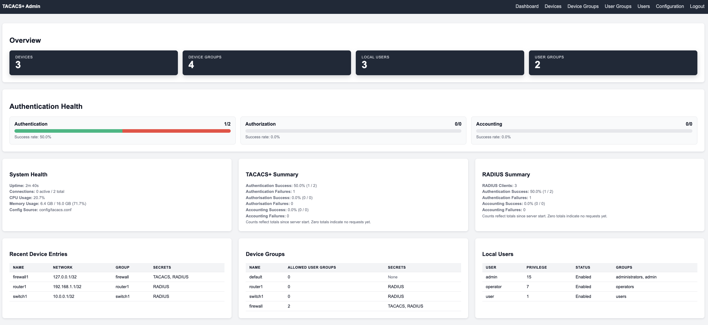

## 🚀 Key Features

### **Authentication & Authorization (AAA)**
- **Multiple backends**: Local SQLite, LDAP, and Okta integrations
- **Group-based authorization**: User groups with privilege levels and device access control
- **Per-device group secrets**: No global secrets - each device group has its own TACACS+/RADIUS shared secrets
- **Policy engine**: Flexible authorization rules based on user groups and device groups
- **Password management**: Secure bcrypt hashing with configurable complexity

### **Protocol Support**
- **TACACS+ (RFC 8907)**: Full AAA support with encryption
- **RADIUS (RFC 2865/2866)**: Authentication and accounting
- **Shared backends**: Both protocols can use the same authentication sources
- **Per-device secrets**: Device groups define their own shared secrets
- **Rate limiting**: Configurable request rate limiting and connection management

### **Device & Network Management**
- **Device inventory**: Centralized device database with grouping
- **Network-based matching**: IP networks and CIDR ranges for device identification
- **Device groups**: Organize devices with shared configurations and secrets
- **Metadata support**: Custom attributes and configuration per device/group
- **Change notifications**: Real-time updates when device configurations change

### **Web Administration Console**
- **Real-time dashboard**: WebSocket-powered live metrics and system health
- **Device management**: Create, edit, and organize network devices and groups
- **User management**: Local user accounts with group assignments and privilege levels
- **Configuration viewer**: Live configuration display with validation status
- **Search & filtering**: Advanced filtering across all management interfaces
- **Session management**: Secure admin sessions with configurable timeouts

### **Monitoring & Observability**
- **Prometheus metrics**: `/metrics` endpoint with comprehensive server statistics
- **Real-time WebSocket**: Live dashboard updates without page refreshes
- **Historical data**: Metrics history with configurable retention
- **Health checks**: System health monitoring with memory and CPU metrics
- **Audit logging**: Comprehensive audit trail for all administrative actions
- **Event correlation**: Detailed logging with request tracing and failure analysis

### **Security & Compliance**
- **Input validation**: Comprehensive validation using Pydantic schemas
- **SQL injection protection**: Parameterized queries and input sanitization
- **Rate limiting**: Per-client request rate limiting
- **Secure secrets**: Per-device group secrets with no global fallbacks
- **Session security**: Secure admin sessions with CSRF protection
- **Audit trails**: Complete audit logging for compliance requirements

### **Configuration & Deployment**
- **Flexible configuration**: File-based or URL-based configuration loading
- **Environment integration**: Environment variable support for secrets
- **Docker support**: Container-ready with docker-compose configuration
- **Configuration validation**: Pre-deployment validation with detailed error reporting
- **Backup & restore**: Automatic configuration backups on changes
- **Hot reload**: Configuration changes without service restart

### **Development & Testing**
- **Comprehensive test suite**: 245 tests with >90% coverage
- **Batch testing**: Test multiple credentials simultaneously
- **Performance benchmarks**: Built-in performance testing and metrics
- **Client tools**: TACACS+ and RADIUS client scripts for testing
- **API documentation**: Complete REST API documentation
- **Type safety**: Full mypy type checking

## 🚀 Quick Start

### Prerequisites
- Python 3.13+
- Poetry (recommended) or pip

### Installation

Always work in a Python virtual environment, then install with Poetry into that environment.

```bash
# Clone the repository
git clone https://github.com/SaschaSchwarzK/tacacs_server.git
cd tacacs_server

# Create and activate a Python 3.13 virtual environment
python3.13 -m venv .venv
source .venv/bin/activate
python -V   # should show 3.13.x from .venv

# Install Poetry inside the venv and configure it to use the active venv
python -m pip install --upgrade pip
pip install poetry
poetry config virtualenvs.create false

# Install project dependencies into the active venv
poetry install

# Set up runtime directories
python scripts/setup_project.py --project-root "$(pwd)" --move-test-client

# Run tests to verify installation
pytest -q
```

Notes
- Deactivate the venv when done: `deactivate`
- Windows PowerShell equivalents:
  - Create venv: `py -3.13 -m venv .venv`
  - Activate: `.venv\\Scripts\\Activate.ps1`
  - Install Poetry: `py -m pip install --upgrade pip; pip install poetry`
  - Configure Poetry: `poetry config virtualenvs.create false`
  - Install deps: `poetry install`
  - Run tests: `pytest -q`

### Running the Server

```bash
# Start the server
python -m tacacs_server.main --config config/tacacs.conf

# Or use the CLI entrypoint
tacacs-server

# Validate configuration before starting
python scripts/validate_config.py
```

### Web Interface Access

| Service | URL | Description |
|---------|-----|-------------|
| **Dashboard** | http://127.0.0.1:8080 | Main admin interface |
| **API Status** | http://127.0.0.1:8080/api/status | Server status JSON |
| **Health Check** | http://127.0.0.1:8080/api/health | Health monitoring |
| **Metrics** | http://127.0.0.1:8080/metrics | Prometheus metrics |
| **WebSocket** | ws://127.0.0.1:8080/ws/metrics | Real-time updates |
| **OpenAPI (Swagger UI)** | http://127.0.0.1:8080/docs | Interactive API docs |
| **OpenAPI (ReDoc)** | http://127.0.0.1:8080/redoc | ReDoc API documentation |
| **OpenAPI (RapiDoc)** | http://127.0.0.1:8080/rapidoc | RapiDoc (dark mode) |
| **Docs Index** | http://127.0.0.1:8080/api-docs | Links to all API docs |
| **OpenAPI Spec** | http://127.0.0.1:8080/openapi.json | Raw OpenAPI schema |

### Testing the Installation

```bash
# Test TACACS+ authentication
python scripts/tacacs_client.py localhost 49 tacacs123 admin admin123

# Test RADIUS authentication  
python scripts/radius_client.py localhost 1812 radius123 admin admin123

# Batch test multiple credentials
python scripts/tacacs_client.py --batch scripts/example_credentials.csv
```

## 📊 Admin Web Console

The web console provides comprehensive management capabilities with real-time monitoring:

Important
- The admin web UI is disabled unless an admin bcrypt password hash is configured via `[admin].password_hash` or `ADMIN_PASSWORD_HASH`. When not configured, `/admin/*` returns `503` and the login page shows a banner explaining that admin auth is not configured. The local TACACS+/RADIUS user database does not grant web admin access.

### **Real-time Dashboard**
- Live-updating metrics tiles with WebSocket connectivity
- System health monitoring (CPU, memory, uptime)
- TACACS+ and RADIUS statistics with success rates
- Active connections and session tracking
- Historical metrics with configurable time ranges

### **Device Management**
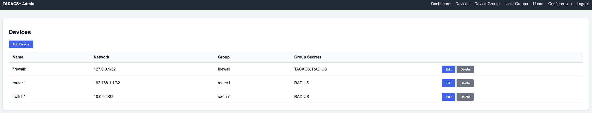
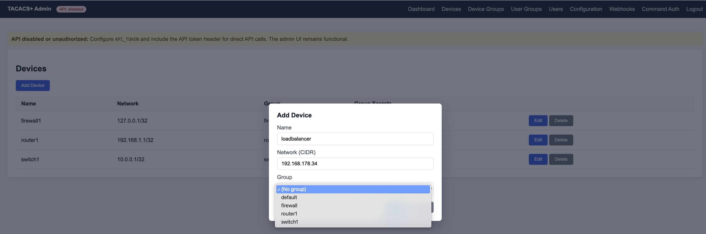
- **Device inventory**: Add, edit, and organize network devices
- **Network matching**: IP addresses and CIDR ranges for device identification
- **Search & filtering**: Advanced filtering by name, network, group, and status
- **Bulk operations**: Import/export device configurations
- **No inline secrets**: Secrets managed at device group level for security

### **Device Groups**
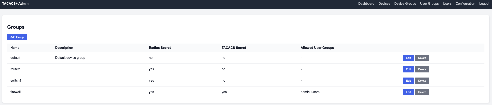
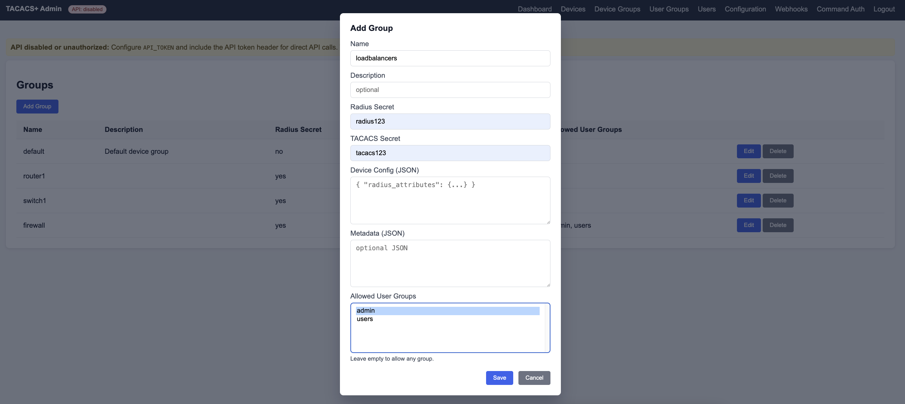
- **Shared secrets**: TACACS+ and RADIUS secrets per group
- **User group permissions**: Control which user groups can access devices
- **Metadata management**: Custom attributes and configuration templates
- **Multi-select controls**: Easy assignment of users and permissions
- **Configuration profiles**: TACACS+ and RADIUS profiles per group

### **User Groups**
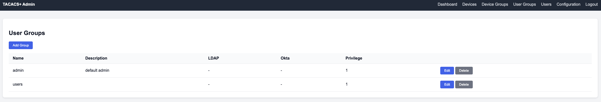
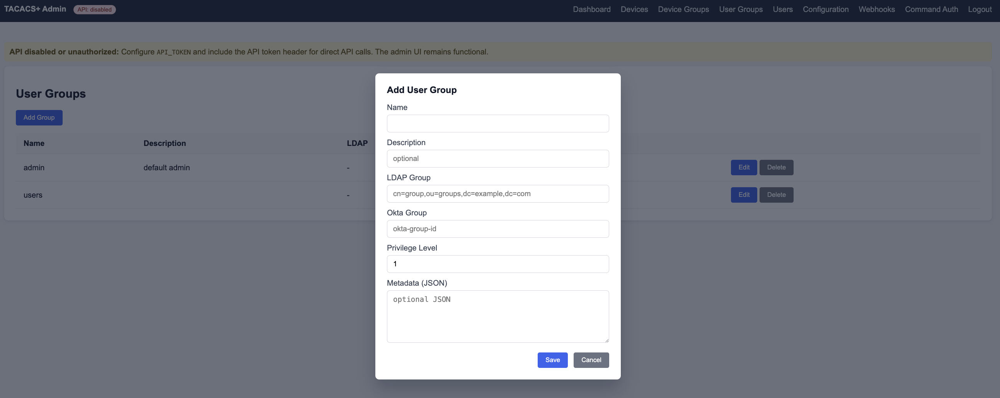
- **Privilege levels**: Configure authorization levels (0-15)
- **Directory mappings**: Map to LDAP/Okta groups
- **Access control**: Define which device groups users can access
- **Bulk management**: Import/export user group configurations

### **Local Users**
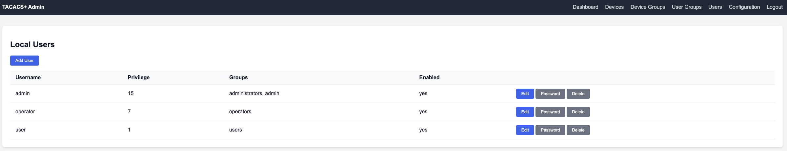
- **User accounts**: Create and manage local user accounts
- **Group assignments**: Assign users to multiple groups
- **Password management**: Secure bcrypt hashing
- **Status tracking**: Enable/disable accounts
- **Search & filtering**: Filter by status, group, and activity
- **Bulk operations**: Import users from CSV

### **Webhooks**
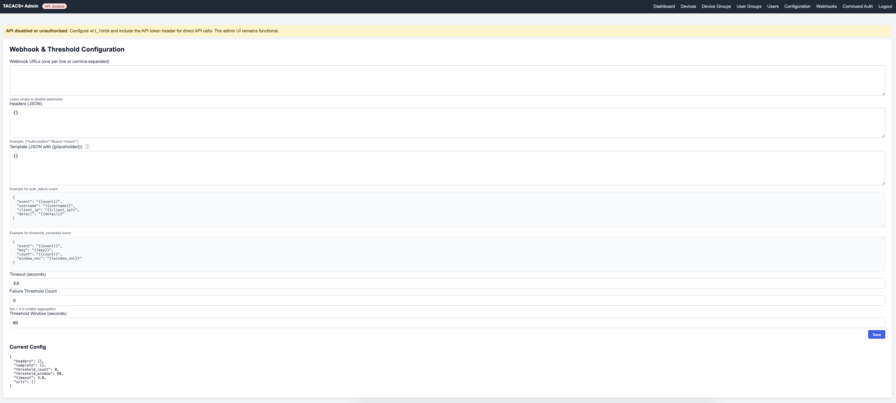
- **Event notifications**: Configure one or more webhook destinations
- **Templating**: JSON payload template with placeholders
- **Thresholds**: Burst threshold and window for suppression
- **Timeouts**: Per-request timeout configuration

### **Command Authorization**

- **Policy engine**: Ordered permit/deny rules (exact/prefix/regex/wildcard)
- **Privilege control**: Min/max privilege matching
- **Scoping**: Optional user/device group conditions

### **Server Tuning**
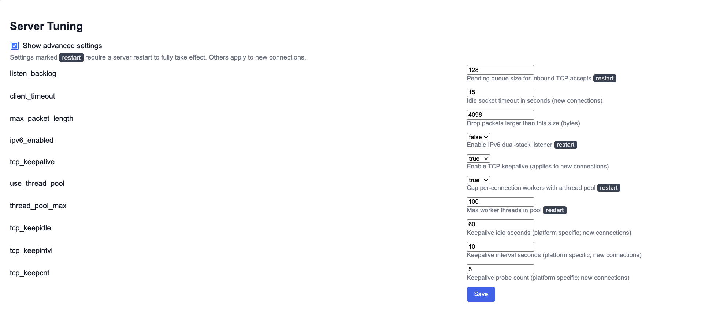
- **Tuning form**: Backlog, timeouts, IPv6, keepalive, thread pool
- **Advanced toggle**: Hide/show advanced options
- **Restart hints**: Fields that require restart are clearly indicated

## 🧭 System Architecture

See docs/ARCHITECTURE.md for detailed diagrams:
- Component Diagram: docs/ARCHITECTURE.md#component-diagram
- Request Flow (Authentication/Authorization): docs/ARCHITECTURE.md#request-flow-authenticationauthorization

## 🔒 Security Model (What’s implemented)

- API protection: REST API under `/api/*` is disabled unless `API_TOKEN` is configured. With a token set, clients must send `X-API-Token` or `Authorization: Bearer`.
- Admin UI: Disabled unless `[admin].password_hash` (bcrypt) or `ADMIN_PASSWORD_HASH` is configured. The local TACACS/RADIUS user database is never used for web admin access.
- Webhooks: Runtime config for URLs, headers, JSON template (with placeholders), timeout, and threshold notifications; persisted to config.
- Command Authorization: Policy engine with ordered permit/deny rules (exact/prefix/regex/wildcard), min/max privilege, and optional scoping by user/device groups. Managed via Admin UI and documented Admin API.


### **Configuration Management**
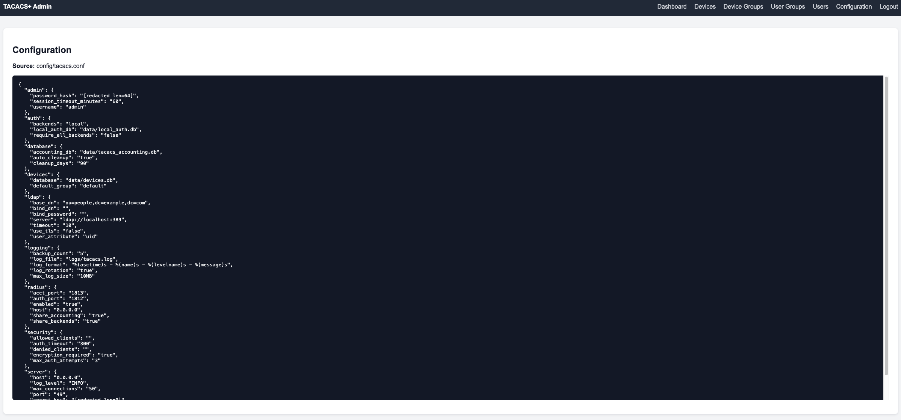

- **Live configuration**: Real-time view of current configuration
- **Validation status**: Immediate feedback on configuration issues
- **Backup functionality**: Automatic backups on changes
- **Change tracking**: Audit trail of configuration modifications
- **Export/import**: Configuration portability

### **Security Features**
- **Session management**: Secure admin sessions with configurable timeouts
- **Authentication required**: All admin requests require authentication
- **CSRF protection**: Cross-site request forgery protection
- **Input validation**: Comprehensive validation of all inputs
- **Audit logging**: Complete audit trail of administrative actions

## ⚙️ Configuration

### **Configuration Sources**
- **Default file**: `config/tacacs.conf`
- **Environment override**: `TACACS_CONFIG=/path/to/tacacs.conf`
- **URL sources**: `TACACS_CONFIG=https://example.com/config.ini` (read-only)
- **Web console**: Live editing through admin interface

### **Configuration Sections**

#### **Server Configuration**
```ini
[server]
host = 0.0.0.0
port = 49
log_level = INFO
max_connections = 50
socket_timeout = 30
# Optional tuning (defaults shown)
listen_backlog = 128
client_timeout = 15
max_packet_length = 4096
ipv6_enabled = false
tcp_keepalive = true
use_thread_pool = true
thread_pool_max = 100
tcp_keepidle = 60
tcp_keepintvl = 10
tcp_keepcnt = 5
```

#### **Authentication Backends**
```ini
[auth]
backends = local,ldap
local_auth_db = data/local_auth.db
require_all_backends = false
```

#### **LDAP Integration**
```ini
[ldap]
server = ldap://localhost:389
base_dn = ou=people,dc=example,dc=com
user_attribute = uid
bind_dn = cn=admin,dc=example,dc=com
bind_password = secret
use_tls = true
timeout = 10
```

#### **RADIUS Server**
```ini
[radius]
enabled = true
auth_port = 1812
acct_port = 1813
host = 0.0.0.0
share_backends = true
share_accounting = true
# Advanced tuning (defaults shown)
workers = 8
socket_timeout = 1.0
rcvbuf = 1048576
```

#### **Security Settings**
```ini
[security]
max_auth_attempts = 3
auth_timeout = 300
encryption_required = true
rate_limit_requests = 60
rate_limit_window = 60
```

### **Configuration Management**
- **Validation**: `python scripts/validate_config.py`
- **Automatic backups**: Changes create timestamped backups
- **Hot reload**: Configuration changes without restart
- **Schema validation**: Pydantic-based validation with detailed error messages
- **Environment variables**: Support for secrets via environment variables

### **Performance Tuning**
- Backlog: Set `[server].listen_backlog` (or `TACACS_LISTEN_BACKLOG`) to handle connection bursts.
- Threads: Enable the thread pool (`[server].use_thread_pool = true`) and size `[server].thread_pool_max` for expected concurrency.
- Timeouts: Tune `[server].client_timeout` (or `TACACS_CLIENT_TIMEOUT`) to clean up stalled clients faster.
- Keepalive: Leave `[server].tcp_keepalive = true` (or `TACACS_TCP_KEEPALIVE`) to prune dead TCP peers more reliably.
- IPv6: Enable `[server].ipv6_enabled = true` (or `TACACS_IPV6_ENABLED`) for dual‑stack; verify firewall/load balancer IPv6 rules.
- RADIUS workers: Size `[radius].workers` (or `RADIUS_WORKERS`) for expected packets/sec; start with 8–16 and measure.
- RADIUS buffers: Increase `[radius].rcvbuf` (or `RADIUS_SO_RCVBUF`) to reduce UDP drops under bursts (e.g., 2–8 MiB).
- RADIUS timeouts: Tune `[radius].socket_timeout` (or `RADIUS_SOCKET_TIMEOUT`) to balance responsiveness vs. jitter.

## 🔌 APIs & Monitoring

### **REST API Endpoints**

#### **Status & Health**
- `GET /api/status` - Server status and statistics
- `GET /api/health` - Health check with system metrics
- `GET /api/stats` - Detailed server statistics
- `GET /api/backends` - Authentication backend status
- `GET /api/sessions` - Active session information
- `GET /api/accounting` - Recent accounting records

#### **Device Management**
- `GET /api/devices` - List all devices with filtering
- `POST /api/devices` - Create new device
- `GET /api/devices/{id}` - Get device details
- `PUT /api/devices/{id}` - Update device
- `DELETE /api/devices/{id}` - Delete device
- `GET /api/device-groups` - List device groups
- `POST /api/device-groups` - Create device group

#### **User Management**
- `GET /api/users` - List local users with filtering
- `POST /api/users` - Create new user
- `GET /api/users/{id}` - Get user details
- `PUT /api/users/{id}` - Update user
- `DELETE /api/users/{id}` - Delete user
- `GET /api/user-groups` - List user groups
- `POST /api/user-groups` - Create user group

#### **Administrative**
- `POST /api/admin/reload-config` - Reload configuration
- `POST /api/admin/reset-stats` - Reset server statistics
- `GET /api/admin/logs` - Recent log entries
- `POST /api/admin/backup-config` - Create configuration backup

#### **RADIUS (when enabled)**
- `GET /api/radius/status` - RADIUS server status
- `GET /api/radius/clients` - RADIUS client configuration

### **Real-time Updates**
- `WebSocket /ws/metrics` - Real-time metrics for dashboard
- Live updates for connections, authentication rates, and system health
- Automatic reconnection with exponential backoff

### **Monitoring Integration**
- `GET /metrics` - Prometheus metrics endpoint
- Historical metrics with configurable retention
- Custom metrics for TACACS+ and RADIUS operations
- System metrics (CPU, memory, connections)

### **API Features**
- **Search & filtering**: All list endpoints support advanced filtering
- **Pagination**: Configurable page sizes and offset-based pagination
- **Sorting**: Multi-field sorting with ascending/descending options
- **Field selection**: Choose specific fields to reduce response size
- **Error handling**: Consistent error responses with detailed messages
- **Rate limiting**: API rate limiting to prevent abuse

### **OpenAPI & Developer Experience**

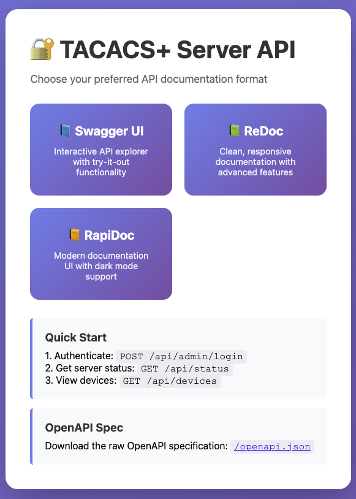

- Three documentation UIs are available out of the box:
  - `GET /docs` (Swagger UI) — Try-it-out support, filtering, operation IDs
  - `GET /redoc` (ReDoc) — Clean, responsive docs with deep linking
  - `GET /rapidoc` (RapiDoc) — Modern docs with dark mode and keyboard nav
- `GET /api-docs` — Landing page linking to all documentation views
- `GET /openapi.json` — Machine-readable OpenAPI schema (for client generation)
- Endpoints are annotated with Pydantic v2 models and examples for clear contracts

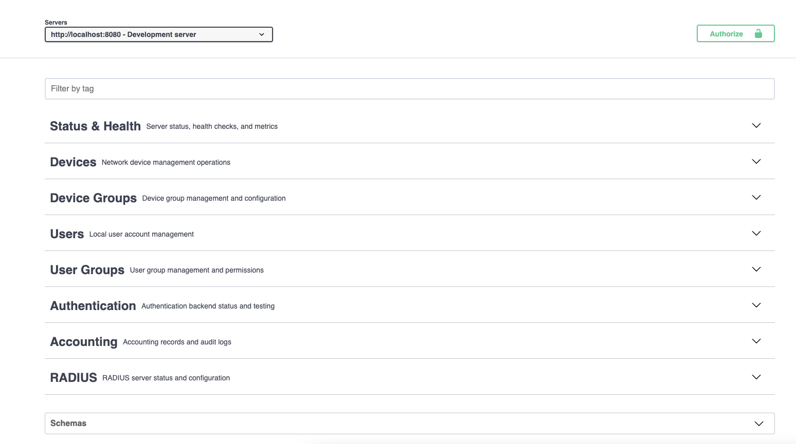

### **Prometheus Integration**

Add to your `prometheus.yml`:
```yaml
scrape_configs:
  - job_name: 'tacacs-server'
    static_configs:
      - targets: ['127.0.0.1:8080']
    metrics_path: '/metrics'
    scrape_interval: 15s
    scrape_timeout: 10s
```

### **Available Metrics**

#### **TACACS+ Metrics**
- `tacacs_auth_requests_total{status, backend}` - Authentication requests
- `tacacs_auth_duration_seconds` - Authentication latency histogram
- `tacacs_active_connections` - Current active connections
- `tacacs_server_uptime_seconds` - Server uptime
- `tacacs_accounting_records_total{status}` - Accounting records

#### **RADIUS Metrics**
- `radius_auth_requests_total{status}` - RADIUS authentication requests
- `radius_acct_requests_total{type}` - RADIUS accounting requests
- `radius_active_clients` - Configured RADIUS clients

#### **System Metrics**
- `process_cpu_seconds_total` - CPU usage
- `process_resident_memory_bytes` - Memory usage
- `process_open_fds` - Open file descriptors

### **Grafana Dashboard Queries**

```promql
# Authentication Rate (requests/second)
rate(tacacs_auth_requests_total[5m])

# Success Rate Percentage
(rate(tacacs_auth_requests_total{status="success"}[5m]) / rate(tacacs_auth_requests_total[5m])) * 100

# Authentication Latency (95th percentile)
histogram_quantile(0.95, rate(tacacs_auth_duration_seconds_bucket[5m]))

# Active Connections
tacacs_active_connections

# Server Uptime (hours)
tacacs_server_uptime_seconds / 3600

# Error Rate
rate(tacacs_auth_requests_total{status="error"}[5m])

# Backend Performance
rate(tacacs_auth_requests_total[5m]) by (backend)

# RADIUS vs TACACS+ Usage
rate(tacacs_auth_requests_total[5m]) + rate(radius_auth_requests_total[5m])

# Dropped RADIUS packets by reason (per second)
sum by (reason) (rate(radius_packets_dropped_total[5m]))

# Message-Authenticator drop rate
rate(radius_packets_dropped_total{reason="invalid_message_authenticator"}[5m])
```

## 📁 Project Architecture

```
tacacs_server/
├── auth/                    # Authentication backends
│   ├── base.py             # Abstract backend interface
│   ├── local.py            # Local SQLite authentication
│   ├── ldap_auth.py        # LDAP integration
│   ├── okta_auth.py        # Okta SSO integration
│   ├── local_store.py      # Local user database
│   ├── local_user_service.py      # User management service
│   └── local_user_group_service.py # User group management
├── tacacs/                  # TACACS+ protocol implementation
│   ├── server.py           # TACACS+ server core
│   ├── handlers.py         # AAA request handlers
│   ├── packet.py           # TACACS+ packet encoding/decoding
│   └── constants.py        # Protocol constants
├── radius/                  # RADIUS protocol implementation
│   ├── server.py           # RADIUS server core
│   └── constants.py        # RADIUS constants
├── devices/                 # Device management
│   ├── store.py            # Device database operations
│   └── service.py          # Device management service
├── accounting/              # Accounting and logging
│   ├── models.py           # Data models
│   ├── database.py         # Database operations
│   └── async_database.py   # High-performance async logging(not yet used)
├── config/                  # Configuration management
│   ├── config.py           # Configuration loader
│   └── schema.py           # Pydantic validation schemas
├── web/                     # Web interface and APIs (FastAPI)
│   ├── monitoring.py       # Dashboard app + Prometheus + router composition
│   ├── api_models.py       # Pydantic v2 models used by public API
│   ├── openapi_config.py   # OpenAPI schema + Swagger/ReDoc/RapiDoc UIs
│   ├── app_setup.py        # Example FastAPI app wiring with custom OpenAPI
│   ├── api/                # REST API routers
│   │   ├── devices.py      # /api/devices endpoints
│   │   ├── device_groups.py# /api/device-groups endpoints
│   │   ├── users.py        # /api/users endpoints
│   │   └── usergroups.py   # /api/user-groups endpoints
│   └── admin/              # Admin interface
│       ├── auth.py         # Admin authentication
│       └── routers.py      # Admin UI routes and handlers
├── utils/                   # Utility modules
│   ├── logger.py           # Structured logging
│   ├── metrics.py          # Metrics collection
│   ├── policy.py           # Authorization policies
│   ├── security.py         # Security utilities
│   ├── validation.py       # Input validation
│   ├── crypto.py           # Cryptographic functions
│   ├── rate_limiter.py     # Rate limiting
│   └── audit_logger.py     # Audit trail logging
├── static/                  # Web assets (served by FastAPI StaticFiles)
│   └── css/                # Stylesheets
├── templates/               # HTML templates (Jinja2)
│   ├── dashboard.html      # Main dashboard
│   └── admin/              # Admin interface templates
├── cli.py                   # Command-line interface
└── main.py                  # Application entry point

tests/                       # Test suite
├── __init__.py             # Package marker
├── conftest.py             # Pytest fixtures and server helpers
├── test_admin_api.py       # Admin API endpoint tests
├── test_api_functionality.py # REST API functionality tests
├── test_api_simple.py      # Basic API sanity tests
├── test_auth.py            # Authentication flow tests
├── test_authorization.py   # Authorization and policy tests
├── test_benchmark.py       # Benchmark/perf smoke tests
├── test_client_script.py   # TACACS+/RADIUS client scripts
├── test_config_env.py      # Env/config loading tests
├── test_debug_syspath.py   # Dev env and sys.path checks
├── test_device_service.py  # Device service unit tests
├── test_input_validation.py # Pydantic/model input validation
├── test_ldap.py            # LDAP backend tests
├── test_local_user_group_service.py # Local user group service
├── test_local_user_service.py # Local user service tests
├── test_okta.py            # Okta backend tests
├── test_radius.py          # RADIUS protocol tests
├── test_server.py          # Server lifecycle and endpoints
├── test_web_api_endpoints.py # Web API endpoint coverage
├── chaos/                  # Chaos engineering tests
│   └── test_chaos.py       # Network/resource chaos scenarios
├── contract/               # API contract/schema tests
│   └── test_api_contracts.py # OpenAPI schema and contracts
├── e2e/                    # End-to-end integration tests
│   └── test_e2e_integration.py # Full workflow tests
├── performance/            # Load/performance suites
│   └── locustfile.py       # Locust scenarios
└── security/               # Security and pentest suites
    └── test_security_pentest.py # Security checks

scripts/                     # Utility scripts
├── setup_project.py        # Project setup
├── validate_config.py      # Configuration validation
├── tacacs_client.py        # TACACS+ test client
├── radius_client.py        # RADIUS test client
└── example_credentials.csv # Test credentials

config/                      # Configuration files
└── tacacs.conf             # Main configuration

data/                        # Runtime data
├── local_auth.db           # Local user database
├── devices.db              # Device inventory
├── tacacs_accounting.db    # Accounting records
└── audit_trail.db          # Audit logs

logs/                        # Log files
└── tacacs.log              # Application logs
```

### **Key Files**

| File | Purpose |
|------|----------|
| `pyproject.toml` | Poetry configuration and package metadata |
| `docker-compose.yml` | Container orchestration configuration |
| `Dockerfile` | Container build configuration |
| `.github/workflows/` | CI/CD pipeline configuration |
| `mypy.ini` | Type checking configuration |
| `pytest.ini` | Test configuration |
| `.bandit` | Security scanning configuration |
| `tacacs_server/web/openapi_config.py` | OpenAPI schema + docs UIs |
| `tacacs_server/web/api_models.py` | API models for request/response contracts |
| `tacacs_server/web/app_setup.py` | Example of wiring OpenAPI into a FastAPI app |

### **Scripts & Tools**

| Script | Purpose |
|--------|----------|
| `scripts/setup_project.py` | Initialize project directories and test clients |
| `scripts/validate_config.py` | Pre-deployment configuration validation |
| `scripts/tacacs_client.py` | TACACS+ test client with batch testing |
| `scripts/radius_client.py` | RADIUS test client with batch testing |
| `scripts/example_credentials.csv` | Sample credentials for batch testing |
| `scripts/okta_check.py` | Okta integration testing tool |

## 🔧 Advanced Configuration

### **Configuration Loading Priority**
1. Command line `--config` parameter
2. `TACACS_CONFIG` environment variable
3. Default `config/tacacs.conf` file

### **Environment Variables**
- `TACACS_CONFIG` - Configuration file path or URL
- `ADMIN_USERNAME` - Admin console username
- `ADMIN_PASSWORD_HASH` - Admin console password hash
- `TACACS_DEFAULT_SECRET` - Fallback TACACS+ secret
- `RADIUS_DEFAULT_SECRET` - Fallback RADIUS secret
  
RADIUS tuning (env overrides)
- `RADIUS_WORKERS` — Worker threads for auth/acct handling (default 8; clamped 1–64)
- `RADIUS_SOCKET_TIMEOUT` — Socket timeout seconds for auth/acct sockets (default 1.0; min 0.1)
- `RADIUS_SO_RCVBUF` — UDP receive buffer size bytes (default 1048576; min 262144)

Prometheus drops
- `radius_packets_dropped_total{reason}` — Dropped packet counter (e.g., reason="invalid_message_authenticator").
  
Server/network tuning (env overrides)
- `TACACS_LISTEN_BACKLOG` — Backlog passed to `listen()` (default 128)
- `TACACS_CLIENT_TIMEOUT` — Client socket timeout seconds (default 15)
- `TACACS_MAX_PACKET_LENGTH` — Max TACACS+ packet length (default 4096)
- `TACACS_IPV6_ENABLED` — Enable IPv6 dual‑stack listener (default false)
- `TACACS_TCP_KEEPALIVE` — Enable TCP keepalive on client sockets (default true)
- `TACACS_TCP_KEEPIDLE` — Keepalive idle seconds (Linux) (default 60)
- `TACACS_TCP_KEEPINTVL` — Keepalive interval seconds (Linux) (default 10)
- `TACACS_TCP_KEEPCNT` — Keepalive probes (Linux) (default 5)
- `TACACS_USE_THREAD_POOL` — Use thread pool for client handlers (default true)
- `TACACS_THREAD_POOL_MAX` — Max worker threads in pool (default 100)

### **URL-based Configuration**
```bash
# Load from HTTPS URL (read-only)
export TACACS_CONFIG=https://config.example.com/tacacs.conf

# Load from file URL
export TACACS_CONFIG=file:///etc/tacacs/tacacs.conf
```

## 🧪 Testing & Validation

Note on API protection in tests
- The test server fixture enables API protection by default. Tests automatically inject `X-API-Token: test-token` on `/api/*` calls, so no changes are required in most tests.
- If you run manual curls against the test server, include the header:
  - `curl -H 'X-API-Token: test-token' http://127.0.0.1:8080/api/health`

### **Running Tests**
```bash
# Run all tests
poetry run pytest -q

# Run with coverage
poetry run pytest --cov=tacacs_server --cov-report=html

# Run specific test categories
poetry run pytest tests/test_auth.py -v
poetry run pytest tests/test_api_*.py -v
poetry run pytest tests/test_benchmark.py -v

# Run performance benchmarks
poetry run pytest tests/test_benchmark.py --benchmark-only
```

### **Performance Benchmarks**
These benchmarks exercise two critical paths and report steady‑state throughput on the test environment.

- tacacs-accounting: Measures end‑to‑end accounting record handling (start/stop/update) through the HTTP API and internal persistence.
  - Result summary (lower is better for time metrics, higher is better for OPS):

    Name: test_accounting_throughput
    Min: 8.30 ms, Max: 55.04 ms, Mean: 9.23 ms, StdDev: 4.41 ms, Median: 8.68 ms
    OPS: 108.30 req/s over 112 rounds

  - Interpretation: The server records and processes accounting events at ~100+ requests/second in this environment, including JSON parsing, validation, and persistence.

- tacacs-auth: Stresses the in‑process authentication path with concurrent requests using the configured backends (local/LDAP/Okta depending on test config).
  - Result summary:

    Name: test_concurrent_authentications
    Min: 947.9 ns, Max: 6,806.25 ns, Mean: 994.14 ns, StdDev: 167.59 ns, Median: 962.50 ns
    OPS: ~1.006 Mops/s (million operations per second) over 51,948 rounds (20 iterations)

  - Interpretation: The authentication hot‑path (without I/O latency) sustains ~1M operations per second under synthetic concurrency, validating that CPU‑bound logic (hash checks, policy evaluation, attribute merge) is not a bottleneck. Real‑world end‑to‑end auth throughput will depend on network latency and external backends.

### **Prometheus & Grafana (Observability)**

### Demo Load Generation

To quickly exercise the monitoring endpoints and dashboards, use the bundled load generator to produce TACACS+ authentication, authorization, and accounting traffic.

Run against a local server:

```bash
poetry run python scripts/generate_load.py \
  --host 127.0.0.1 \
  --port ${TEST_TACACS_PORT:-49} \
  --users apitestuser:ApiTestPass1! \
  --duration 30 \
  --concurrency 5 \
  --mix auth,author,acct
```

Notes
- Uses UNENCRYPTED TACACS+ bodies; no shared secret required for testing.
- Creates short‑lived TCP connections per request to stimulate connection metrics.
- Ensure the user exists (create via Admin UI or the API). For a PASS result on auth, provide valid credentials.
- With Prometheus running (see docker-compose.yml), metrics appear at `http://127.0.0.1:8080/metrics` and scrape into Prometheus at `http://127.0.0.1:9090`.

- What’s included
  - docker-compose.yml standing up:
    - tacacs-server (API_TOKEN=test-token, admin web enabled)
    - Prometheus (scrapes `http://tacacs-server:8080/metrics` every 15s)
    - Grafana (provisioned Prometheus datasource + “TACACS+ Server Overview” dashboard)

- Quick start
  - `docker compose up --build`
  - TACACS server UI/API: `http://localhost:8080`
  - Prometheus: `http://localhost:9090`
  - Grafana: `http://localhost:3000` (admin/admin)
    - Open “TACACS+ Server Overview” (auto-provisioned)

- Metrics endpoint
  - Path: `/metrics` (Prometheus exposition)
  - Requires API token header if API_TOKEN is set:
    - `curl -H 'X-API-Token: test-token' http://localhost:8080/metrics`

- Useful PromQL
  - Auth requests (per status): `sum(rate(tacacs_auth_requests_total[1m])) by (status)`
  - Auth failures by backend: `sum(rate(tacacs_auth_requests_total{status="fail"}[1m])) by (backend)`
  - p95 auth duration: `histogram_quantile(0.95, sum(rate(tacacs_auth_duration_seconds_bucket[5m])) by (le))`
  - Active connections: `tacacs_active_connections`
  - Accounting records: `sum(rate(tacacs_accounting_records_total[1m])) by (status)`
  - Server uptime: `tacacs_server_uptime_seconds`

- Notes
  - The compose file enables Grafana public dashboards by default. If you see log lines like `public dashboards not found`, it’s harmless unless you plan to share a public link. You can disable with `GF_PUBLIC_DASHBOARDS_ENABLED=false`.
  - Change the API token or admin password by editing environment variables in docker-compose.yml.
```

### **Advanced Testing with Server Fixture**
The test suite includes advanced tests that require a running server. These tests use an automatic server fixture that:
- **Starts the server**: Automatically launches TACACS+ server before tests
- **Waits for readiness**: Ensures server is fully operational
- **Runs tests**: Executes tests against the live server
- **Stops server**: Cleanly shuts down server after tests complete

```bash
# Run advanced test suites (server auto-managed)
poetry run pytest tests/chaos/ -v          # Chaos engineering tests
poetry run pytest tests/security/ -v       # Security penetration tests
poetry run pytest tests/contract/ -v       # API contract tests
poetry run pytest tests/e2e/ -v            # End-to-end integration tests

# Run all advanced tests
poetry run python scripts/run_advanced_tests.py

# Run specific advanced test type
poetry run python scripts/run_advanced_tests.py --test-type chaos
poetry run python scripts/run_advanced_tests.py --test-type security

# List available advanced test types
poetry run python scripts/run_advanced_tests.py --list-tests
```

**Test Categories:**
- **Core Tests** (143 tests): Unit tests that don't require a running server
- **Chaos Tests**: Network resilience, resource exhaustion, cascade failures
- **Security Tests**: OWASP Top 10, penetration testing, vulnerability scanning
- **Contract Tests**: API schema validation, consumer-driven contracts
- **E2E Tests**: Complete user workflows, integration testing

### **Batch Testing**
```bash
# Test multiple TACACS+ credentials
python scripts/tacacs_client.py --batch scripts/example_credentials.csv

# Test multiple RADIUS credentials
python scripts/radius_client.py --batch scripts/example_credentials.csv

# Custom credential file format (CSV)
# username,password,expected_result
admin,admin123,success
user1,wrongpass,failure
```

### **Configuration Validation**
```bash
# Validate current configuration
python scripts/validate_config.py

# Validate specific configuration file
python scripts/validate_config.py /path/to/tacacs.conf

# Quiet mode (only show errors)
python scripts/validate_config.py --quiet
```

### **Integration Testing**
```bash
# Test Okta integration
python scripts/okta_check.py

# Test LDAP connectivity
python -c "from tacacs_server.auth.ldap_auth import LDAPAuthBackend; print('LDAP OK')"

# Test server fixture functionality
poetry run pytest tests/chaos/test_chaos.py::TestNetworkChaos::test_network_latency_resilience -v
```

### **Server Fixture Architecture**
The server fixture (`tacacs_server`) provides:
- **Session scope**: Server starts once per test session
- **Automatic lifecycle**: Start → Wait for ready → Provide to tests → Stop
- **Port availability**: Checks TACACS+ (49) and HTTP (8080) ports
- **Clean shutdown**: Graceful termination with SIGTERM/SIGKILL fallback
- **Error handling**: Robust error handling and timeout management

```python
# Using server fixture in tests
class TestMyFeature:
    @pytest.fixture(autouse=True)
    def setup_server(self, tacacs_server):
        """Use server fixture"""
        self.server_info = tacacs_server
    
    def test_my_feature(self):
        # Server is automatically running
        response = requests.get(
            "http://localhost:8080/api/health",
            headers={"X-API-Token": "test-token"},
        )
        assert response.status_code == 200
```


## 🛠️ Development

### **Development Setup**
```bash
# Install development dependencies
poetry install --with dev

# Install pre-commit hooks
poetry run pre-commit install

# Run quality checks
poetry run ruff check .
poetry run ruff format .
poetry run mypy .
poetry run bandit -r . -x tests
```

### **Code Quality**
- **Linting**: Ruff for fast Python linting
- **Formatting**: Ruff for consistent code formatting
- **Type checking**: mypy for static type analysis
- **Security**: Bandit for security vulnerability scanning
- **Testing**: pytest with comprehensive test coverage

### **Architecture Principles**
- **Separation of concerns**: Clear module boundaries
- **Dependency injection**: Services injected via constructors
- **Type safety**: Full type annotations with mypy checking
- **Security first**: Input validation, SQL injection prevention
- **Observability**: Comprehensive logging and metrics
- **Testability**: Dependency injection enables easy testing

### **Security Guidelines**
- **No global secrets**: All secrets are per-device group
- **Input validation**: Pydantic schemas for all inputs
- **SQL safety**: Parameterized queries only
- **Session security**: Secure session management
- **Audit logging**: Complete audit trail
- **Rate limiting**: Protection against abuse

### **Integration Best Practices**
- **Okta**: Use Authorization Code + PKCE or API tokens
- **LDAP**: Prefer TLS connections and service accounts
- **Secrets**: Environment variables or external secret stores
- **Configuration**: Validate before deployment
- **Monitoring**: Prometheus metrics for observability

## 🤝 Contributing

### **Development Workflow**
1. Fork the repository
2. Create a feature branch: `git checkout -b feature/amazing-feature`
3. Make your changes with tests
4. Run quality checks: `poetry run ruff check . && poetry run mypy .`
5. Run tests: `poetry run pytest`
6. Commit with conventional commits: `git commit -m "feat: add amazing feature"`
7. Push and create a pull request

### **Code Standards**
- Follow PEP 8 style guidelines
- Add type annotations for all functions
- Write tests for new functionality
- Update documentation for user-facing changes
- Use conventional commit messages

### **Pull Request Requirements**
- All tests must pass
- Code coverage should not decrease
- Security scans must pass
- Documentation must be updated
- Changes must be backwards compatible

## 📚 Documentation

Comprehensive documentation is available in the `docs/` directory:

- **[API Reference](docs/API_REFERENCE.md)** - Complete REST API documentation
- **[Configuration Guide](docs/CONFIGURATION.md)** - Detailed configuration options
- **[Deployment Guide](docs/DEPLOYMENT.md)** - Production deployment instructions
- **[Integration Guide](docs/INTEGRATIONS.md)** - LDAP, Okta, and other integrations
- **[Troubleshooting](docs/TROUBLESHOOTING.md)** - Common issues and solutions

## 🐳 Docker Deployment

```bash
# Build and run with docker-compose
docker-compose up -d

# View logs
docker-compose logs -f tacacs-server

# Scale for high availability
docker-compose up -d --scale tacacs-server=3

## 🧱 Multi-Arch Images (amd64 + arm64)

Build and publish a multi-architecture image so both Intel/AMD and Apple Silicon hosts can run the same tag.

```bash
# One-time: create and use a buildx builder
docker buildx create --use --name tacacs-builder || docker buildx use tacacs-builder

# Build and push multi-arch manifest
docker buildx build \
  --platform linux/amd64,linux/arm64 \
  -t <your-registry>/tacacs-server:latest \
  --push .

# For local testing of a single arch, use --load (one platform only)
docker buildx build --platform linux/arm64 -t tacacs-server:dev --load .
```

Notes
- The Dockerfile installs build and runtime deps (libffi) so bcrypt works on both arches.
- Prefer pushing tagged versions (e.g., v1.0.0) alongside `latest` for reproducibility.

Security/cache note
- For Okta/local auth result caching, set `AUTH_CACHE_HMAC_KEY` in your environment to keep cache keys stable across restarts (improves cache hit rates). If unset, a random key is generated at process start and cache entries won’t carry across restarts.

Note on high availability
- Scaling multiple containers behind a load balancer provides failover at the process level, but the current implementation does not replicate state between instances.
- For true HA, run a shared database and shared config:
  - Shared data: Use an external database or a shared persistent volume for `data/` so all replicas read/write the same state.
  - Config sync: Ensure `config/tacacs.conf` and device/group data are consistent across replicas (e.g., Kubernetes ConfigMap/Secret, GitOps, or a shared config volume).
  - Secrets: Distribute `ADMIN_PASSWORD_HASH` and group/device secrets via environment/secret stores so all replicas use identical values.
  - Caution: Running independent local SQLite files per replica will diverge state and break HA semantics.
```

## 🔧 Admin CLI (tacacs-admin)

Use the built-in admin CLI for common administrative tasks.

Commands
- `tacacs-admin check-config [-c config/tacacs.conf]`
  - Validates configuration and prints issues; exits non-zero on failure.
- `tacacs-admin generate-bcrypt [--password <pwd> | --stdin]`
  - Generates a bcrypt hash for use in `ADMIN_PASSWORD_HASH` or config.
- `tacacs-admin audit-hashes [-c config/tacacs.conf]`
  - Audits local auth DB password hashes; exits non-zero if legacy hashes exist.
- `tacacs-admin migrate-hashes --csv users.csv [-c config/tacacs.conf]`
  - Migrates legacy SHA-256 user hashes to bcrypt using a CSV `username,password`.

Examples
```bash
# Validate config
poetry run tacacs-admin check-config -c config/tacacs.conf

# Generate bcrypt hash (interactive prompt)
poetry run tacacs-admin generate-bcrypt

# Audit and migrate
poetry run tacacs-admin audit-hashes -c config/tacacs.conf
poetry run tacacs-admin migrate-hashes --csv scripts/example_credentials.csv -c config/tacacs.conf
```

## 🧪 Example Configurations

Example configurations are provided under `config/examples/`:

- `minimal.ini` — non-privileged TACACS (5049/TCP), RADIUS disabled, monitoring on 8080.
- `standard.ini` — TACACS 49/TCP, RADIUS 1812/1813 UDP, moderate rate limits.
- `enterprise.ini` — multi-backend (local+LDAP), environment interpolation for secrets, higher limits, monitoring enabled.

Use them as starting points and adjust paths, ports, and secrets for your environment.

## ☁️ Azure Container Instances (ACI)

ACI supports both TCP and UDP, which makes it suitable for TACACS+ (49/TCP) and RADIUS (1812/1813 UDP). Deploy with a container image and a small Azure Files volume for persistence.

- Image entrypoint uses `tini` and runs non-interactively.
- Use the ACI profile config: `config/tacacs.aci.ini` (TACACS on 49/TCP, RADIUS enabled, web on 8080).
- Pass secrets (e.g., `ADMIN_PASSWORD_HASH`) via environment variables or secret mounts. Do not bake secrets into images.

Quick steps
- Build and push the image to your registry (ACR or Docker Hub).
- Prepare an Azure Files share and storage account.
- Deploy using the provided template: `deploy/aci/aci-container.yaml`.

Parameters to substitute
- `${IMAGE}`: your image, e.g., `myregistry.azurecr.io/tacacs:latest`
- `${AZ_LOCATION}`: Azure region, e.g., `westeurope`
- `${AZURE_FILES_SHARE}`, `${AZURE_STORAGE_ACCOUNT}`, `${AZURE_STORAGE_KEY}`: for the Azure Files volume
- `${ADMIN_PASSWORD_HASH}`: bcrypt hash for admin login (generate with python/bcrypt)

Notes
- ACI allows binding to privileged ports; the container should run as root for 49/1812/1813.
- Health endpoint: `http://<aci-ip>:8080/health`, readiness: `http://<aci-ip>:8080/ready`.
- RADIUS is enabled in the ACI config; for environments without UDP (e.g., ACA), use `config/tacacs.container.ini` with RADIUS disabled and TACACS on 5049/TCP.

## 📈 Performance

- **Concurrent connections**: 1000+ simultaneous connections
- **Authentication rate**: 10,000+ authentications/second
- **Memory usage**: <100MB typical, <500MB under load
- **Startup time**: <5 seconds
- **Response time**: <10ms average authentication latency

## 🔒 Security

- **CVE scanning**: Automated vulnerability scanning
- **Dependency updates**: Regular security updates
- **Input validation**: Comprehensive input sanitization
- **Audit logging**: Complete audit trail
- **Rate limiting**: DDoS protection
- **Secure defaults**: Security-first configuration

### API Token Protection
- Set `API_TOKEN` to require a specific token for all HTTP endpoints under `/api/*`.
- Send either `X-API-Token: <token>` or `Authorization: Bearer <token>`.
- To force a token on all `/api/*` requests even without pinning a specific value, set `API_TOKEN_REQUIRED=true`. If `API_TOKEN` is not set, any non-empty token is accepted; set both to require an exact match.
- Admin endpoints under `/api/admin/*` also require an authenticated admin session; when no admin auth is configured, these return `401` by default.


## 🚀 What's New

### **Recent Features**
- ✅ Per-device group secrets (no more global secrets)
- ✅ Real-time WebSocket dashboard updates
- ✅ Comprehensive API with search and filtering
- ✅ RADIUS server with shared authentication backends
- ✅ Advanced device and user group management
- ✅ Prometheus metrics with Grafana integration
- ✅ Docker containerization with docker-compose
- ✅ Comprehensive test suite with 130+ tests
- ✅ Type safety with full mypy coverage
- ✅ Security scanning with bandit and semgrep

### **Coming Soon**
- 🔄 High availability clustering
- 🔄 Advanced reporting and analytics
- 🔄 SAML/OAuth2 integration
- 🔄 REST API for device provisioning
- 🔄 Mobile-responsive admin interface

## 📄 License

MIT License with Attribution Requirement

All forks, copies, or deployments must retain the upstream attribution notice and link back to the original repository: https://github.com/SaschaSchwarzK/tacacs_server

See the [LICENSE](LICENSE) file for full terms.

## 🙏 Acknowledgments

- Built with modern Python and FastAPI
- Inspired by enterprise network management needs
- Community contributions and feedback
- Open source security and networking tools

---

**Enterprise Support**: For enterprise support, custom integrations, or professional services, please contact the maintainers.

**Community**: Join our community for discussions, questions, and contributions.
## 🔔 Webhooks & Syslog Auditing

### Webhooks
- Enable by setting `WEBHOOK_URL` (single) or `WEBHOOK_URLS` (comma-separated list).
- Optional headers (e.g., authentication): set `WEBHOOK_HEADERS` to a JSON object, e.g.:
  - `WEBHOOK_HEADERS='{"Authorization":"Bearer <token>","X-App":"TACACS"}'`
- Optional payload template: set `WEBHOOK_TEMPLATE` to a JSON object where `{{placeholder}}` values will be replaced from the event payload.
  - Example: `WEBHOOK_TEMPLATE='{"event":"{{event}}","user":"{{username}}","ip":"{{client_ip}}","detail":"{{detail}}"}'`
- Timeout: `WEBHOOK_TIMEOUT` (seconds, default 3)
- Threshold notifications: trigger `threshold_exceeded` when `THRESHOLD_AUTH_FAIL_COUNT` failures occur within `THRESHOLD_WINDOW_SEC` seconds.
  - Example: `THRESHOLD_AUTH_FAIL_COUNT=5`, `THRESHOLD_WINDOW_SEC=60`

Events
- `auth_failure` — authentication failed; payload contains `username`, `client_ip`, `detail`.
- `authorization_failure` — authorization failed; payload contains `username`, `client_ip`, `reason`.
- `threshold_exceeded` — failure threshold reached; payload contains `event`, `key`, `count`, `window_sec`.

### Syslog Auditing
- Accounting logs are mirrored to syslog for audit trails.
- Configure destination via `SYSLOG_ADDRESS`:
  - Unix socket path (e.g., `/dev/log`) or `host:port` (UDP).
- Example UDP: `SYSLOG_ADDRESS=192.0.2.10:514`

## 🛡️ Command Authorization

Fine‑grained command authorization for TACACS+ authorization (AUTHOR) requests. Define ordered rules (permit/deny) that match commands by prefix, exact, regex, or wildcard; rules can also scope by user groups, device groups, and privilege levels. A default action applies when no rule matches.

Config
- `[command_authorization]`
  - `default_action` = `permit` or `deny` (default: `deny`)
  - `rules_json` = JSON array of rule objects
    - Fields: `action`, `match_type` (`exact|prefix|regex|wildcard`), `pattern`, `min_privilege`, `max_privilege`, optional `description`, `user_groups`, `device_groups`.

Examples
- Permit read‑only on Cisco: `{ "action":"permit", "match_type":"prefix", "pattern":"show ", "min_privilege": 1 }`
- Deny reload: `{ "action":"deny", "match_type":"wildcard", "pattern":"reload*", "min_privilege":0, "max_privilege":15 }`

Admin UI
- Navigate to `Admin → Command Auth` (`/admin/command-authorization`).
  - Toggle Default Action (`permit/deny`).
  - Manage rules (add/delete) and test commands with privilege, user groups, and device group context.

API
- Settings
  - `GET /api/command-authorization/settings` → `{ "default_action": "deny|permit" }`
  - `PUT /api/command-authorization/settings` with `{ "default_action": "deny|permit" }`
- Rules
  - `GET /api/command-authorization/rules` → list of persisted rules
  - `POST /api/command-authorization/rules` → create a new rule
  - `DELETE /api/command-authorization/rules/{rule_id}` → delete by ID
  - `GET /api/command-authorization/templates` → available templates
  - `POST /api/command-authorization/templates/{name}/apply` → apply a template

Runtime behavior
- The engine is initialized from config at startup; admin/API changes persist to the config file.
- TACACS+ authorization consults the engine (in addition to existing prefix allow‑lists). Denials emit an `authorization_failure` webhook with a reason.
Troubleshooting admin login in containers
- Bcrypt hash must be passed verbatim; avoid YAML/env interpolation mangling.
- In `docker-compose.yml`, prefer key/value mapping and quote the hash:

```yaml
services:
  tacacs:
    environment:
      API_TOKEN: test-token
      ADMIN_USERNAME: admin
      ADMIN_PASSWORD_HASH: "$2b$12$EXAMPLEEXAMPLEEXAMPLEEXAMPLEEXAMPLEEXAMPLEEXAMPLExx"
```

- If you use the list form (`- ADMIN_PASSWORD_HASH=...`), escape dollar signs as `$$` or move secrets into a `.env` file:

```env
# .env
ADMIN_PASSWORD_HASH=$2b$12$EXAMPLEEXAMPLEEXAMPLEEXAMPLEEXAMPLEEXAMPLEEXAMPLExx
```

```yaml
services:
  tacacs:
    env_file:
      - .env
```

- Errors you may see and their causes:
  - `bcrypt module unavailable` → missing runtime libs; rebuild with updated Dockerfile.
  - `Invalid salt` → hash was altered by YAML/interpolation; quote or escape as above.
  - `password mismatch` → wrong password for the configured hash.
Example dashboards


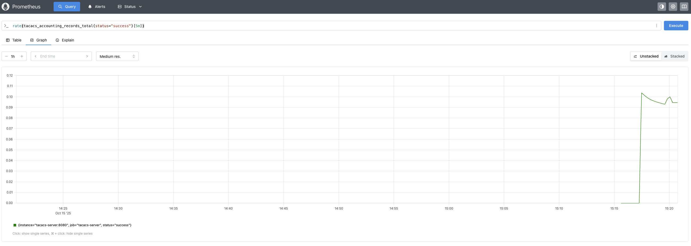
