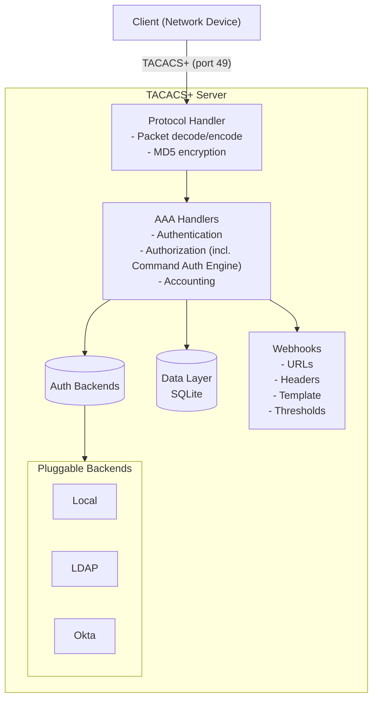
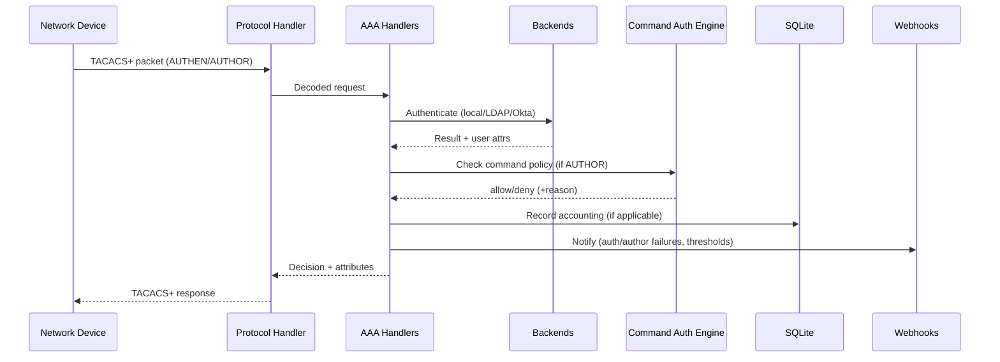
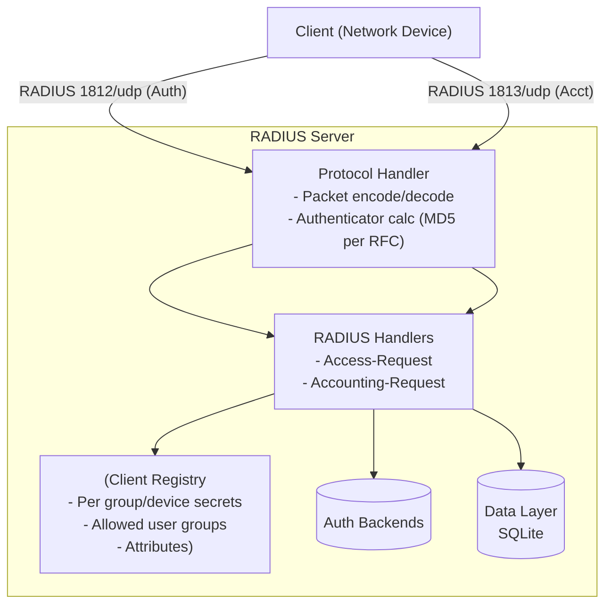
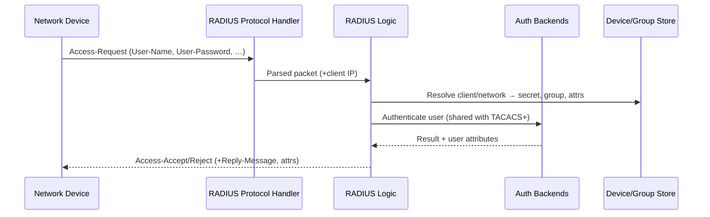
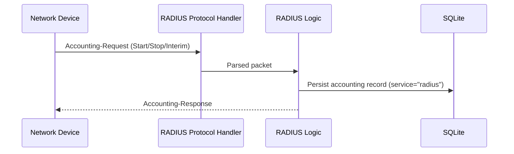

# System Architecture

This document provides a high‑level overview of the AAA appliance: TACACS+ and RADIUS, and how they share core components.

## TACACS+ Components

## TACACS+ Request Flow (AuthN/AuthZ)

## RADIUS Components

RADIUS support provides Authentication and Accounting per RFC 2865/2866. Authorization is TACACS+-specific; in RADIUS, attributes are returned on Access‑Accept.

Key implementation: `tacacs_server/radius/server.py`

### RADIUS Request Flows

Authentication (Access‑Request):

Accounting (Accounting‑Request):

### Shared Components and Integration

- Authentication Backends: TACACS+ and RADIUS share the same pluggable backends (`tacacs_server/auth/*`).
- Device/Group Store: RADIUS client definitions (networks, secrets, allowed groups, attributes) are resolved from the device store and group metadata.
- Accounting: Records are written via the shared accounting logger with `service="radius"`.
- Monitoring/Admin: The web monitoring layer exposes RADIUS stats and configured clients; the Admin UI summarizes auth/acct metrics and per‑group RADIUS secret status.

## Notes

- Command Authorization is implemented via a policy engine (permit/deny rules) invoked by AAA Handlers.
- Webhooks support templated JSON payloads, headers, timeouts, and threshold notifications.
- REST API is disabled by default unless `API_TOKEN` is configured. Admin UI is disabled unless an admin bcrypt password hash is configured.
