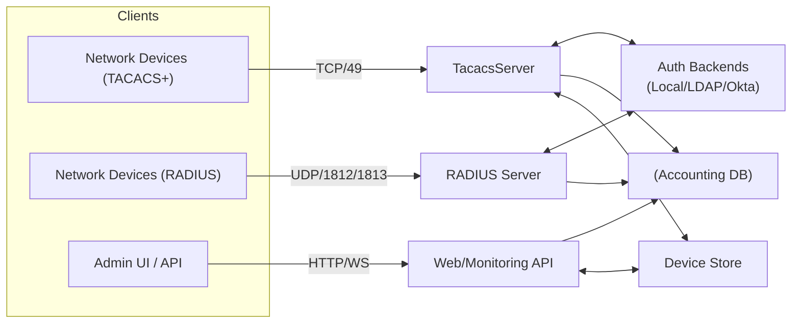
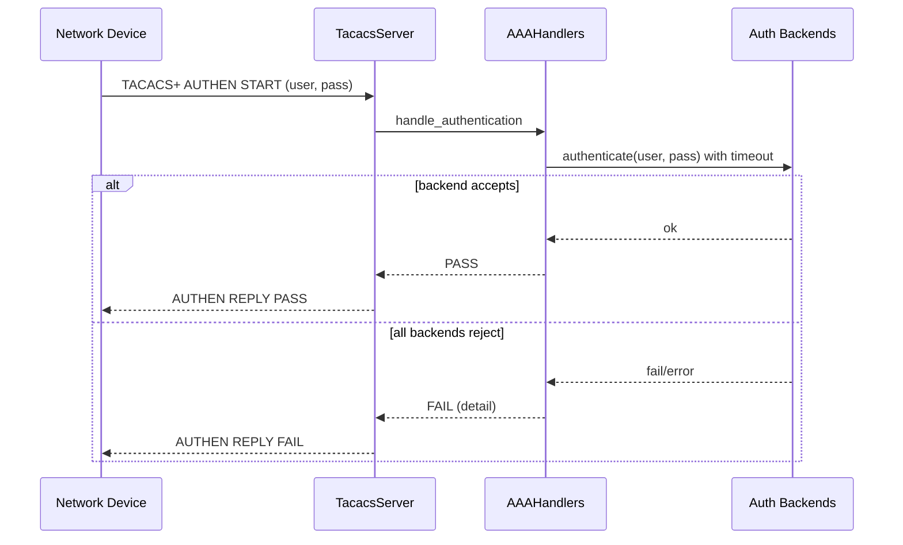
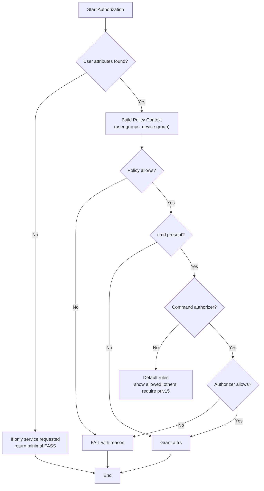

# Architecture Overview

## Component Interaction

```mermaid
flowchart LR
  subgraph Clients
    TAC["Network Devices (TACACS+)"]
    RAD["Network Devices (RADIUS)"]
    Admin[Admin UI / API]
  end

  TAC -->|TCP/49| TS[TacacsServer]
  RAD -->|UDP/1812/1813| RS[RADIUS Server]
  Admin -->|HTTP/WS| Web[Web/Monitoring API]

  TS <--> Auth["Auth Backends\n(Local/LDAP/Okta)"]
  TS --> DB["(Accounting DB)"]
  RS <--> Auth
  RS --> DB
  Web --> DB
  Web <--> DevStore[Device Store]
  TS <--> DevStore
```

## Authentication Flow (TACACS+ PAP)

```mermaid
sequenceDiagram
  participant Dev as Network Device
  participant TS as TacacsServer
  participant AH as AAAHandlers
  participant BE as Auth Backends

  Dev->>TS: TACACS+ AUTHEN START (user, pass)
  TS->>AH: handle_authentication
  AH->>BE: authenticate(user, pass) with timeout
  alt backend accepts
    BE-->>AH: ok
    AH-->>TS: PASS
    TS-->>Dev: AUTHEN REPLY PASS
  else all backends reject
    BE-->>AH: fail/error
    AH-->>TS: FAIL (detail)
    TS-->>Dev: AUTHEN REPLY FAIL
  end
```

## Authorization Decision

```mermaid
flowchart TD
  A[Start Authorization] --> B{User attributes found?}
  B -- No --> C[If only service requested\nreturn minimal PASS] --> G[End]
  B -- Yes --> D["Build Policy Context\n(user groups, device group)"]
  D --> E{Policy allows?}
  E -- No --> F[FAIL with reason]
  E -- Yes --> H{cmd present?}
  H -- No --> I[Grant attrs]
  H -- Yes --> J{Command authorizer?}
  J -- No --> K[Default rules\nshow allowed; others require priv15]
  J -- Yes --> L{Authorizer allows?}
  L -- No --> F
  L -- Yes --> I
  I --> G
  F --> G
```

