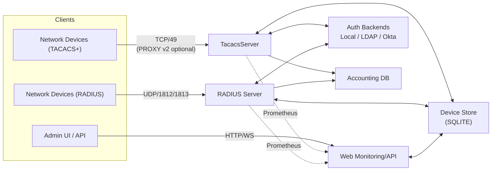
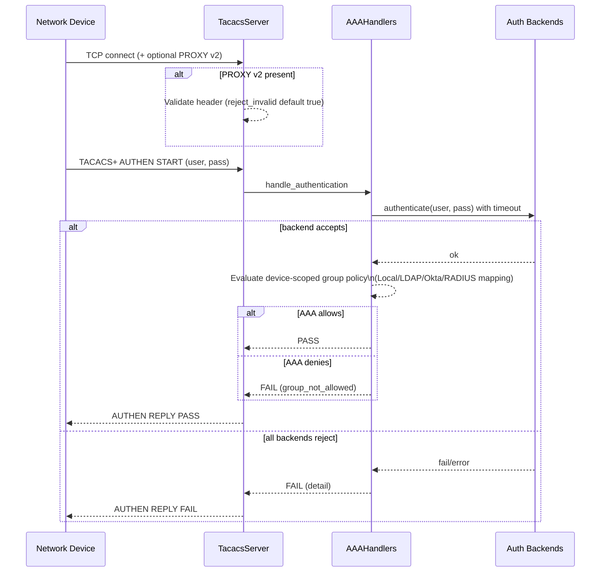
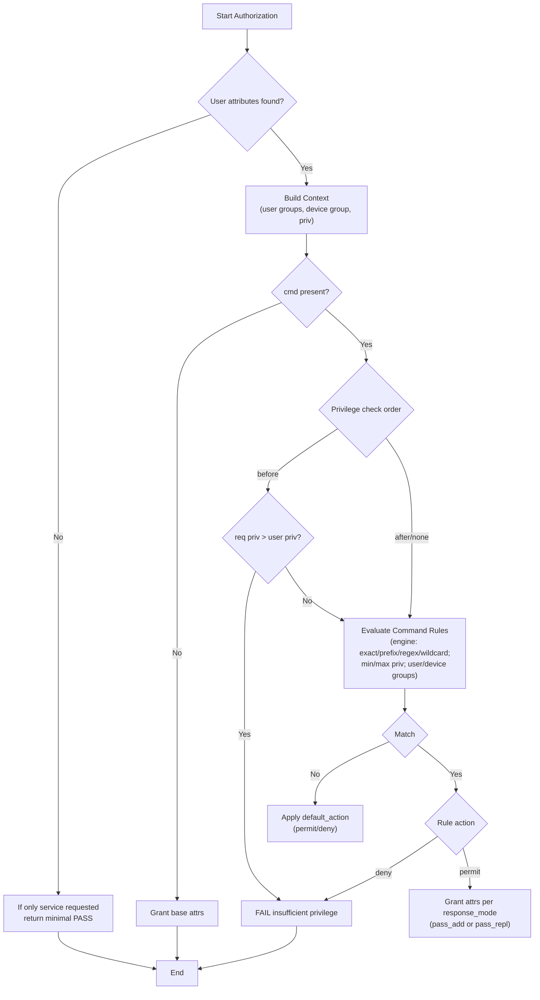

# Architecture Overview

## Components and Data Flow

## TACACS+ Authentication (PAP)

## TACACS+ Authorization (Command + Exec)

Notes
- Privilege enforcement order is configurable: `before` (default), `after`, or `none`.
- When no rule matches, `default_action` decides allow/deny, and `response_mode` controls PASS_ADD vs PASS_REPL for allowed results.

## Web Monitoring and Admin

- FastAPI app exposes:
  - Admin UI under `/admin/*` (requires authenticated session)
  - REST API under `/api/*` (disabled unless `API_TOKEN` is configured; enforces token or admin session)
  - Health, status, metrics, and device/user management endpoints
- Security headers middleware sets CSP, X-Frame-Options, X-Content-Type-Options, Referrer-Policy, X-XSS-Protection, and removes `Server` header.

## PROXY Protocol v2 Handling

- Optional HAProxy PROXY v2 parsing on TCP accept for TACACS+:
  - Detects signature via peek with short retries
  - Parses header; on invalid/unsupported headers, rejects by default (`reject_invalid=true`)
  - On success, sets `(client_ip, proxy_ip)` for device resolution and metrics
- Device matching supports proxy-aware groups via `proxy_network` with exact + fallback tiers and longest-prefix selection.
