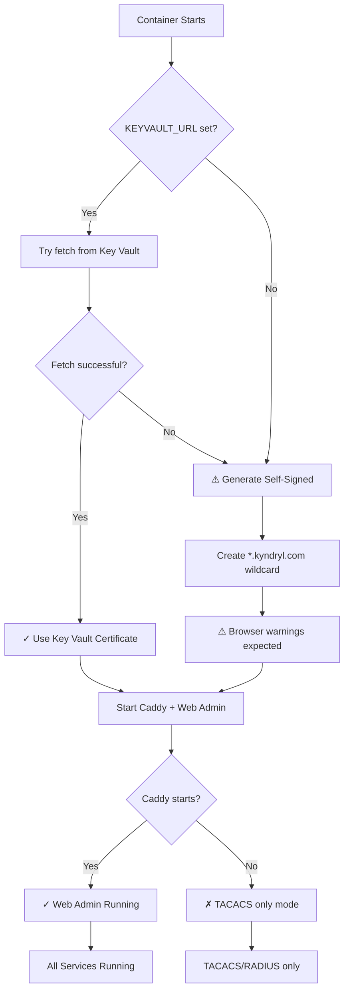

# Certificate Management - Key Vault with Self-Signed Fallback

## Overview

The container now uses a **two-tier certificate strategy**:

1. **Primary**: Fetch certificate from Azure Key Vault
2. **Fallback**: Generate self-signed wildcard certificate

This ensures the web admin **always starts**, even without Key Vault access.

## Behavior Flow



## Certificate Priority

### Priority 1: Key Vault Certificate (Production)
```bash
# Environment variables set
KEYVAULT_URL=https://tacacs-shared-kv.vault.azure.net/
CERT_NAME=customer1-ssl-cert
CERT_PASSWORD=optional-pfx-password

# Result:
✓ Certificate fetched from Key Vault
✓ Production-grade certificate
✓ No browser warnings
```

### Priority 2: Self-Signed Certificate (Fallback)
```bash
# Key Vault not available or certificate missing
# Automatically generates:

Certificate: *.kyndryl.com
Valid: 365 days from creation
Type: Self-signed wildcard
SANs: *.kyndryl.com, kyndryl.com

# Result:
⚠ Self-signed certificate generated
⚠ Browser security warnings
⚠ Not suitable for production
✓ Web admin still accessible
```

## Use Cases

### Development/Testing (Self-Signed OK)
```bash
# Don't set KEYVAULT_URL - use self-signed
az container create \
  --name tacacs-dev \
  --environment-variables \
    CUSTOMER_ID="dev-test" \
    STORAGE_CONTAINER="tacacs-data" \
  --secure-environment-variables \
    AZURE_STORAGE_CONNECTION_STRING="..." \
    ADMIN_PASSWORD="..." \
    API_TOKEN="..."

# Result: Self-signed cert, no Key Vault needed
```

### Production (Key Vault Required)
```bash
# Set KEYVAULT_URL and CERT_NAME
az container create \
  --name tacacs-prod \
  --environment-variables \
    CUSTOMER_ID="customer1" \
    KEYVAULT_URL="https://tacacs-kv.vault.azure.net/" \
    CERT_NAME="customer1-ssl-cert" \
    STORAGE_CONTAINER="tacacs-data" \
  --secure-environment-variables \
    AZURE_STORAGE_CONNECTION_STRING="..." \
    ADMIN_PASSWORD="..." \
    API_TOKEN="..."

# Result: Uses Key Vault cert, falls back if unavailable
```

### Disaster Recovery
If Key Vault becomes unavailable:
1. Container restarts
2. Cannot fetch Key Vault certificate
3. **Automatically generates self-signed certificate**
4. Web admin remains accessible (with browser warning)
5. TACACS/RADIUS continue working normally

## Customizing Fallback Domain

```bash
# Default: *.kyndryl.com
# Change via environment variable:

CERT_FALLBACK_DOMAIN="*.mycompany.com"

# This generates self-signed cert for *.mycompany.com
```

## Security Considerations

### Self-Signed Certificate Limitations

❌ **Not trusted by browsers** - Security warnings  
❌ **Not trusted by clients** - Manual certificate acceptance  
❌ **Not suitable for production** - Use Key Vault certificates  
✅ **Allows development/testing** - Better than no HTTPS  
✅ **Emergency fallback** - Service remains accessible  

### When Self-Signed is Acceptable

- ✅ Development environments
- ✅ Internal testing
- ✅ Demo systems
- ✅ Emergency access during Key Vault outage
- ✅ Initial deployment before certificate procurement

### When Key Vault is Required

- ⚠️ Production deployments
- ⚠️ Customer-facing systems
- ⚠️ Compliance requirements
- ⚠️ External access
- ⚠️ Any public-facing service

## Deployment Scenarios

### Scenario 1: Fresh Deployment (No Certificate Yet)

```bash
# Deploy without Key Vault configured
./deploy/aci/deploy-customer.sh customer1 /dev/null

# Or with minimal config:
az container create \
  --name tacacs-customer1 \
  --environment-variables CUSTOMER_ID="customer1" \
  ...

# Result:
✓ Container starts
✓ Self-signed cert generated
✓ Web admin accessible at https://<ip>:8443
⚠ Browser shows security warning
✓ You can access admin panel and configure
→ Later: Upload proper certificate to Key Vault and restart
```

### Scenario 2: Production Deployment (With Certificate)

```bash
# Deploy with Key Vault certificate
./deploy/aci/deploy-customer.sh customer1 customer1.pfx password

# Result:
✓ Container starts
✓ Key Vault certificate loaded
✓ Web admin accessible at https://<ip>:8443
✓ No browser warnings
✓ Production-ready
```

### Scenario 3: Key Vault Failure (Disaster Recovery)

```bash
# Key Vault becomes unavailable
# Container restarts (e.g., after update)

# Automatic behavior:
1. Tries to fetch Key Vault certificate → FAILS
2. Generates self-signed certificate → SUCCESS
3. Starts Caddy with self-signed cert → SUCCESS
4. Web admin accessible (with warning) → SUCCESS
5. TACACS/RADIUS running normally → SUCCESS

# Result:
⚠ Degraded security (self-signed cert)
✓ Service remains operational
✓ Admin can investigate/fix Key Vault issue
```

## Logging & Diagnostics

### Successful Key Vault Fetch
```
Fetching/generating certificate...
Attempting to fetch certificate 'customer1-ssl-cert' from https://...
Converting PFX to PEM...
✓ Certificate fetched from Key Vault
✓ Certificate saved to /certs/cert.pem
✓ Private key saved to /certs/key.pem
✓ Certificate ready
Starting Caddy on port 8443...
✓ Caddy started
✓ Starting TACACS/RADIUS + Web Admin
```

### Self-Signed Fallback
```
Fetching/generating certificate...
Attempting to fetch certificate 'customer1-ssl-cert' from https://...
⚠ Key Vault fetch failed: Certificate not found
⚠ Generating self-signed certificate for *.kyndryl.com
⚠ This is NOT suitable for production use!
✓ Self-signed certificate generated successfully
✓ CN: *.kyndryl.com
⚠ WARNING: Browsers will show security warnings!
✓ Certificate saved to /certs/cert.pem
✓ Private key saved to /certs/key.pem
✓ Certificate ready
Starting Caddy on port 8443...
✓ Caddy started
✓ Starting TACACS/RADIUS + Web Admin
```

### Key Vault Not Configured
```
Fetching/generating certificate...
⚠ Key Vault fetch failed: KEYVAULT_URL or CERT_NAME not set
⚠ Generating self-signed certificate for *.kyndryl.com
⚠ This is NOT suitable for production use!
✓ Self-signed certificate generated successfully
✓ CN: *.kyndryl.com
⚠ WARNING: Browsers will show security warnings!
✓ Certificate saved to /certs/cert.pem
✓ Private key saved to /certs/key.pem
✓ Certificate ready
Starting Caddy on port 8443...
✓ Caddy started
✓ Starting TACACS/RADIUS + Web Admin
```

## Troubleshooting

### Browser Shows "Not Secure" Warning

**Cause**: Self-signed certificate is being used

**Solutions**:
1. **Accept the risk** (development only)
2. **Upload proper certificate** to Key Vault
3. **Restart container** to fetch Key Vault cert

### How to Check Which Certificate is Active

```bash
# Connect and check certificate
openssl s_client -connect <container-ip>:8443 -showcerts

# Look for:
# - "CN=*.kyndryl.com" → Self-signed
# - Your organization name → Key Vault certificate
```

### Force Self-Signed Certificate

```bash
# Don't set KEYVAULT_URL or CERT_NAME
az container create \
  --environment-variables CUSTOMER_ID="test" \
  # No KEYVAULT_URL, no CERT_NAME
  
# Result: Always uses self-signed
```

### Force Key Vault Certificate (No Fallback)

Modify `fetch_cert.py` to return exit code 1 on Key Vault failure:
```python
if private_key and certificate:
    save_certificate(private_key, certificate, cert_dir)
    return 0
else:
    print(f"ERROR: {error}")
    return 1  # Don't fallback, fail hard
```

## Migration Path

### Phase 1: Initial Deployment (Self-Signed)
```bash
# Quick start without certificates
./deploy/aci/deploy-customer.sh customer1 /dev/null

# Web admin accessible immediately
# Begin configuration
```

### Phase 2: Obtain Certificate
```
1. Request SSL certificate from your CA
2. Receive certificate in PFX format
3. Upload to Key Vault
```

### Phase 3: Switch to Production Certificate
```bash
# Upload certificate
az keyvault certificate import \
  --vault-name tacacs-shared-kv \
  --name customer1-ssl-cert \
  --file customer1.pfx

# Update container with Key Vault config
az container update \
  --name tacacs-customer1 \
  --resource-group tacacs-rg \
  --set environmentVariables[0].name=KEYVAULT_URL \
       environmentVariables[0].value=https://tacacs-shared-kv.vault.azure.net/ \
       environmentVariables[1].name=CERT_NAME \
       environmentVariables[1].value=customer1-ssl-cert

# Restart to pick up new certificate
az container restart \
  --name tacacs-customer1 \
  --resource-group tacacs-rg
```

### Phase 4: Production Running
```
✓ Key Vault certificate active
✓ No browser warnings
✓ Self-signed as safety fallback
✓ Ready for production traffic
```

## Best Practices

### Development
- ✅ Use self-signed certificates
- ✅ Don't configure Key Vault
- ✅ Fast deployment and testing

### Staging
- ✅ Use Key Vault certificates
- ✅ Test Key Vault integration
- ✅ Self-signed fallback available

### Production
- ✅ Always use Key Vault certificates
- ✅ Self-signed fallback for disaster recovery only
- ✅ Monitor certificate expiration
- ✅ Automated certificate renewal

## Summary

**Key Changes:**
- ✅ Web admin **always starts** (unless certificate generation completely fails)
- ✅ Key Vault certificate is **preferred**
- ✅ Self-signed certificate is **automatic fallback**
- ✅ No manual intervention needed for basic deployment
- ✅ Production deployments should still use Key Vault certificates

**Benefits:**
- 🚀 Faster development/testing (no certificate needed)
- 🔧 Easier initial deployment
- 🛡️ Disaster recovery capability
- ✅ Service continuity during Key Vault issues
- 📝 Clear logging of certificate source
