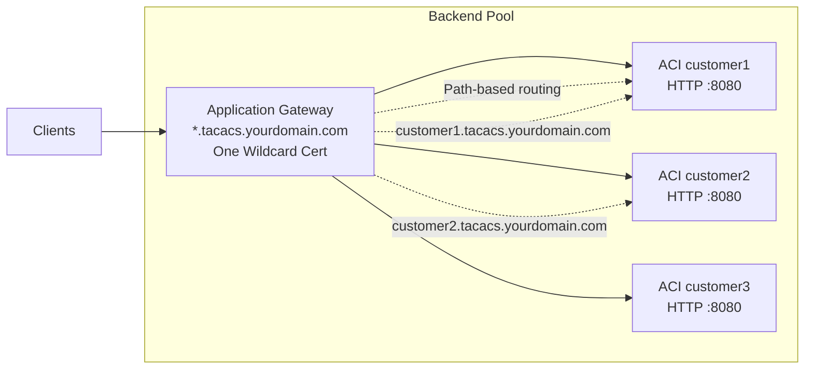

# Certificate Strategy for Multi-Container Deployment

## Problem

Each ACI container has a unique DNS name/IP:
- `tacacs-customer1.westeurope.azurecontainer.io` → 20.1.2.3
- `tacacs-customer2.westeurope.azurecontainer.io` → 20.1.2.4

A single shared certificate won't match different DNS names.

## Solutions

### Option 1: Per-Customer Certificates (Recommended for Production)

Each customer gets their own certificate in Key Vault.

**Key Vault Structure:**
```
Certificates:
├── customer1-ssl-cert         # For customer1.yourdomain.com
├── customer2-ssl-cert         # For customer2.yourdomain.com
└── customer3-ssl-cert         # For customer3.yourdomain.com
```

**Environment Variables:**
```bash
CUSTOMER_ID=customer1
CERT_NAME=${CUSTOMER_ID}-ssl-cert    # Auto-computed: customer1-ssl-cert
```

**Pros:**
- Each customer has their own cert (better isolation)
- Works with customer-specific domains
- Certificate rotation per customer

**Cons:**
- More certificates to manage
- Each customer needs DNS setup

---

### Option 2: Wildcard Certificate + DNS Setup

Use one wildcard cert with proper DNS configuration.

**Setup:**
```
Certificate: *.tacacs.yourdomain.com

DNS Records:
customer1.tacacs.yourdomain.com → CNAME → tacacs-customer1.westeurope.azurecontainer.io
customer2.tacacs.yourdomain.com → CNAME → tacacs-customer2.westeurope.azurecontainer.io
```

**Caddyfile Update:**
```
customer1.tacacs.yourdomain.com:8443 {
    tls /certs/cert.pem /certs/key.pem
    reverse_proxy localhost:8080
}
```

**Pros:**
- Single certificate for all customers
- Easy certificate management
- Consistent setup

**Cons:**
- Requires DNS zone management
- All customers under same domain
- SNI reveals customer ID in DNS

---

### Option 3: Self-Signed Per Container (Development Only)

For the current `https` image, self‑signed certificates are handled centrally by `docker/https/fetch_cert.py`:

- If `KEYVAULT_URL`/`CERT_NAME` are missing or Key Vault fetch fails, `fetch_cert.py` generates a self‑signed wildcard certificate for `CERT_FALLBACK_DOMAIN` (default `*.kyndryl.com`) and writes `cert.pem`/`key.pem` under `CERT_DIR` (default `/certs`).
- There is no longer a need to manually mutate `bootstrap-https.sh` with `openssl` calls; that logic is encapsulated in `fetch_cert.py`.

**Pros:**
- No Key Vault needed for dev/test
- Works immediately
- No DNS requirements

**Cons:**
- Browser warnings
- Not for production
- No public trust chain

---

### Option 4: Azure Application Gateway + Single Wildcard Cert

Put all containers behind Application Gateway with single cert.



**Setup:**
- Application Gateway handles HTTPS with one cert
- Containers only expose HTTP (no Caddy needed)
- AG routes by hostname or path

**Pros:**
- Single certificate
- No certificate management in containers
- Better security (containers private)
- WAF capabilities

**Cons:**
- Additional Azure cost (~$300/month)
- More complex setup
- Overkill for small deployments

---

### Option 5: Per-Customer Cert with Fallback

Support both per-customer certs and shared fallback.

**Key Vault:**
```
Certificates:
├── ssl-wildcard-fallback      # Optional shared cert
├── customer1-ssl-cert         # Customer-specific
└── customer2-ssl-cert         # Customer-specific
```

**fetch_cert.py Update:**
```python
cert_name = os.environ.get('CERT_NAME')

if not cert_name:
    # Try customer-specific first
    customer_id = os.environ.get('CUSTOMER_ID')
    cert_name = f"{customer_id}-ssl-cert"
    
    try:
        secret = client.get_secret(cert_name)
    except:
        # Fallback to shared cert
        print(f"Customer cert not found, trying fallback...")
        cert_name = "ssl-wildcard-fallback"
        secret = client.get_secret(cert_name)
```

**Pros:**
- Flexible: per-customer or shared
- Gradual migration path
- Works during transition

**Cons:**
- More complex logic
- Potential confusion

---

## Recommended Approach by Use Case

### Small Deployment (< 10 customers)
**Option 1: Per-Customer Certificates**
- Each customer gets their own cert
- Simple and clean
- Easy to understand

### Medium Deployment (10-50 customers)
**Option 2: Wildcard Certificate + DNS**
- One cert, managed DNS
- Good balance of simplicity and scale

### Large Deployment (50+ customers)
**Option 4: Application Gateway**
- Centralized HTTPS termination
- Better security and features
- Worth the cost at scale

### Development/Testing
**Option 3: Self-Signed**
- No setup required
- Fast iteration

---

## Updated Deployment Guide

### For Option 1 (Per-Customer Certs):

```bash
# 1. Upload customer-specific certificate
az keyvault certificate import \
  --vault-name tacacs-shared-kv \
  --name "${CUSTOMER_ID}-ssl-cert" \
  --file customer1.pfx \
  --password "pfx-password"

# 2. Deploy with customer-specific cert name
az container create \
  --name "tacacs-${CUSTOMER_ID}" \
  --environment-variables \
    CUSTOMER_ID="${CUSTOMER_ID}" \
    CERT_NAME="${CUSTOMER_ID}-ssl-cert" \
    ...
```

### For Option 2 (Wildcard + DNS):

```bash
# 1. Upload wildcard certificate once
az keyvault certificate import \
  --vault-name tacacs-shared-kv \
  --name "ssl-wildcard-tacacs" \
  --file wildcard-tacacs.pfx

# 2. Configure DNS
az network dns record-set cname create \
  --name customer1.tacacs \
  --zone-name yourdomain.com \
  --resource-group tacacs-rg

az network dns record-set cname set-record \
  --cname tacacs-customer1.westeurope.azurecontainer.io \
  --record-set-name customer1.tacacs \
  --zone-name yourdomain.com \
  --resource-group tacacs-rg

# 3. Update Caddyfile
cat > Caddyfile <<EOF
customer1.tacacs.yourdomain.com:8443 {
    tls /certs/cert.pem /certs/key.pem
    reverse_proxy localhost:8080
}
EOF

# 4. Deploy with shared cert
az container create \
  --name "tacacs-${CUSTOMER_ID}" \
  --environment-variables \
    CUSTOMER_ID="${CUSTOMER_ID}" \
    CERT_NAME="ssl-wildcard-tacacs" \
    CADDY_DOMAIN="customer1.tacacs.yourdomain.com" \
    ...
```

---

## My Recommendation

**Start with Option 1 (Per-Customer Certificates)** because:

1. **Security**: Each customer isolated with own cert
2. **Simplicity**: No DNS coordination needed
3. **Flexibility**: Each customer can use their own domain
4. **Compliance**: Some customers may require it
5. **Scale**: Works from 1 to 1000+ customers

Update `CERT_NAME` environment variable pattern:
```bash
CERT_NAME="${CUSTOMER_ID}-ssl-cert"  # Not a shared cert
```

Would you like me to update the deployment guide and scripts for per-customer certificates?
