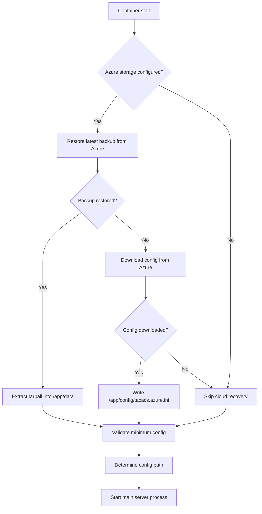

# Container Startup Orchestration

## Overview

The TACACS+ server container implements intelligent startup orchestration that automatically handles backup restoration and configuration management from Azure Storage.

## Startup Flow



## Environment Variables

### Azure Storage Authentication

Choose ONE of the following authentication methods:

**Option 1: Connection String**
```bash
AZURE_CONNECTION_STRING=DefaultEndpointsProtocol=https;AccountName=...
AZURE_STORAGE_CONTAINER=tacacs-backups
```

**Option 2: Account Key**
```bash
AZURE_STORAGE_ACCOUNT=mystorageaccount
AZURE_ACCOUNT_KEY=your-access-key
AZURE_STORAGE_CONTAINER=tacacs-backups
```

**Option 3: SAS Token**
```bash
AZURE_STORAGE_ACCOUNT=mystorageaccount
AZURE_SAS_TOKEN=?sv=2021-06-08&ss=b&srt=sco...
AZURE_STORAGE_CONTAINER=tacacs-backups
```

**Option 4: Managed Identity**
```bash
AZURE_STORAGE_ACCOUNT=mystorageaccount
AZURE_USE_MANAGED_IDENTITY=true
AZURE_STORAGE_CONTAINER=tacacs-backups
```

### Optional Azure Configuration

```bash
# Backup storage path prefix (used by restore_from_azure_backup)
AZURE_BACKUP_PATH=backups  # default: backups

# Config file location (used by download_config_from_azure)
AZURE_CONFIG_PATH=config        # default: config
AZURE_CONFIG_FILE=tacacs.conf   # default: tacacs.conf
```

### Server Configuration

```bash
# Override config file path
TACACS_CONFIG=/path/to/custom/config.ini

# Admin credentials
# Recommended (production): provide a bcrypt hash
ADMIN_USERNAME=admin
ADMIN_PASSWORD_HASH='$2b$12$examplehash...'

# Development-only fallback: plaintext password (hashed at startup if
# ADMIN_PASSWORD_HASH is not set)
# ADMIN_PASSWORD=secure-password
```

## Configuration Priority

The server selects configuration in this order:

1. **Azure-downloaded config** (`/app/config/tacacs.azure.ini`) if `download_config_from_azure` succeeded and the file exists.
2. **`TACACS_CONFIG` env var** if set and points to an existing file.
3. **Container default** (`/app/config/tacacs.container.ini`) bundled with the image.
4. **Standard location** (`config/tacacs.conf`) in the working directory.

## Docker Compose Example

```yaml
version: '3.8'

services:
  tacacs:
    image: tacacs-server:latest
    container_name: tacacs-server
    ports:
      - "49:49"      # TACACS+
      - "8080:8080"  # Web UI
    environment:
      # Azure Storage for backup/config
      AZURE_STORAGE_ACCOUNT: mystorageaccount
      AZURE_ACCOUNT_KEY: ${AZURE_KEY}
      AZURE_STORAGE_CONTAINER: tacacs-backups
      
      # Optional: customize paths
      AZURE_BACKUP_PATH: backups
      AZURE_CONFIG_PATH: config
      
      # Server config
      ADMIN_USERNAME: admin
      ADMIN_PASSWORD: ${ADMIN_PASSWORD_HASH}
    volumes:
      - tacacs-data:/app/data
      - tacacs-logs:/app/logs
    restart: unless-stopped

volumes:
  tacacs-data:
  tacacs-logs:
```

## Kubernetes Example

```yaml
apiVersion: apps/v1
kind: Deployment
metadata:
  name: tacacs-server
spec:
  replicas: 1
  selector:
    matchLabels:
      app: tacacs-server
  template:
    metadata:
      labels:
        app: tacacs-server
    spec:
      containers:
      - name: tacacs
        image: tacacs-server:latest
        ports:
        - containerPort: 49
          protocol: TCP
        - containerPort: 8080
          protocol: TCP
        env:
        # Using managed identity in Azure Kubernetes Service
        - name: AZURE_STORAGE_ACCOUNT
          value: "mystorageaccount"
        - name: AZURE_USE_MANAGED_IDENTITY
          value: "true"
        - name: AZURE_STORAGE_CONTAINER
          value: "tacacs-backups"
        - name: ADMIN_USERNAME
          value: "admin"
        - name: ADMIN_PASSWORD
          valueFrom:
            secretKeyRef:
              name: tacacs-secrets
              key: admin-password
        volumeMounts:
        - name: data
          mountPath: /app/data
        - name: logs
          mountPath: /app/logs
        livenessProbe:
          httpGet:
            path: /health
            port: 8080
          initialDelaySeconds: 30
          periodSeconds: 30
      volumes:
      - name: data
        persistentVolumeClaim:
          claimName: tacacs-data
      - name: logs
        persistentVolumeClaim:
          claimName: tacacs-logs
```

## Behavior Details

### Backup Restoration

When Azure storage is configured:

1. **Connects to Azure Blob Storage** using provided credentials
2. **Lists all available backups** in the configured path
3. **Selects the latest backup** by timestamp
4. **Downloads backup** to a safe temporary location (using `backup.path_policy.join_safe_temp` when available)
5. **Extracts backup** to `/app/data` directory using `backup.archive_utils.extract_tarball`
6. **Cleans up temp file** (best effort)
7. **Continues startup** with restored data

If backup restoration fails (no backups, connection error, etc.), the startup continues to the next step.

### Config Download

If backup restoration fails or no backup exists:

1. **Checks for config file** in Azure storage
2. **Computes remote path** as `<AZURE_CONFIG_PATH>/<AZURE_CONFIG_FILE>` (e.g. `config/tacacs.conf`)
3. **Downloads to** `/app/config/tacacs.azure.ini` using:
   - Direct `BlobServiceClient` when a connection string is present (with retries), or
   - `AzureBlobBackupDestination.download_backup` as a helper
4. **Uses downloaded config** for server startup if the file is present

If config download fails, falls back to local configuration.

### Minimum Validation

`StartupOrchestrator.validate_minimum_config()` currently only checks a (potentially empty) list of required env vars and logs success. It is intentionally minimal so individual deployments can extend this logic (for example by enforcing required secrets).

### Skip Orchestration

For testing or special cases, skip orchestration with:

```bash
docker run tacacs-server tacacs-server --skip-startup-orchestration --config /custom/path
```

## Logging

Startup orchestration logs include:

```
============================================================
TACACS+ Server Container Startup
============================================================

Azure storage environment variables detected
Connecting to Azure storage to check for backups...
Found latest backup: backup-instance-20241113-120000.tar.gz from 2024-11-13 12:00:00
Downloading backup from Azure...
Restoring backup...
✓ Backup restored successfully from Azure storage

Validating minimum configuration...
Minimum configuration requirements met

============================================================
Startup orchestration complete
Backup restored: True
Config downloaded: False
Using config: /app/config/tacacs.container.ini
============================================================
```

## Troubleshooting

### No Azure Credentials

```
Missing Azure env vars: AZURE_STORAGE_ACCOUNT, AZURE_STORAGE_CONTAINER
Azure storage not configured, skipping cloud recovery
```

**Solution:** Set required Azure environment variables.

### Connection Failed

```
Failed to restore from Azure backup: AuthenticationError
```

**Solution:** Verify credentials and container permissions.

### No Backups Found

```
No backups found in Azure storage
Attempting config download from Azure...
```

**Solution:** This is normal for first startup. Server will use default config.

### Invalid Container Name

```
Invalid container_name; must be lowercase alphanumeric and hyphens (3-63 chars)
```

**Solution:** Use valid Azure container name (lowercase, 3-63 chars).

## Best Practices

1. **Use Managed Identity** when running in Azure (AKS, ACI, VM)
2. **Store sensitive env vars** in secrets (Kubernetes Secrets, Docker Secrets)
3. **Test startup** with `--skip-startup-orchestration` flag first
4. **Monitor startup logs** to ensure backup restoration succeeds
5. **Keep backups current** with scheduled backup jobs
6. **Use SAS tokens** with minimal permissions for non-Azure deployments

## Security Considerations

- **Never commit** connection strings or keys to version control
- **Use managed identities** when possible (zero secrets)
- **Rotate SAS tokens** regularly if using token authentication
- **Limit container permissions** to minimum required (read for restore, write for backup)
- **Enable Azure Storage** encryption at rest
- **Use private endpoints** for enhanced security in Azure
