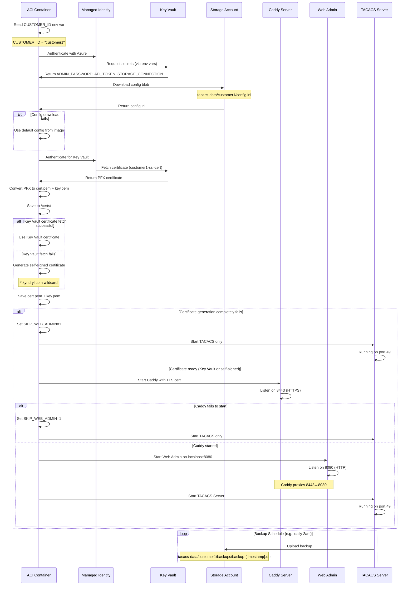
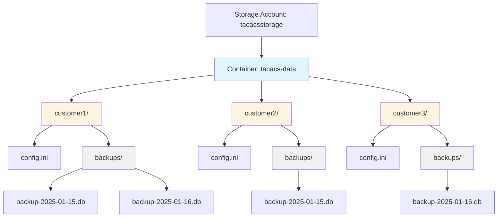

# TACACS+ Server Azure ACI Deployment Guide

Complete guide for deploying TACACS+ server instances in Azure Container Instances with shared Key Vault and Storage Account.

## Overview

Multiple TACACS+ container instances share:
- **One Key Vault** - Stores per-customer certificates and secrets
- **One Storage Account** - Stores configs and backups

Instances are distinguished by **CUSTOMER_ID** which acts as the namespace/tenant identifier.

## Architecture Diagram

```mermaid
graph TB
    subgraph "Azure Resources (Shared)"
        KV[Key Vault<br/>tacacs-shared-kv]
        SA[Storage Account<br/>tacacsstorage]
        
        subgraph "Key Vault Secrets/Certificates"
            CERT1[Certificate: customer1-ssl-cert<br/>PFX format]
            CERT2[Certificate: customer2-ssl-cert<br/>PFX format]
            PWD1[Secret: customer1-admin-password]
            PWD2[Secret: customer2-admin-password]
            TOK1[Secret: customer1-api-token]
            TOK2[Secret: customer2-api-token]
            STORAGE[Secret: storage-connection-string]
        end
        
        subgraph "Storage Container: tacacs-data"
            subgraph "customer1/"
                C1[config.ini]
                subgraph "backups/"
                    B1A[backup-2025-01-15-120000.db]
                    B1B[backup-2025-01-16-120000.db]
                end
            end
            
            subgraph "customer2/"
                C2[config.ini]
                subgraph "backups/"
                    B2A[backup-2025-01-15-120000.db]
                    B2B[backup-2025-01-16-120000.db]
                end
            end
        end
    end
    
    subgraph "ACI Instance 1"
        ACI1[Container: tacacs-customer1<br/>Managed Identity: MI1]
        ACI1_ENV[Env: CUSTOMER_ID=customer1]
    end
    
    subgraph "ACI Instance 2"
        ACI2[Container: tacacs-customer2<br/>Managed Identity: MI2]
        ACI2_ENV[Env: CUSTOMER_ID=customer2]
    end
    
    ACI1 -->|Read cert| CERT1
    ACI1 -->|Read secrets| PWD1
    ACI1 -->|Read secrets| TOK1
    ACI1 -->|Download/Upload| C1
    ACI1 -->|Backup| B1A
    ACI1 -->|Backup| B1B
    
    ACI2 -->|Read cert| CERT2
    ACI2 -->|Read secrets| PWD2
    ACI2 -->|Read secrets| TOK2
    ACI2 -->|Download/Upload| C2
    ACI2 -->|Backup| B2A
    ACI2 -->|Backup| B2B
```



## Resource Naming Convention

### Key Vault Secrets/Certificates

| Resource Type | Naming Pattern | Example | Notes |
|--------------|----------------|---------|-------|
| Certificate (per-customer) | `{CUSTOMER_ID}-ssl-cert` | `customer1-ssl-cert` | Each customer has own cert |
| Admin Password | `{CUSTOMER_ID}-admin-password` | `customer1-admin-password` | Per-customer |
| API Token | `{CUSTOMER_ID}-api-token` | `customer1-api-token` | Per-customer |
| Storage Connection | `storage-connection-string` | `storage-connection-string` | Shared across all |
| LDAP Bind Password | `{CUSTOMER_ID}-ldap-password` | `customer1-ldap-password` | Optional, per-customer |
| RADIUS Secret | `{CUSTOMER_ID}-radius-secret` | `customer1-radius-secret` | Optional, per-customer |

### Storage Account Structure

**Single container with customer folders:**

```
Storage Account: tacacsstorage
└── Container: tacacs-data
    ├── customer1/
    │   ├── config.ini
    │   └── backups/
    │       ├── backup-2025-01-15-120000.db
    │       ├── backup-2025-01-16-120000.db
    │       └── backup-2025-01-17-120000.db
    │
    ├── customer2/
    │   ├── config.ini
    │   └── backups/
    │       ├── backup-2025-01-15-120000.db
    │       └── backup-2025-01-16-120000.db
    │
    └── customer3/
        ├── config.ini
        └── backups/
            └── backup-2025-01-16-120000.db
```

**Blob Paths:**
- Config: `{CUSTOMER_ID}/config.ini`
- Backups: `{CUSTOMER_ID}/backups/backup-{timestamp}.db`

## Prerequisites

### 1. Azure Key Vault Setup

Create Key Vault and add resources:

```bash
# Create Key Vault
az keyvault create \
  --name tacacs-shared-kv \
  --resource-group tacacs-rg \
  --location westeurope

# Add storage connection string (shared secret)
STORAGE_CONN=$(az storage account show-connection-string \
  --name tacacsstorage \
  --resource-group tacacs-rg \
  --query connectionString -o tsv)

az keyvault secret set \
  --vault-name tacacs-shared-kv \
  --name storage-connection-string \
  --value "$STORAGE_CONN"

# Upload per-customer certificate
az keyvault certificate import \
  --vault-name tacacs-shared-kv \
  --name customer1-ssl-cert \
  --file customer1.pfx \
  --password "pfx-password"

# Add per-customer secrets
az keyvault secret set \
  --vault-name tacacs-shared-kv \
  --name customer1-admin-password \
  --value "SecureAdminPass123!"

az keyvault secret set \
  --vault-name tacacs-shared-kv \
  --name customer1-api-token \
  --value "tok_abc123xyz789"
```

### 2. Storage Account Setup

```bash
# Create Storage Account
az storage account create \
  --name tacacsstorage \
  --resource-group tacacs-rg \
  --location westeurope \
  --sku Standard_LRS

# Get connection string
CONN_STR=$(az storage account show-connection-string \
  --name tacacsstorage \
  --resource-group tacacs-rg \
  --query connectionString -o tsv)

# Create single container for all customers
az storage container create \
  --name tacacs-data \
  --connection-string "$CONN_STR"

# Upload initial config for customer1
az storage blob upload \
  --container-name tacacs-data \
  --name customer1/config.ini \
  --file customer1-config.ini \
  --connection-string "$CONN_STR"

# Create backups folder (optional, created automatically)
az storage blob upload \
  --container-name tacacs-data \
  --name customer1/backups/.placeholder \
  --file /dev/null \
  --connection-string "$CONN_STR"
```

### 3. Managed Identity Setup

Each ACI instance needs a User-Assigned Managed Identity:

```bash
# Create Managed Identity for customer1
az identity create \
  --name tacacs-customer1-identity \
  --resource-group tacacs-rg

# Get identity details
IDENTITY_ID=$(az identity show \
  --name tacacs-customer1-identity \
  --resource-group tacacs-rg \
  --query id -o tsv)

PRINCIPAL_ID=$(az identity show \
  --name tacacs-customer1-identity \
  --resource-group tacacs-rg \
  --query principalId -o tsv)

# Grant Key Vault access
az keyvault set-policy \
  --name tacacs-shared-kv \
  --object-id $PRINCIPAL_ID \
  --secret-permissions get \
  --certificate-permissions get
```

## Container Environment Variables

### Required Variables

| Variable | Source | Example | Description |
|----------|--------|---------|-------------|
| `CUSTOMER_ID` | Direct | `customer1` | Unique customer identifier (namespace) |
| `KEYVAULT_URL` | Direct | `https://tacacs-shared-kv.vault.azure.net/` | Key Vault URL |
| `CERT_NAME` | Direct | `customer1-ssl-cert` | Certificate name in Key Vault |
| `AZURE_STORAGE_CONNECTION_STRING` | Key Vault Secret | `DefaultEndpoints...` | Storage connection string |
| `ADMIN_PASSWORD` | Key Vault Secret | `SecurePass123!` | Web admin password |
| `API_TOKEN` | Key Vault Secret | `tok_abc123xyz` | API authentication token |

### Optional Variables

| Variable | Default | Description |
|----------|---------|-------------|
| `CERT_PASSWORD` | _(empty)_ | PFX certificate password |
| `STORAGE_CONTAINER` | `tacacs-data` | Storage container name |
| `CERT_DIR` | `/certs` | Directory for certificate files |
| `CERT_FALLBACK_DOMAIN` | `*.kyndryl.com` | Domain for self-signed cert fallback |

## Deployment Process

### Step 1: Prepare Secrets in Key Vault

For each new customer:

```bash
CUSTOMER_ID="customer1"
KV_NAME="tacacs-shared-kv"

# Upload certificate (per-customer)
az keyvault certificate import \
  --vault-name $KV_NAME \
  --name "${CUSTOMER_ID}-ssl-cert" \
  --file "${CUSTOMER_ID}.pfx" \
  --password "pfx-password"

# Admin password
az keyvault secret set \
  --vault-name $KV_NAME \
  --name "${CUSTOMER_ID}-admin-password" \
  --value "GeneratedSecurePassword123!"

# API token
az keyvault secret set \
  --vault-name $KV_NAME \
  --name "${CUSTOMER_ID}-api-token" \
  --value "tok_$(openssl rand -hex 16)"
```

### Step 2: Upload Initial Configuration

```bash
# Create initial config file
cat > /tmp/${CUSTOMER_ID}-config.ini <<EOF
[server]
port = 49
host = 0.0.0.0

[web]
enabled = true
port = 8080

[database]
path = /tmp/tacacs.db

[backup]
enabled = true
backend = azure
schedule = "0 2 * * *"
EOF

# Upload to Storage in customer folder
az storage blob upload \
  --account-name tacacsstorage \
  --container-name tacacs-data \
  --name "${CUSTOMER_ID}/config.ini" \
  --file /tmp/${CUSTOMER_ID}-config.ini
```

### Step 3: Deploy ACI Container

```bash
CUSTOMER_ID="customer1"
KV_NAME="tacacs-shared-kv"
IDENTITY_NAME="tacacs-${CUSTOMER_ID}-identity"
CONTAINER_IMAGE="yourregistry.azurecr.io/tacacs-server:https-latest"

# Get resource IDs
IDENTITY_ID=$(az identity show --name $IDENTITY_NAME --resource-group tacacs-rg --query id -o tsv)

# Deploy ACI with secret references
az container create \
  --resource-group tacacs-rg \
  --name "tacacs-${CUSTOMER_ID}" \
  --image $CONTAINER_IMAGE \
  --assign-identity $IDENTITY_ID \
  --ports 49 1812 1813 8443 \
  --protocol TCP \
  --cpu 2 \
  --memory 4 \
  --restart-policy Always \
  --environment-variables \
    CUSTOMER_ID="${CUSTOMER_ID}" \
    KEYVAULT_URL="https://${KV_NAME}.vault.azure.net/" \
    CERT_NAME="${CUSTOMER_ID}-ssl-cert" \
    STORAGE_CONTAINER="tacacs-data" \
  --secure-environment-variables \
    AZURE_STORAGE_CONNECTION_STRING="@Microsoft.KeyVault(SecretUri=https://${KV_NAME}.vault.azure.net/secrets/storage-connection-string/)" \
    ADMIN_PASSWORD="@Microsoft.KeyVault(SecretUri=https://${KV_NAME}.vault.azure.net/secrets/${CUSTOMER_ID}-admin-password/)" \
    API_TOKEN="@Microsoft.KeyVault(SecretUri=https://${KV_NAME}.vault.azure.net/secrets/${CUSTOMER_ID}-api-token/)"
```

## Startup Sequence



## Instance Isolation Matrix

| Resource | Shared? | Isolation Method | Example |
|----------|---------|------------------|---------|
| Key Vault | ✅ Shared | Secret/cert name prefix: `{CUSTOMER_ID}-*` | `customer1-ssl-cert` |
| Certificate | ❌ Per-customer | Cert name: `{CUSTOMER_ID}-ssl-cert` | `customer1-ssl-cert` |
| Storage Account | ✅ Shared | Folder path: `{CUSTOMER_ID}/` | `customer1/` |
| Storage Container | ✅ Shared | Single container: `tacacs-data` | `tacacs-data` |
| Config File | ❌ Per-customer | Blob: `{CUSTOMER_ID}/config.ini` | `customer1/config.ini` |
| Backup Files | ❌ Per-customer | Blob: `{CUSTOMER_ID}/backups/backup-*` | `customer1/backups/backup-*.db` |
| Managed Identity | ❌ Per-instance | Separate identity per ACI | `tacacs-customer1-identity` |
| Container Instance | ❌ Per-instance | Container name: `tacacs-{CUSTOMER_ID}` | `tacacs-customer1` |
| Database | ❌ Per-instance | In-memory `/tmp/tacacs.db` | Isolated by container |
| Ports | ✅ Shared protocol | Each ACI has own IP | Each instance: 49, 1812, 1813, 8443 |

## Security Considerations

### Managed Identity Permissions

Each Managed Identity should have minimal permissions:

```bash
# Key Vault: Only read secrets/certs for this customer
az keyvault set-policy \
  --name tacacs-shared-kv \
  --object-id $PRINCIPAL_ID \
  --secret-permissions get \
  --certificate-permissions get

# Note: No 'list' permission prevents enumeration of other customers
```

### Storage Account Access

**Current Approach: Shared Connection String**
- Single connection string in Key Vault
- All instances can access all blobs
- Application logic enforces CUSTOMER_ID isolation
- Simple to implement

**Alternative: Managed Identity with RBAC (More Secure)**
```bash
# Grant Storage Blob Data Contributor scoped to customer folder
# Note: Folder-level RBAC not directly supported, container-level only
az role assignment create \
  --assignee $PRINCIPAL_ID \
  --role "Storage Blob Data Contributor" \
  --scope "/subscriptions/{sub}/resourceGroups/{rg}/providers/Microsoft.Storage/storageAccounts/tacacsstorage/blobServices/default/containers/tacacs-data"

# Application must still enforce CUSTOMER_ID path filtering
```

## Checklist for New Deployment

- [ ] **Key Vault**: Add `{CUSTOMER_ID}-ssl-cert` certificate (PFX)
- [ ] **Key Vault**: Add `{CUSTOMER_ID}-admin-password` secret
- [ ] **Key Vault**: Add `{CUSTOMER_ID}-api-token` secret
- [ ] **Key Vault**: Verify `storage-connection-string` secret exists
- [ ] **Storage**: Upload `{CUSTOMER_ID}/config.ini` to `tacacs-data`
- [ ] **Storage**: Verify `{CUSTOMER_ID}/backups/` folder accessible
- [ ] **Azure**: Create Managed Identity `tacacs-{CUSTOMER_ID}-identity`
- [ ] **Azure**: Grant Key Vault permissions to Managed Identity
- [ ] **Azure**: Deploy ACI with correct env vars
- [ ] **Network**: Configure DNS if using custom domain
- [ ] **Testing**: Verify TACACS port 49 accessible
- [ ] **Testing**: Verify HTTPS web admin on port 8443
- [ ] **Testing**: Verify backup uploads to `{CUSTOMER_ID}/backups/`

## Troubleshooting

### Check storage structure

```bash
# List customer folders
az storage blob list \
  --account-name tacacsstorage \
  --container-name tacacs-data \
  --prefix customer1/ \
  --output table

# Check backups folder
az storage blob list \
  --account-name tacacsstorage \
  --container-name tacacs-data \
  --prefix customer1/backups/ \
  --output table
```

### Verify certificate

```bash
# Check certificate exists for customer
az keyvault certificate show \
  --vault-name tacacs-shared-kv \
  --name customer1-ssl-cert

# Download certificate for testing
az keyvault certificate download \
  --vault-name tacacs-shared-kv \
  --name customer1-ssl-cert \
  --file customer1-test.pem
```

### Container logs

```bash
# Check container logs
az container logs \
  --resource-group tacacs-rg \
  --name tacacs-customer1 \
  --follow

# Check for certificate fetch
az container logs \
  --resource-group tacacs-rg \
  --name tacacs-customer1 | grep -i cert

# Check for backup uploads
az container logs \
  --resource-group tacacs-rg \
  --name tacacs-customer1 | grep -i backup
```

## Multi-Instance Deployment Script

```bash
#!/bin/bash
# deploy-customer.sh - Deploy new TACACS instance

set -e

CUSTOMER_ID=$1
CERT_FILE=$2

if [ -z "$CUSTOMER_ID" ] || [ -z "$CERT_FILE" ]; then
    echo "Usage: $0 <customer-id> <cert-pfx-file> [pfx-password]"
    exit 1
fi

CERT_PASSWORD=${3:-""}
KV_NAME="tacacs-shared-kv"
RG="tacacs-rg"
STORAGE_ACCOUNT="tacacsstorage"
IMAGE="yourregistry.azurecr.io/tacacs-server:https"

echo "=== Deploying TACACS instance for $CUSTOMER_ID ==="

# 1. Create Managed Identity
echo "[1/7] Creating Managed Identity..."
az identity create \
  --name "tacacs-${CUSTOMER_ID}-identity" \
  --resource-group $RG

IDENTITY_ID=$(az identity show --name "tacacs-${CUSTOMER_ID}-identity" --resource-group $RG --query id -o tsv)
PRINCIPAL_ID=$(az identity show --name "tacacs-${CUSTOMER_ID}-identity" --resource-group $RG --query principalId -o tsv)

# 2. Grant Key Vault access
echo "[2/7] Granting Key Vault access..."
az keyvault set-policy \
  --name $KV_NAME \
  --object-id $PRINCIPAL_ID \
  --secret-permissions get \
  --certificate-permissions get

# 3. Upload certificate
echo "[3/7] Uploading certificate..."
if [ -n "$CERT_PASSWORD" ]; then
    az keyvault certificate import \
      --vault-name $KV_NAME \
      --name "${CUSTOMER_ID}-ssl-cert" \
      --file "$CERT_FILE" \
      --password "$CERT_PASSWORD"
else
    az keyvault certificate import \
      --vault-name $KV_NAME \
      --name "${CUSTOMER_ID}-ssl-cert" \
      --file "$CERT_FILE"
fi

# 4. Generate and store secrets
echo "[4/7] Creating secrets..."
ADMIN_PWD=$(openssl rand -base64 24)
API_TOKEN="tok_$(openssl rand -hex 16)"

az keyvault secret set --vault-name $KV_NAME --name "${CUSTOMER_ID}-admin-password" --value "$ADMIN_PWD"
az keyvault secret set --vault-name $KV_NAME --name "${CUSTOMER_ID}-api-token" --value "$API_TOKEN"

# 5. Upload initial config
echo "[5/7] Uploading initial config..."
cat > /tmp/${CUSTOMER_ID}-config.ini <<EOF
[server]
port = 49
host = 0.0.0.0

[web]
enabled = true
port = 8080

[database]
path = /tmp/tacacs.db

[backup]
enabled = true
backend = azure
schedule = "0 2 * * *"
EOF

az storage blob upload \
  --account-name $STORAGE_ACCOUNT \
  --container-name tacacs-data \
  --name "${CUSTOMER_ID}/config.ini" \
  --file /tmp/${CUSTOMER_ID}-config.ini \
  --overwrite

# 6. Create backups folder placeholder
echo "[6/7] Creating backup folder..."
echo "" | az storage blob upload \
  --account-name $STORAGE_ACCOUNT \
  --container-name tacacs-data \
  --name "${CUSTOMER_ID}/backups/.placeholder" \
  --file /dev/stdin \
  --overwrite

# 7. Deploy container
echo "[7/7] Deploying ACI..."
az container create \
  --resource-group $RG \
  --name "tacacs-${CUSTOMER_ID}" \
  --image $IMAGE \
  --assign-identity $IDENTITY_ID \
  --ports 49 1812 1813 8443 \
  --cpu 2 --memory 4 \
  --restart-policy Always \
  --environment-variables \
    CUSTOMER_ID="${CUSTOMER_ID}" \
    KEYVAULT_URL="https://${KV_NAME}.vault.azure.net/" \
    CERT_NAME="${CUSTOMER_ID}-ssl-cert" \
    STORAGE_CONTAINER="tacacs-data" \
  --secure-environment-variables \
    AZURE_STORAGE_CONNECTION_STRING="@Microsoft.KeyVault(SecretUri=https://${KV_NAME}.vault.azure.net/secrets/storage-connection-string/)" \
    ADMIN_PASSWORD="@Microsoft.KeyVault(SecretUri=https://${KV_NAME}.vault.azure.net/secrets/${CUSTOMER_ID}-admin-password/)" \
    API_TOKEN="@Microsoft.KeyVault(SecretUri=https://${KV_NAME}.vault.azure.net/secrets/${CUSTOMER_ID}-api-token/)"

CONTAINER_IP=$(az container show -g $RG -n tacacs-${CUSTOMER_ID} --query ipAddress.ip -o tsv)

echo ""
echo "=== Deployment complete ==="
echo "Customer ID: $CUSTOMER_ID"
echo "Container IP: $CONTAINER_IP"
echo "Admin URL: https://${CONTAINER_IP}:8443"
echo "Admin password: $ADMIN_PWD"
echo "API token: $API_TOKEN"
echo ""
echo "Storage paths:"
echo "  Config: tacacs-data/${CUSTOMER_ID}/config.ini"
echo "  Backups: tacacs-data/${CUSTOMER_ID}/backups/"
echo ""
echo "IMPORTANT: Save the admin password and API token securely!"
```

## Storage Structure Visualization



## Summary

This setup provides:
- ✅ **Multi-tenant isolation** via CUSTOMER_ID namespace
- ✅ **Per-customer certificates** for proper HTTPS
- ✅ **Secure secret management** via Key Vault
- ✅ **Organized storage structure** - one container, folders per customer
- ✅ **Separate config and backups** - config at root, backups in subfolder
- ✅ **HTTPS with corporate certificates** via Caddy + Key Vault
- ✅ **High availability** - core services (TACACS/RADIUS) always run
- ✅ **Graceful degradation** - web admin fails independently
- ✅ **Minimal permissions** via Managed Identity RBAC

**Key Changes from Previous Version:**
- Single storage container `tacacs-data` instead of separate containers
- Storage path: `{CUSTOMER_ID}/config.ini` and `{CUSTOMER_ID}/backups/`
- Per-customer certificates: `{CUSTOMER_ID}-ssl-cert` instead of shared cert
- Backup prefix: `{CUSTOMER_ID}/backups/` instead of `{CUSTOMER_ID}/`
