# TACACS+ Server End-to-End Testing

## Table of Contents
- [Authentication Backend Tests](#authentication-backend-tests)
  - [LDAP Authentication](#ldap-authentication)
- [Backup Backend Tests](#backup-backend-tests)
  - [FTP/SFTP Backup](#ftp-backup)
  - [Azure Blob Storage](#azure-backup)
- [Running Tests](#running-tests)
- [Troubleshooting](#troubleshooting)

## Authentication Backend Tests

### LDAP Authentication

#### Test Purpose
Verify that the TACACS+ server can authenticate users against an LDAP server and properly map LDAP attributes to TACACS+ privileges.

#### Test Components
- **TACACS+ Server**: Configured with LDAP authentication backend
- **OpenLDAP Server**: Pre-configured with test users and groups
- **Test Runner**: Manages test execution and validation

#### Test Architecture

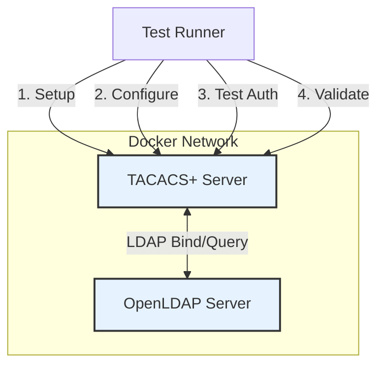

#### Test Workflow

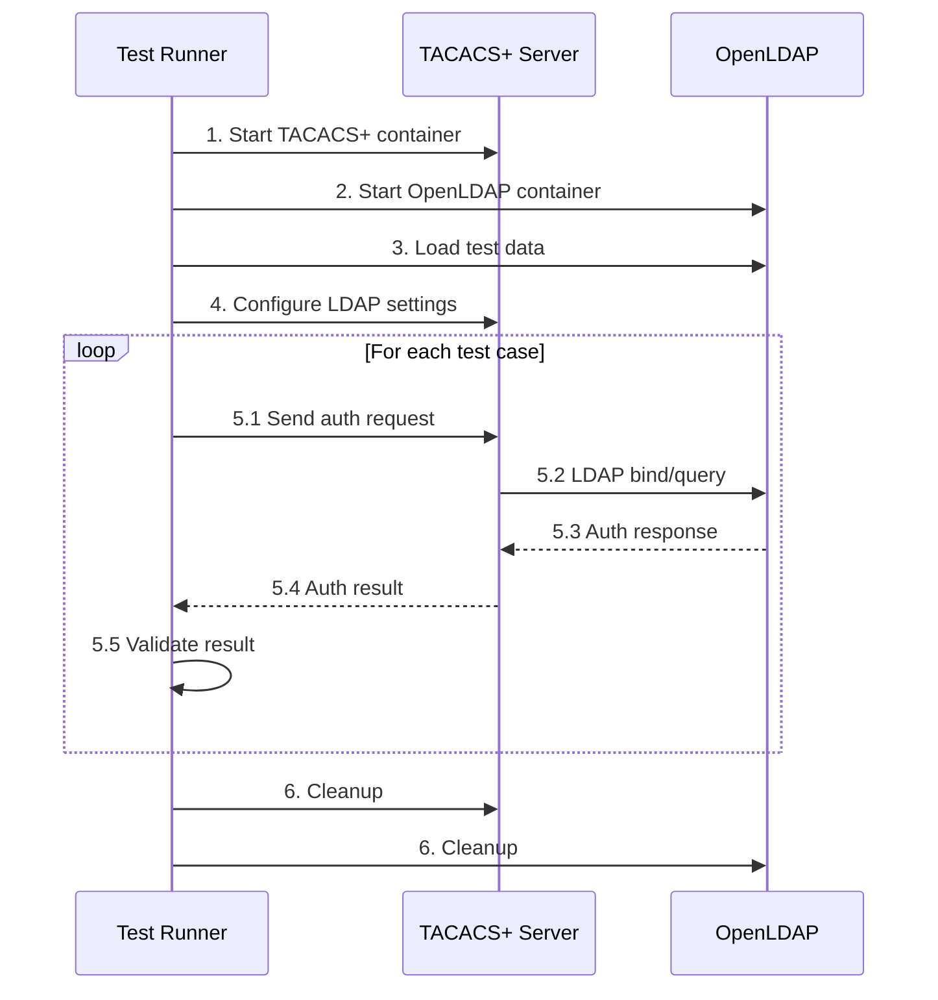

#### Test Cases
1. **Successful Authentication**
   - Verify valid credentials authenticate successfully
   - Check proper privilege level mapping from LDAP attributes
   
2. **Failed Authentication**
   - Test with invalid credentials
   - Verify proper error handling
   
3. **Group Membership**
   - Test authorization based on LDAP group membership
   - Verify privilege level mapping from LDAP groups

## Backup Backend Tests

### FTP/SFTP Backup

#### Test Purpose
Verify that the TACACS+ server can create and manage backups on an FTP/SFTP server.

#### Test Components
- **TACACS+ Server**: Configured with backup API
- **FTP Server**: vsftpd container for testing
- **Test Runner**: Manages test execution and validation

#### Test Architecture

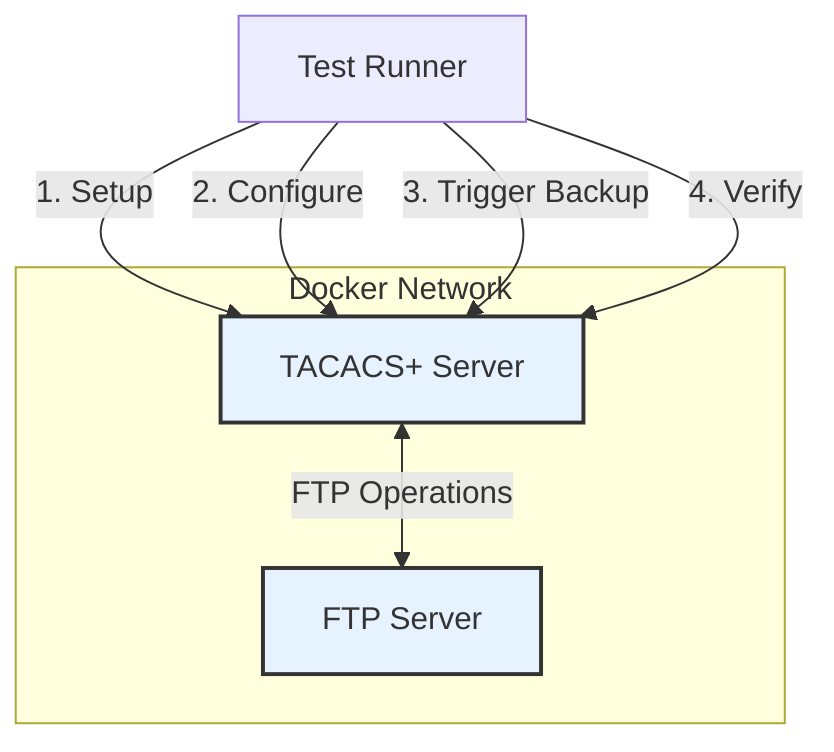

#### Test Workflow

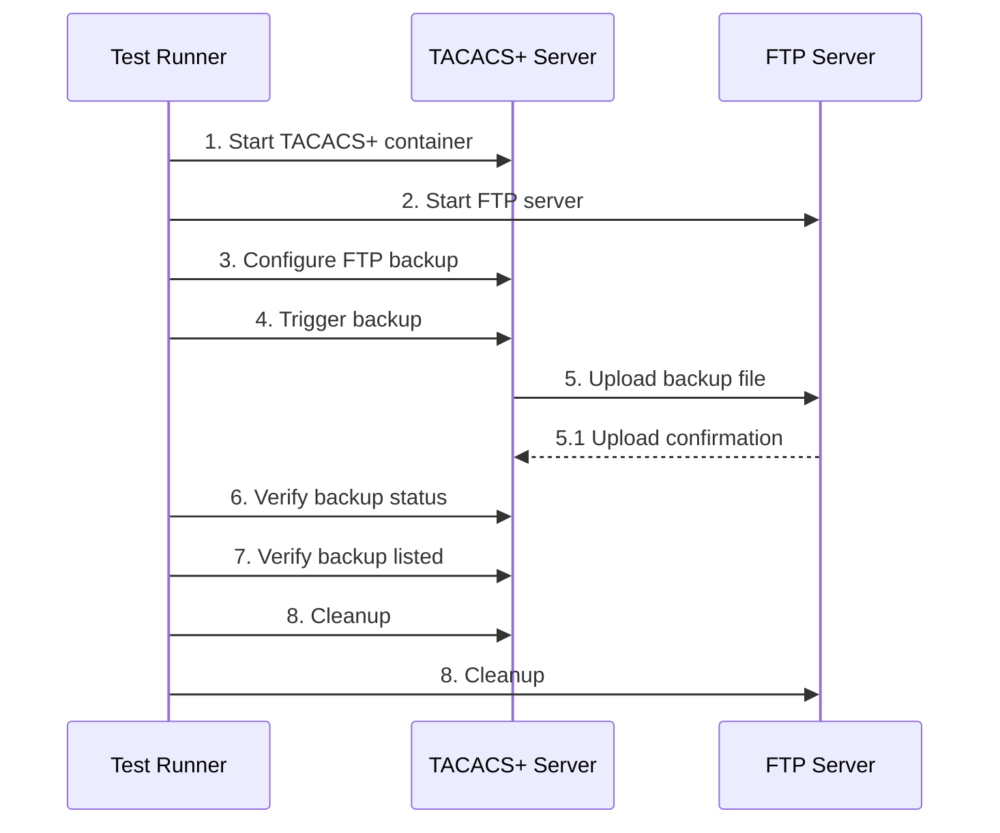

#### Test Cases
1. **Backup Creation**
   - Verify backup file is created on FTP server
   - Check backup file integrity
   
2. **Backup Retrieval**
   - Verify backup can be listed and retrieved
   - Check backup metadata
   
3. **Error Handling**
   - Test with invalid FTP credentials
   - Verify proper error handling for FTP operations

## Running Tests

### Prerequisites
- Docker and Docker Compose
- Python 3.10+
- Poetry for dependency management

Install dependencies with Poetry (uses the active venv):
```bash
pip install poetry
poetry config virtualenvs.create false
poetry install
```

Note: E2E tests are skipped by default. Add `--e2e` to include them.

### Running Tests

#### Run All E2E Tests
```bash
poetry run pytest tests/e2e/ -v --e2e
```

#### Run Specific Test Type
```bash
# LDAP Authentication
poetry run pytest tests/e2e/auth_backends/ldap/ -v --e2e

# FTP Backup
poetry run pytest tests/e2e/backup_backends/ftp/ -v --e2e

# Azure Backup
poetry run pytest tests/e2e/backup_backends/azure/ -v --e2e
```

## Troubleshooting

### Common Issues

#### LDAP Authentication
- **Connection Issues**: Verify LDAP server is running and accessible
- **Authentication Failures**: Check LDAP bind credentials and user attributes

#### FTP Backup
- **Connection Timeouts**: Verify FTP server is accessible
- **Permission Issues**: Check FTP user permissions

### Debugging

#### View Container Logs
```bash
docker logs <container_name>
```

#### Run with Verbose Output
```bash
poetry run pytest -vvs tests/e2e/ --e2e
```

#### Keep Containers After Test
```bash
KEEP_CONTAINERS=true poetry run pytest tests/e2e/ --e2e
```

## Overview

End-to-end tests verify the complete functionality of the TACACS+ server across different backends and scenarios. Each test type has its own architecture, components, and validation procedures.

## Authentication Backend Tests

### LDAP Authentication

#### LDAP Architecture

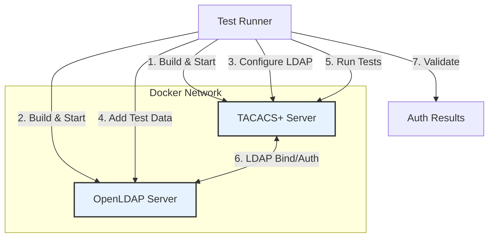

**Key Components:**
- **OpenLDAP Server**: Pre-configured with test users and groups
- **TACACS+ Server**: Configured to use LDAP for authentication
- **Test Runner**: Manages test lifecycle and validations

#### LDAP Test Cases
- Verifies successful authentication with valid credentials
- Tests authorization based on LDAP group membership
- Validates privilege level mapping from LDAP attributes
- Tests error handling for invalid credentials
- Verifies connection pooling and performance

#### LDAP Workflow

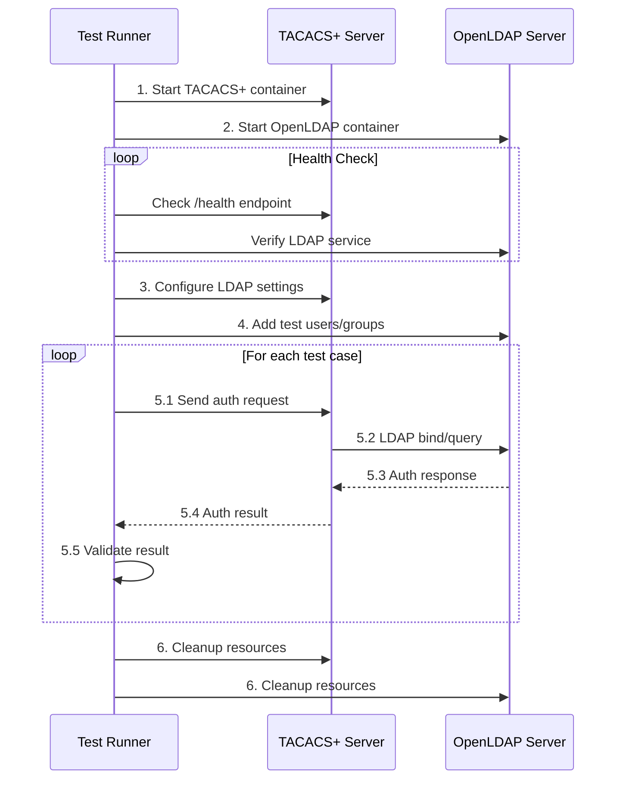

## Backup Backend Tests

### FTP/SFTP Backup

#### FTP Architecture

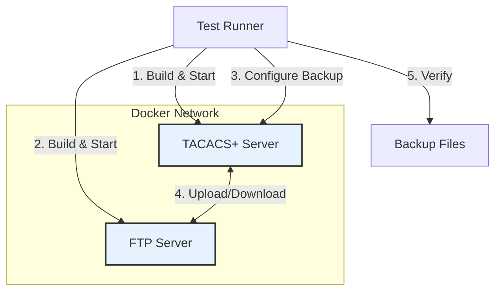

**Key Components:**
- **FTP Server**: vsftpd or similar FTP server in a container
- **TACACS+ Server**: Configured for FTP backup
- **Test Runner**: Manages test execution and validation

#### FTP Test Cases
- Verifies file upload to FTP server
- Validates backup file integrity
- Tests backup listing and retrieval
- Verifies error handling for FTP operations
- Tests cleanup of old backups

#### FTP Workflow

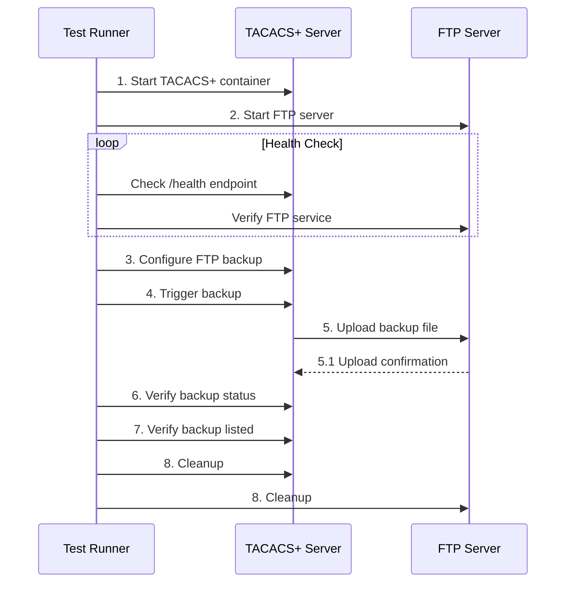

### Azure Blob Storage

#### Azure Architecture

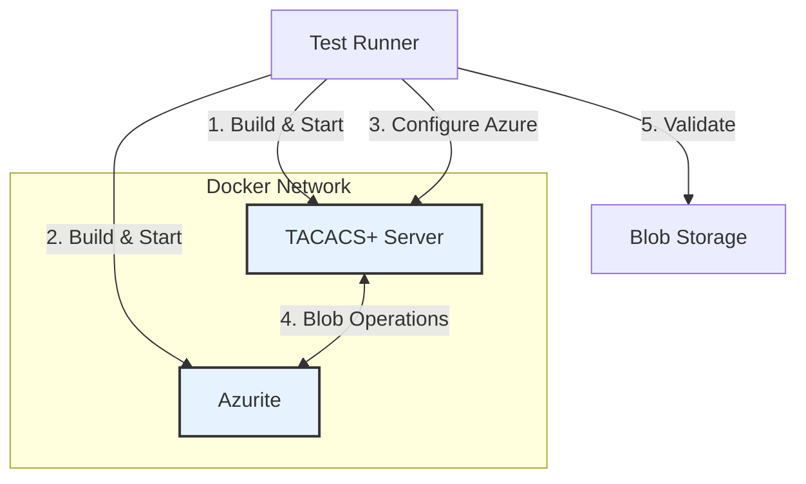

**Key Components:**
- **Azurite**: Azure Storage emulator
- **TACACS+ Server**: Configured for Azure Blob Storage
- **Test Runner**: Manages test execution and validation

#### Azure Test Cases
- Tests container creation and management
- Verifies blob upload and download
- Validates backup metadata and listing
- Tests Azure-specific configurations
- Verifies error handling for storage operations

#### Azure Workflow

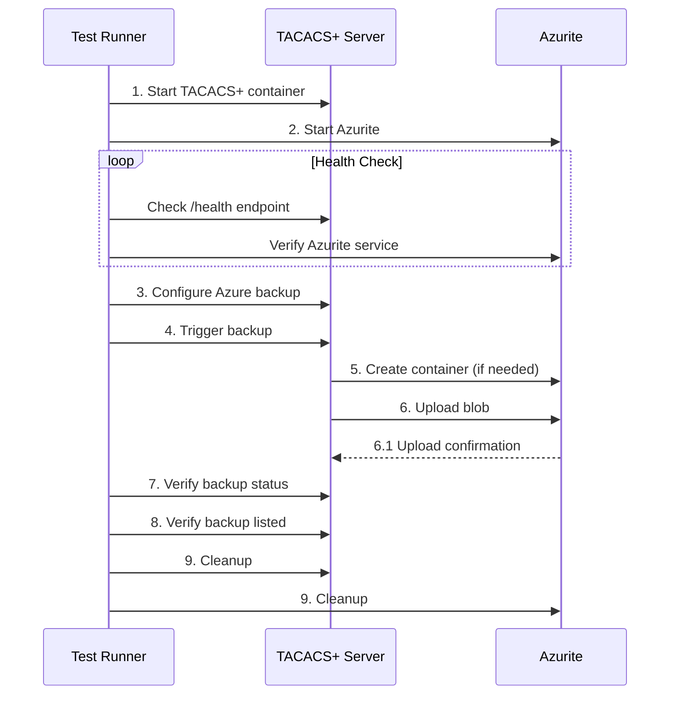

#### Azurite Quickstart (Manual Mock)

Run the Azure Blob mock locally for manual testing:

```bash
cd tests/e2e/backup_backends/azure
docker compose up --build
# or
./run_azurite.sh
```

Connection details for Azurite:

- Account Name: `devstoreaccount1`
- Account Key:
  `Eby8vdM02xNOcqFlqUwJPLlmEtlCDXJ1OUzFT50uSRZ6IFsuFq2UVErCz4I6tq/\
K1SZFPTOtr/KBHBeksoGMGw==`

Example connection strings:

```text
# From host to docker-compose (Blob on localhost:10000)
DefaultEndpointsProtocol=http;AccountName=devstoreaccount1;\
AccountKey=Eby8vdM02xNOcqFlqUwJPLlmEtlCDXJ1OUzFT50uSRZ6IFsuFq2UVErCz4I6tq/\
K1SZFPTOtr/KBHBeksoGMGw==;BlobEndpoint=http://127.0.0.1:10000/devstoreaccount1

# From another container on same Docker network (replace <container> with service name)
DefaultEndpointsProtocol=http;AccountName=devstoreaccount1;\
AccountKey=Eby8vdM02xNOcqFlqUwJPLlmEtlCDXJ1OUzFT50uSRZ6IFsuFq2UVErCz4I6tq/\
K1SZFPTOtr/KBHBeksoGMGw==;BlobEndpoint=http://<container>:10000/devstoreaccount1
```

Notes:
- The E2E test configures `container_name = backups` by default; the API creates it if absent.
- Authentication is enforced via the shared key in the connection string, matching Azure’s SDK behavior.

## Test Architecture

### Backup Functionality Tests

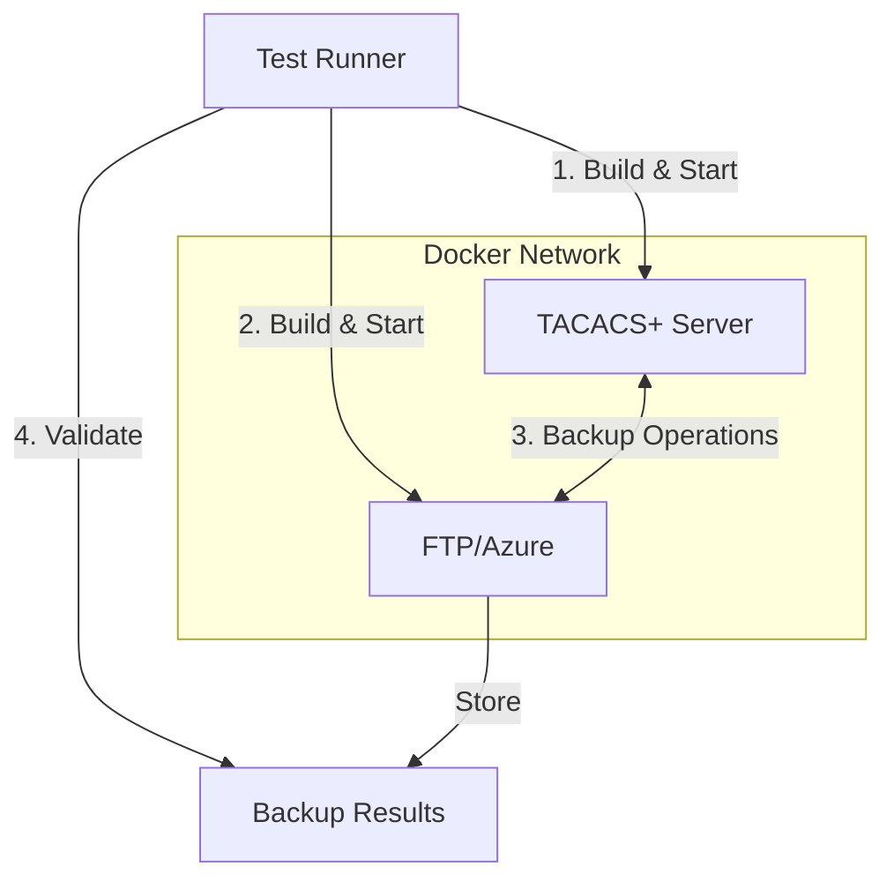

### LDAP Authentication Tests


Key Components for LDAP Tests:
- **OpenLDAP Server**: Pre-configured with test users and groups
- **TACACS+ Server**: Configured to use LDAP for authentication
- **Test Runner**: Manages test lifecycle and validations

## Test Components

### Common Components

#### 1. Test Runner
- Written in Python using pytest
- Manages the test lifecycle
- Handles Docker container orchestration
- Performs assertions and validations
- Generates test reports and logs

#### 2. TACACS+ Server
- Main application under test
- Runs in a Docker container
- Can be configured with different backends
- Exposes admin API for test control
- Logs all operations for debugging

### Backend-Specific Components

#### LDAP Components
- **OpenLDAP Server**: LDAP v3 compliant server
  - Pre-loaded with test users and groups
  - Configured with test organizational structure
  - Supports secure LDAP (LDAPS)
- **Test Data**:
  - Sample users with different privilege levels
  - Test groups for authorization
  - Custom schemas if needed

#### FTP Components
- **vsftpd Server**: Lightweight FTP server
  - Configured for passive mode
  - Supports both FTP and FTPS
  - Pre-configured test user accounts
- **Test Data**:
  - Sample backup files
  - Directory structure for organization
  - Permission test cases

#### Azure Components
- **Azurite**: Azure Storage Emulator
  - Implements Blob, Queue, and Table storage
  - Supports connection strings and SAS tokens
  - Runs in a container for test isolation
- **Test Data**:
  - Sample containers
  - Test blobs with different sizes
  - Metadata for validation

## Test Workflows

### Backup Functionality Workflow

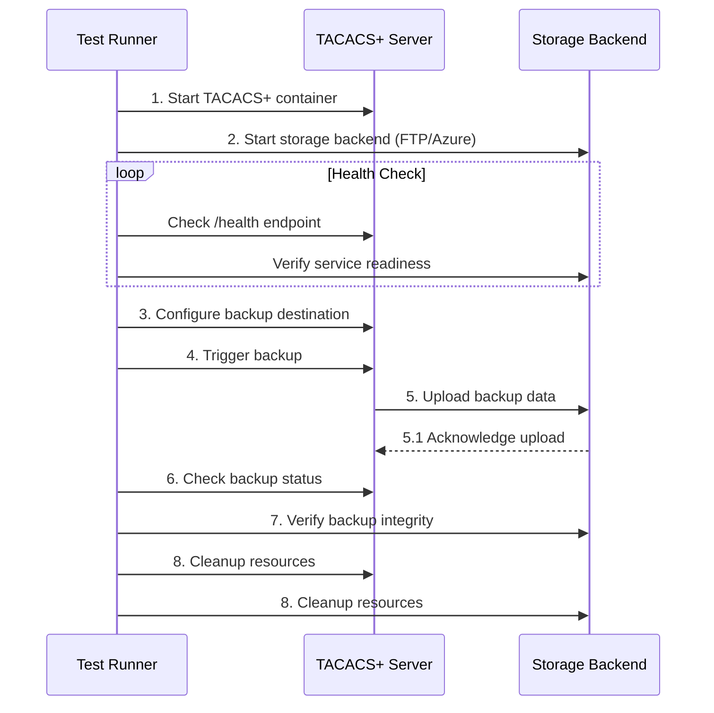

### LDAP Authentication Workflow


## Test Cases

### Backup Functionality Tests

#### FTP Backup Test (`test_ftp_backup_e2e.py`)
- Verifies file upload to FTP server
- Validates backup file integrity
- Tests backup listing and retrieval
- Verifies error handling for FTP operations

#### Azure Blob Storage Test (`test_azure_backup_e2e.py`)
- Tests Azure Blob Storage integration
- Validates container creation and blob upload
- Verifies backup metadata and listing
- Tests Azure-specific configurations

### Authentication Backend Tests

#### LDAP Authentication Test (`test_ldap_e2e.py`)
- Verifies LDAP authentication flow
- Tests user authentication against OpenLDAP server
- Validates group membership and authorization
- Tests LDAP configuration options
- Verifies error handling for invalid credentials
- Tests TACACS+ privilege level mapping from LDAP groups

## Running Tests

### Prerequisites
- Docker and Docker Compose
- Python 3.8+
- Required Python packages: `pytest`, `requests`, `pytest-xdist` (for parallel test execution)

### Environment Variables

| Variable | Description | Default |
|----------|-------------|---------|
| `TEST_DEBUG` | Enable debug output | `false` |
| `KEEP_CONTAINERS` | Don't remove containers after test | `false` |
| `PARALLEL_TESTS` | Number of parallel test workers | `2` |

### Running Tests

#### Run All Tests
```bash
# Run all E2E tests with parallel execution
poetry run pytest tests/e2e/ -v -n auto --e2e
```

#### LDAP Authentication Tests
```bash
# Run all LDAP authentication tests
pytest tests/e2e/auth_backends/ldap/ -v

# Run specific LDAP test with debug output
TEST_DEBUG=true poetry run pytest tests/e2e/auth_backends/ldap/test_ldap_e2e.py -v --e2e
```

#### FTP Backup Tests
```bash
# Run all FTP backup tests
poetry run pytest tests/e2e/backup_backends/ftp/ -v --e2e

# Run specific FTP test with container logs
KEEP_CONTAINERS=true poetry run pytest tests/e2e/backup_backends/ftp/test_ftp_backup_e2e.py -v --e2e
```

#### Azure Backup Tests
```bash
# Run all Azure backup tests
poetry run pytest tests/e2e/backup_backends/azure/ -v --e2e

# Run specific Azure test with debug output
TEST_DEBUG=true poetry run pytest tests/e2e/backup_backends/azure/test_azure_backup_e2e.py -v --e2e
```

## Troubleshooting

### Common Issues by Backend
#### LDAP Authentication Issues
- **Connection Refused**: Verify OpenLDAP container is running and ports are exposed
- **Bind Failed**: Check LDAP credentials and base DN in test configuration
- **User Not Found**: Verify test users are properly imported in LDAP
- **TLS Handshake Failed**: Ensure LDAPS certificates are properly configured

#### FTP Backup Issues
- **Connection Timeout**: Check FTP server is accessible from TACACS+ container
- **Permission Denied**: Verify FTP user permissions and directory ownership
- **Passive Mode Failure**: Ensure passive ports are properly configured and forwarded
- **File Corruption**: Verify checksum validation in test cases

#### Azure Backup Issues
- **Container Creation Failed**: Check Azure storage account permissions
- **Blob Upload Failed**: Verify connection string and container name
- **SAS Token Expired**: Regenerate tokens if tests run for extended periods
- **Azurite Not Responding**: Restart Azurite container and check logs

### Debugging Techniques

#### Enable Verbose Logging
```bash
# Set debug environment variable
export TEST_DEBUG=true

# Run tests with increased verbosity
poetry run pytest -vvs tests/e2e/ --e2e
```

#### Inspect Containers
```bash
# List running containers
docker ps

# View container logs
docker logs <container_id> --tail 100 -f

# Execute shell in container
docker exec -it <container_id> /bin/bash
```

#### Network Diagnostics
```bash
# Check container network
docker network inspect <network_name>

# Test connectivity between containers
docker exec <container1> ping <container2>

# Check exposed ports
docker port <container_id>
```

### Performance Considerations

1. **Resource Limits**:
   - Set appropriate memory and CPU limits for containers
   - Monitor resource usage during tests

2. **Parallel Execution**:
   - Use `pytest-xdist` for parallel test execution
   - Balance between parallel workers and system resources

3. **Test Data**:
   - Keep test data size reasonable
   - Clean up after tests to prevent disk space issues

### Adding New Tests

1. **Test Structure**:
   - Place new test files in the appropriate backend directory
   - Follow the existing test patterns and naming conventions
   - Include comprehensive docstrings and comments

2. **Test Data**:
   - Provide sample data for testing
   - Document any required setup or configuration

3. **Documentation**:
   - Update this guide with new test information
   - Add any new troubleshooting steps
   - Document any additional dependencies
