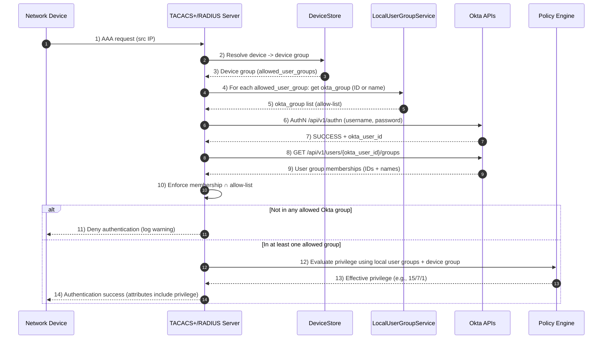

# Okta Authentication Backend

This document describes the Okta backend integration, configuration, behavior, caching, and metrics.

## Overview

The Okta backend authenticates users via Okta and optionally derives a TACACS+/RADIUS privilege level from Okta group membership.

Supported flow
- Authentication API (AuthN) using `/api/v1/authn`.

Group membership
- Uses the Okta Management API to query `/api/v1/users/{sub}/groups` if `api_token` is provided.

## Configuration

Add `okta` to the `[auth]` backends list and configure the `[okta]` section. See `docs/CONFIGURATION.md` for all options. Key settings:

```ini
[auth]
backends = local, okta

[okta]
org_url = https://company.okta.com
api_token = ${OKTA_API_TOKEN}      # required for group lookups
verify_tls = true

# Optional: require membership in an allowed Okta group (from device group allow‑list)
require_group_for_auth = false

# Timeouts and pooling
connect_timeout = 3
read_timeout = 10
pool_maxsize = 50
max_retries = 2
backoff_factor = 0.3

# Caching
group_cache_ttl = 1800
group_cache_fail_ttl = 60

# Flow flags
authn_enabled = true

# Circuit breaker
circuit_failures = 5
circuit_cooldown = 30
```

## Self-Test

Use the helper script to verify your Okta setup quickly. It supports two modes:

- Direct mode (no server config): calls AuthN directly and, if provided, the Groups API.
- Config mode (server-backed): loads your `tacacs.conf`, instantiates the Okta backend, and runs auth using your exact settings and group mapping.

Direct mode
- Credentials via env only: `OKTA_API_TOKEN` for group lookups (optional).
- Flags: `--org`, `--api-token`, `--insecure` to disable TLS verification (testing only).

Examples
- python scripts/okta_selftest.py --org https://dev-12345.okta.com --username alice
- OKTA_API_TOKEN=ssws-... \
  python scripts/okta_selftest.py --org https://dev-12345.okta.com --api-token ssws-... \
  --username alice --insecure

Config mode
- Uses `[okta]` from your config to ensure parity with the server.

Example
- python scripts/okta_selftest.py --config config/tacacs.conf --username alice

Output
- SUCCESS prints `okta_user_id` and safe attributes like `privilege`.
- If `require_group_for_auth=true`, ensure you provided a valid `api_token` and the user is listed in a device group’s `allowed_user_groups` with a matching `okta_group`.

MFA in Self-Test (Direct Mode)
- OTP: append your 6-digit code to the password, e.g. `Secr3t!123456`.
- Push: append the push keyword to the end of the password.
  - Accepted suffixes: ` push`, `+push`, `:push`, `/push`, `.push`, `-push`, `#push`, `@push`, or just `push`.
  - Example: `Secr3t! push` or `Secr3t!+push` or `Secr3t!push`.
- Tunables via env:
  - `OKTA_TEST_OTP_DIGITS` (default 6)
  - `OKTA_TEST_PUSH_KEYWORD` (default `push`)
  - `OKTA_TEST_MFA_TIMEOUT` (default 25), `OKTA_TEST_MFA_POLL` (default 2.0)
 - You can add `--require-mfa` to fail if an OTP/push suffix was provided but Okta did not return `MFA_REQUIRED` (indicates a policy not enforcing MFA for that transaction).

Why a push may not appear
- The AuthN API only initiates factor verification when Okta returns `MFA_REQUIRED`.
- If your Okta Sign-On policy returns `SUCCESS` for the transaction, the password is accepted without step-up and no push is sent — even if you appended `push`.
- To enforce push/OTP, adjust Okta policies so MFA is required for this context (e.g., for this user/group, network zone, or API auth).

## Device-Scoped Okta Group Enforcement

When a user authenticates via TACACS+ or RADIUS, the server restricts access based on the requesting device’s group and the Okta groups associated with the local user groups that are allowed on that device group.

- Device group resolution
  - TACACS+: uses the incoming connection’s resolved device record (by source IP) and its assigned device group.
  - RADIUS: matches the client by source IP/network and uses that client’s group and its configured `allowed_user_groups`.

- Allowed user groups → Okta groups
  - Each local user group can be linked to an Okta group via `okta_group` (Okta group ID or name).
  - For the matched device group, the server collects all `okta_group` values from its `allowed_user_groups` and passes them as the allow‑list to the Okta backend.

- Okta backend behavior
  - Authenticates the user via AuthN (`/api/v1/authn`) and retrieves `okta_user_id`.
  - Fetches the user’s Okta groups from `/api/v1/users/{okta_user_id}/groups`.
  - Enforces membership: the user must be in at least one of the allowed Okta groups (by ID or name). If not, authentication is denied and a warning is logged.
  - If group membership passes, authorization proceeds. Privilege is resolved later via your local user groups and policy engine.

Mermaid sequence diagram



Notes
- The allow‑list denial is not cached to avoid cross‑device interference.
- `okta_group` on local user groups may be an Okta group ID or the group name. The backend matches either.
- Privilege is determined by the Policy Engine from local user groups and device group context; Okta is not used to assign privilege.
- To further scope commands post‑login, use the Policy Engine rules (min/max privilege, user/device groups).

## MFA With AuthN (Password Suffix)

Some network devices only support a single password prompt. You can still use MFA with the AuthN API by encoding the second factor into the password value:

- OTP suffix: append your TOTP code to the end of the password.
  - Example: if the real password is `Secr3t!` and the current code is `123456`, enter `Secr3t!123456`.
- Push trigger: append a space and the word `push` to the password to initiate an Okta Verify push.
  - Example: `Secr3t! push`

Configuration
- In `[okta]` set:
  - `mfa_enabled = true`
  - `mfa_otp_digits = 6` (default)
  - `mfa_push_keyword = push` (default)
  - Optional: `mfa_timeout_seconds` and `mfa_poll_interval` to tune push waiting.

Flow
1) Server posts `/api/v1/authn` with the base password (after removing the suffix/keyword).
2) If Okta returns `MFA_REQUIRED` and you provided an OTP, the server verifies the TOTP factor.
3) If you provided `push`, the server initiates a push on the Okta Verify factor and polls until success or timeout.
4) On success, normal group evaluation and device-scoped allow‑list enforcement continues in the AAA layer (see below).

Caveats
- Do not log passwords; the implementation redacts secrets and never stores OTPs.
- Requires users to have an appropriate factor enrolled (TOTP for OTP; Okta Verify push for push).
- If MFA is required but the password did not include an OTP or `push`, authentication fails (no interactive prompt is possible over PAP/CHAP).


## Behavior

- Auth cache is keyed by HMAC(username, password) with a server-side key (`AUTH_CACHE_HMAC_KEY`). Passwords are never stored; only boolean results and safe attributes are cached.
- Group names are normalized to lowercase before matching, and mappings are case-insensitive.
- Device-scoped policies are enforced centrally in the TACACS+ AAA layer:
  - OktaAuthBackend is responsible only for validating credentials and caching group memberships.
  - AAAHandlers maps device group `allowed_user_groups` → local user groups → `okta_group` and evaluates intersection with the user's Okta groups (from the backend) on every auth.
  - This design avoids pushing per-device policy into the backend and keeps the Okta auth cache free of device context.
- 429 handling:
  - AuthN endpoint: backoff on 429 by opening the circuit breaker for a short cooldown.
  - Groups endpoint: respects `Retry-After` by increasing the short negative-cache TTL to reduce thundering herds.
- Circuit breaker: after `circuit_failures` consecutive failures, authentication is short-circuited for `circuit_cooldown` seconds; resets after cooldown.
- `close()` gracefully releases HTTP sockets; called during application shutdown.

## Required Okta permissions

- Authentication: AuthN API requires no OAuth application configuration.
- Group lookups: The API token must have privileges to read user groups (`okta.groups.read` equivalent). Consult Okta documentation for least privilege.

## Metrics

Prometheus metrics (exposed by the monitoring endpoint):
- `okta_token_latency_seconds`: AuthN request latency (name retained for compatibility)
- `okta_group_requests_total`: group API requests
- `okta_group_latency_seconds`: group API latency
- `okta_retries_total`: count of retry-worthy responses (429/5xx)
- `okta_group_cache_hits_total`, `okta_group_cache_misses_total`
- `okta_circuit_open`: 1 when the circuit breaker is open; 0 when closed

The admin dashboard also shows a small status pill for the Okta backend (Healthy or Circuit Open) and the backend stats table includes `retries_429_total`.

## Security notes

- Do not log access tokens or passwords.
- Configure `AUTH_CACHE_HMAC_KEY` to keep auth cache keys stable across restarts.
 
