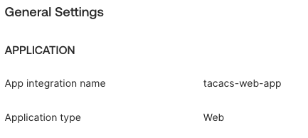
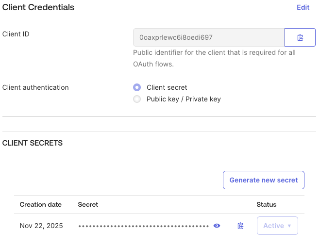
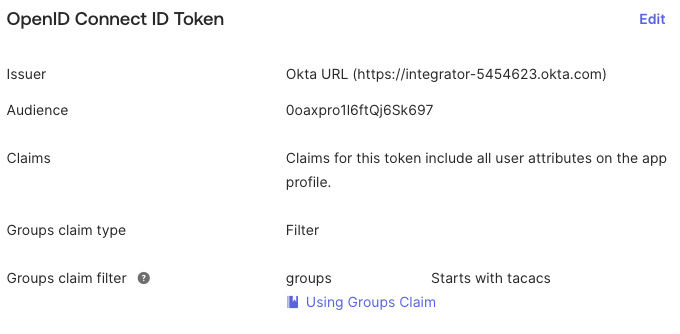
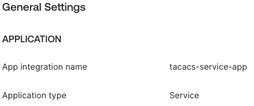
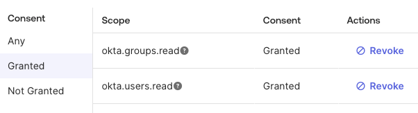

# Okta: Two-App Setup (Admin Login vs. Service API)

Use two separate Okta apps:
- **Admin Web Login App (OIDC web)**: authenticates human admins into the TACACS+ web UI and supplies group claims for RBAC.
- **Service/API App (machine-to-machine)**: lets the TACACS server call Okta (AuthN/Management APIs) to fetch users/groups (e.g., for group lookups).

Separating them keeps human auth flows and backend API access isolated, and avoids over-scoping the admin login app.

## 1) Admin Web Login App (human login)

- Type: OIDC **Web** application. Choose the auth method you use in your deployment:
  - `private_key_jwt` (recommended) or

    
  - `client_secret` (fallback).

    
- Redirect URI: `https://<your-host>/admin/login/openid-callback` (or `http://127.0.0.1:8080/admin/login/openid-callback` in dev).
- Scopes: `openid profile email groups`.
- Groups claim: On your **app** OpenID Connect ID Token (Sign-on tab), add a `Groups claim filter`:

  
  - Include in: **Access Token** (optionally ID Token / Userinfo).
  - Groups claim type: Filter.
  - Name field: "groups"  will be used later in the token.
  - Filter: Method and string match that covers your admin group (e.g., `tacacs-web-admin`).
- Assignments: Assign the app to the admin users and to the admin group (`tacacs-web-admin`).
- Issuer: Use the Okta AS base, e.g. `https://your-domain.okta.com/` (the org AS).

### TACACS config (env or tacacs.container.ini)
- Common (both options):
  ```ini
  OPENID_ISSUER_URL=https://your-domain.okta.com/oauth2/default
  OPENID_CLIENT_ID=<admin_oidc_client_id>
  OPENID_REDIRECT_URI=https://<your-host>/admin/login/openid-callback
  OPENID_SCOPES=openid profile email groups
  OPENID_ADMIN_GROUPS=tacacs-web-admin
  # Optional: enforce OpenID-only
  # ADMIN_REQUIRE_OPENID=true
  ```
- **Option A: Client secret (confidential client, default)**
  ```ini
  OPENID_CLIENT_AUTH_METHOD=client_secret
  OPENID_CLIENT_SECRET=<admin_oidc_client_secret>
  ```
- **Option B: Public client with PKCE / interaction_code (no client secret)**
  In Okta: token endpoint auth method `none`, grant types include `interaction_code` (and optionally `authorization_code`), PKCE `S256` enabled.
  
  ```ini
  OPENID_CLIENT_SECRET=
  OPENID_USE_INTERACTION_CODE=1
  OPENID_CLIENT_AUTH_METHOD=private_key_jwt
  OPENID_CLIENT_PRIVATE_KEY=<private_key>
  OPENID_CLIENT_PRIVATE_KEY_ID=<kid>
  OPENID_CODE_VERIFIER=<random_urlsafe_string>  # 32+ bytes urlsafe base64
  ```

## 2) Service/API App (Backend)

- Purpose: let the TACACS server call Okta AuthN/Management APIs to resolve users/groups.
- Type: Machine-to-machine (API Service). Choose the auth method you use in your deployment:
  - `private_key_jwt` (recommended) or

    
  - `client_secret` (fallback).

    
- Scopes (Okta Management API): grant least privilege you need, e.g. `okta.users.read`, `okta.groups.read`, and any others your workflows require.

    
- Assignments: Assign the app to the groups/users permitted to use these APIs if your org policies require it.

### TACACS config (env or tacacs.container.ini)
- Common (both options):
  ```ini
  OKTA_ORG_URL=https://your-domain.okta.com
  OKTA_CLIENT_ID=<service_app_client_id>
  OKTA_VERIFY_TLS=true
  ```
- For private_key_jwt:
  ```ini
  OKTA_AUTH_METHOD=private_key_jwt
  OKTA_PRIVATE_KEY=/app/config/okta_service_private_key.pem
  OKTA_PRIVATE_KEY_ID=<kid_from_okta>
  ```
- For client_secret (fallback):
  ```ini
  OKTA_AUTH_METHOD=client_secret
  OKTA_CLIENT_SECRET=<service_app_client_secret>
  ```

- Ensure the service app has the Management API scopes needed for group lookups.

## Why two apps?
-	Principle of least privilege:
  The admin login app only needs end-user authentication and group claims.
  The backend (machine-to-machine) app should never carry interactive login scopes or Management API rights.
-	Separation of concerns:
  Human login (OIDC + browser + MFA) and backend access (service credentials + headless password-only flow) require completely different security policies, token types, and authentication paths.
-	Different MFA requirements:
  The web admin app enforces full MFA for human users, while the TACACS+/backend app must explicitly disable MFA to allow password-only, headless authentication for devices and automated services. Mixing both in one app is impossible in Okta Identity Engine.
-	Operational safety:
  Rotating or testing one application (e.g., PKCE/OIDC login for admins) does not affect the backend service app, its policies, or its machine credentials.
