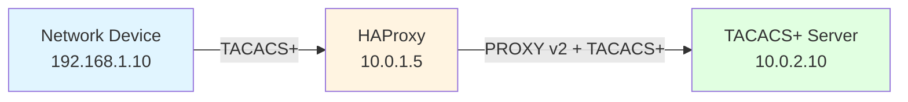
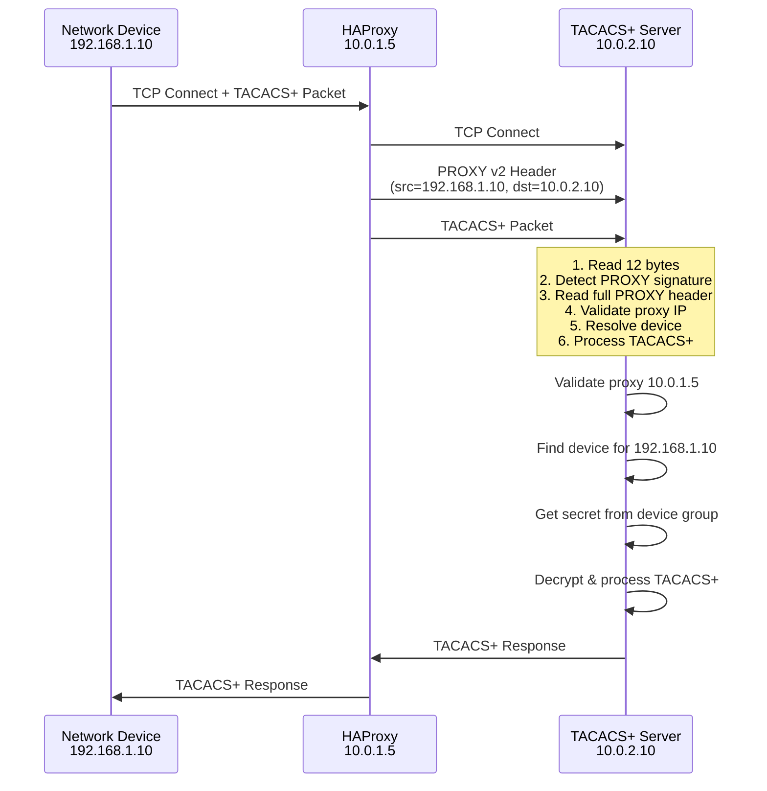
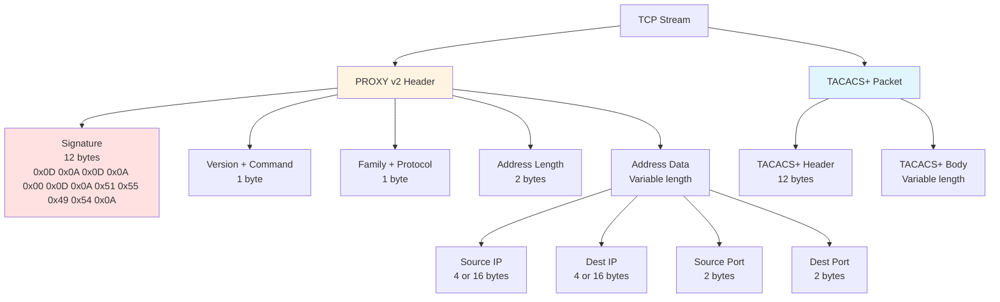
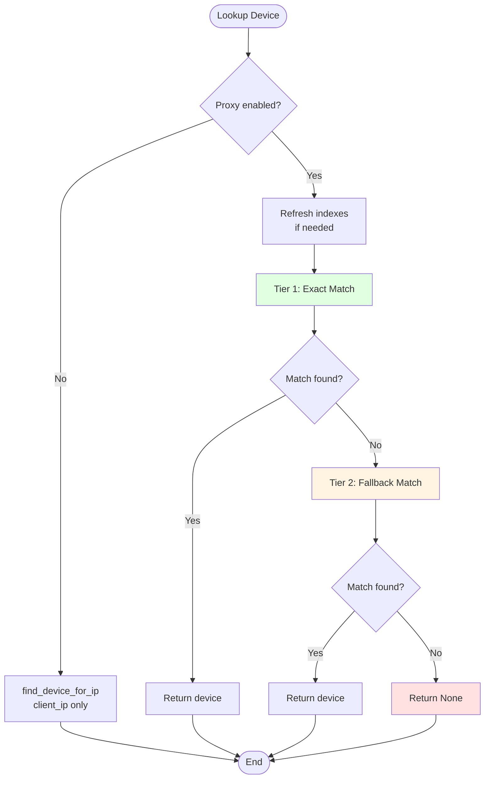
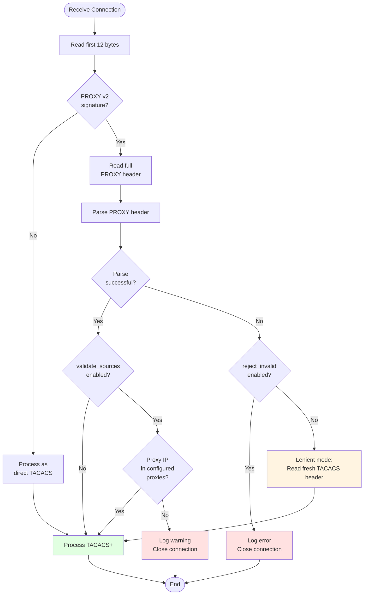

# HAProxy PROXY Protocol v2 Support

## Overview

The TACACS+ server supports the HAProxy PROXY protocol v2, which allows the server to receive client connection information (source IP, destination IP, ports) when connections are proxied through a load balancer or reverse proxy.

This is essential for:
- **Accurate client identification**: The server sees the real client IP, not the proxy's IP
- **Device-based authentication**: Matching clients to device records based on their actual IP
- **Audit logging**: Recording the true source of authentication requests
- **Access control**: Applying IP-based rules to the actual client

### Network Topology



Without PROXY protocol, the server would only see connections from 10.0.1.5 (the proxy). With PROXY protocol, the server receives the real client IP (192.168.1.10) in the PROXY header.

## Configuration

### Enable PROXY Protocol

Add the following sections to your `tacacs.conf`:

```ini
[server]
# Enable proxy-aware device matching
proxy_enabled = true

[proxy_protocol]
# Enable PROXY protocol v2 header parsing
enabled = true

# Accept PROXY protocol headers on incoming connections
accept_proxy_protocol = true

# Validate that proxy IPs match configured proxies
validate_sources = true

# Reject connections with invalid PROXY headers (strict mode)
# Set to false for lenient mode (ignore invalid headers)
reject_invalid = true
```

### Configure Proxies

Proxies must be registered in the device database:

```python
from tacacs_server.devices.store import DeviceStore

store = DeviceStore("data/devices.db")

# Register a proxy by its IP network
store.create_proxy(
    name="haproxy-01",
    network="10.0.1.5/32",  # Proxy's IP address
    description="Primary HAProxy instance"
)
```

### Configure Device Groups with Proxy Networks

Device groups can specify which proxy networks are allowed:

```python
store.ensure_group(
    name="datacenter-devices",
    description="Devices in datacenter behind HAProxy",
    metadata={"tacacs_secret": "shared-secret"},
    proxy_network="10.0.1.0/24"  # Allowed proxy network
)

# Add devices that will connect through the proxy
store.ensure_device(
    name="switch-01",
    network="192.168.1.10/32",  # Client's actual IP
    group="datacenter-devices"
)
```

## How It Works

### Connection Flow Diagram



### Packet Structure



### Detailed Connection Flow

1. **Client connects through proxy**
   ```
   Client (192.168.1.10) → HAProxy (10.0.1.5) → TACACS+ Server (10.0.2.10)
   ```

2. **Proxy sends PROXY v2 header**
   - HAProxy prepends a PROXY protocol v2 header to the connection
   - Header contains: `src=192.168.1.10, dst=10.0.2.10, src_port=45678, dst_port=49`

3. **Server processes header**
   - Server reads first 12 bytes
   - Detects PROXY v2 signature: `\r\n\r\n\x00\r\nQUIT\n`
   - Reads remaining header bytes (16-byte fixed header + address data)
   - Parses header to extract client IP and proxy IP

4. **Proxy validation** (if `validate_sources = true`)
   - Server checks if proxy IP (10.0.1.5) matches a configured proxy
   - Rejects connection if proxy is unknown

5. **Device resolution**
   - Server looks up device using client IP (192.168.1.10) and proxy IP (10.0.1.5)
   - Matches device to group with matching `proxy_network`
   - Retrieves TACACS secret from device group

6. **TACACS+ processing**
   - Server reads TACACS+ packet (after PROXY header)
   - Decrypts using device group's secret
   - Processes authentication/authorization request
   - Logs show client IP (192.168.1.10), not proxy IP

### Code Flow in `server.py`

#### 1. PROXY Header Detection (`_handle_client` method, lines 404-530)

```python
# Read first 12 bytes
first12 = self._recv_exact(client_socket, 12)
buffered_bytes = first12 or b""

# Check for PROXY v2 signature
if (self.proxy_enabled and 
    self.accept_proxy_protocol and
    first12 and
    first12.startswith(ProxyProtocolV2Parser.SIGNATURE)):
    
    # Read rest of PROXY header
    next4 = self._recv_exact(client_socket, 4)
    buffered_bytes += next4
    hdr16 = first12 + next4
    
    # Read address data
    addr_len = int.from_bytes(hdr16[14:16], "big")
    rest = self._recv_exact(client_socket, addr_len)
    buffered_bytes += rest
    
    # Parse PROXY header
    raw_header = hdr16 + rest
    info, consumed = ProxyProtocolV2Parser.parse(raw_header)
    
    # Extract client and proxy IPs
    if info and info.is_proxied:
        client_ip = info.src_addr  # Real client IP
        proxy_ip = address[0]      # Proxy's IP
```

#### 2. Proxy Validation (lines 579-600)

```python
if (self.proxy_enabled and 
    self.proxy_validate_sources and
    proxy_ip is not None):
    
    allowed = self._proxy_ip_allowed(proxy_ip)
    if not allowed:
        conn_logger.warning(
            "Rejecting proxied connection: proxy %s not in configured networks",
            proxy_ip
        )
        self._safe_close_socket(client_socket)
        return
```

#### 3. Device Resolution (lines 607-619)

```python
if self.device_store:
    if self.proxy_enabled and proxy_ip is not None:
        # Proxy-aware device lookup
        connection_device = self.device_store.find_device_for_identity(
            client_ip,  # Real client IP from PROXY header
            proxy_ip    # Proxy IP from connection
        )
    else:
        # Direct connection
        connection_device = self.device_store.find_device_for_ip(client_ip)
```

#### 4. Secret Selection (lines 813-832)

```python
def _select_session_secret(self, session_id: int, device_record) -> str:
    secret = self.session_secrets.get(session_id)
    if secret is None:
        # Resolve secret from device group
        secret = self._resolve_tacacs_secret(device_record) or self.secret_key
        self.session_secrets[session_id] = secret
    return str(secret)

def _resolve_tacacs_secret(self, device_record) -> str | None:
    if not device_record:
        return None
    group = getattr(device_record, "group", None)
    if not group:
        return None
    # Get secret from group metadata
    return str(getattr(group, "tacacs_secret", None))
```

### Device Store Proxy-Aware Lookup

The `DeviceStore.find_device_for_identity()` method implements a two-tier matching algorithm:



#### Tier 1: Exact Match
- Client IP must be in device's network
- Proxy IP must be in device group's proxy_network
- **Example**: Device `192.168.1.10/32` in group with `proxy_network=10.0.1.0/24`
  - Matches when: `client_ip=192.168.1.10` AND `proxy_ip=10.0.1.5`

#### Tier 2: Fallback Match
- Client IP must be in device's network
- Device group's proxy_network is NULL (accepts any proxy)
- **Example**: Device `192.168.1.10/32` in group with `proxy_network=NULL`
  - Matches when: `client_ip=192.168.1.10` (any proxy)

#### Longest-Prefix Match
Within each tier, devices with longer network prefixes are preferred.
- `/32` (single host) beats `/24` (subnet)
- `/24` beats `/16`

```python
def find_device_for_identity(
    self, client_ip: str, proxy_ip: str | None
) -> DeviceRecord | None:
    # Build indexes of (client_network, proxy_network, device_id)
    proxy_idx = []  # Tier 1: exact proxy matches
    fallback_idx = []  # Tier 2: NULL proxy_network
    
    for device in devices:
        if device.group.proxy_network:
            # Tier 1: requires proxy match
            proxy_idx.append((
                device.network,
                device.group.proxy_network,
                device.id
            ))
        else:
            # Tier 2: accepts any proxy
            fallback_idx.append((device.network, device.id))
    
    # Sort by prefix length (longest first)
    proxy_idx.sort(key=lambda t: t[0].prefixlen, reverse=True)
    fallback_idx.sort(key=lambda t: t[0].prefixlen, reverse=True)
    
    # Try Tier 1 first
    for client_net, proxy_net, dev_id in proxy_idx:
        if client_ip in client_net and proxy_ip in proxy_net:
            return devices[dev_id]
    
    # Fall back to Tier 2
    for client_net, dev_id in fallback_idx:
        if client_ip in client_net:
            return devices[dev_id]
    
    return None
```

### Index Refresh Mechanism

The device store maintains in-memory indexes for fast lookups. These indexes are automatically refreshed:

1. **On modification**: When devices/groups are modified through the same `DeviceStore` instance
2. **Time-based**: Every 0.5 seconds to detect external database changes (e.g., from tests or other processes)

```python
def _ensure_indexes_current(self) -> None:
    need_refresh = self._index_built_version < self._index_version
    
    # Also refresh if enough time has passed
    time_since_refresh = time.time() - self._last_refresh_time
    if not need_refresh and time_since_refresh > 0.5:
        need_refresh = True
    
    if need_refresh:
        self.refresh_indexes()
```

## Error Handling

### Error Handling Flow



### Invalid PROXY Headers

When `reject_invalid = false` (lenient mode):
- Server attempts to parse PROXY header
- If parsing fails, **discards invalid PROXY bytes** and reads fresh TACACS header from socket
- Continues processing as a direct connection
- **Use case**: Testing environments, gradual rollout

When `reject_invalid = true` (strict mode):
- Server rejects connections with invalid PROXY headers
- Logs error and closes connection
- **Use case**: Production environments with strict security requirements

### Unknown Proxies

When `validate_sources = true`:
- Server checks if proxy IP matches configured proxies
- Rejects connection if proxy is unknown
- Logs warning with proxy IP
- **Use case**: Production environments with known proxy infrastructure

When `validate_sources = false`:
- Server accepts PROXY headers from any source
- Useful for testing or trusted network environments
- **Use case**: Development, testing, or fully trusted networks

### Fallback Behavior

```python
try:
    # Attempt PROXY parsing
    info, consumed = ProxyProtocolV2Parser.parse(raw_header)
    client_ip = info.src_addr
    proxy_ip = address[0]
except Exception as e:
    if self.proxy_reject_invalid and self.proxy_validate_sources:
        # Strict mode: reject
        conn_logger.error("Rejecting connection: PROXY parse error")
        self._safe_close_socket(client_socket)
        return
    else:
        # Lenient mode: fall back to direct connection
        conn_logger.debug("Lenient mode: ignoring invalid PROXY header")
        first_header_data = buffered_bytes[:12]  # Use as TACACS header
        proxy_ip = None
```

## Statistics

The server tracks PROXY protocol statistics:

```python
self.stats = {
    "connections_proxied": 0,      # Connections with valid PROXY headers
    "connections_direct": 0,        # Direct connections (no PROXY header)
    "proxy_headers_parsed": 0,      # Successfully parsed PROXY headers
    "proxy_header_errors": 0,       # Failed PROXY header parsing
    "proxy_rejected_unknown": 0,    # Rejected due to unknown proxy
}
```

Access via monitoring API:
```bash
curl http://localhost:8080/api/stats
```

## Testing

### Unit Tests

```python
def test_proxy_v2_detect_and_authenticates_through_proxy():
    # Create proxy and device
    store.create_proxy("test-proxy", "127.0.0.1/32")
    store.ensure_group("proxied", proxy_network="127.0.0.1/32")
    store.ensure_device("client", network="10.1.2.3/32", group="proxied")
    
    # Build PROXY v2 header
    proxy_hdr = build_proxy_v2("10.1.2.3", "127.0.0.1", 55555, 49)
    
    # Send PROXY header + TACACS packet
    sock.sendall(proxy_hdr + tacacs_packet)
    
    # Verify authentication succeeds
    response = sock.recv(12)
    assert len(response) == 12
```

### Integration Testing

```bash
# Start server with PROXY protocol enabled
python -m tacacs_server.main --config tacacs.conf

# Configure HAProxy
backend tacacs_servers
    mode tcp
    option tcp-check
    server tacacs1 10.0.2.10:49 check send-proxy-v2

# Test connection
tactest -s 10.0.1.5 -k secret -u testuser -p testpass
```

## Security Considerations

1. **Proxy Validation**: Always enable `validate_sources = true` in production
2. **Proxy Registration**: Only register trusted proxy IPs
3. **Network Segmentation**: Proxies should be on a separate, trusted network
4. **Strict Mode**: Use `reject_invalid = true` to prevent header spoofing
5. **Audit Logging**: Monitor `proxy_rejected_unknown` statistics

## Logging Guide

The server provides comprehensive logging at different levels to help troubleshoot PROXY protocol issues in production.

### Log Levels

#### INFO Level
Production-ready logs for normal operations:
- `proxy_v2_accepted`: Successfully parsed PROXY header with client details
  ```json
  {"event": "proxy_v2_accepted", "client_ip": "10.0.1.5", "src": "192.168.1.10", "dst": "10.0.2.10", "consumed": 28}
  ```

#### DEBUG Level  
Detailed troubleshooting information (enable with `log_level = DEBUG`):
- `PROXY v2 signature detected from X.X.X.X`: PROXY header signature found
- `PROXY header: read=N bytes, parser consumed=M, addr_len=K`: Header parsing details
- `Using proxied identity: client_ip=X, proxy_ip=Y`: Extracted client/proxy IPs
- `Validating proxy IP X against configured proxies`: Proxy validation started
- `Proxy IP X validated successfully`: Proxy validation passed
- `Resolving device for proxied connection: client_ip=X, proxy_ip=Y`: Device lookup started
- `Device resolved: NAME (group: GROUP)`: Device found
- `No device found for client_ip=X`: Device not found
- `Lenient mode: ignoring invalid PROXY v2 header`: Fallback to direct connection

#### WARNING Level
Potential issues that don't stop processing:
- `Failed to resolve device for X: error`: Device lookup failed
- `Rate limit exceeded for X`: Too many requests from client

#### ERROR Level
Critical failures that reject connections:
- `Rejecting connection: invalid PROXY v2 header from X`: Strict mode rejection
- `Rejecting connection due to PROXY v2 parse error from X: error`: Parse exception in strict mode
- `Rejecting proxied connection from X: proxy IP Y not in any configured proxy network`: Unknown proxy
- `PROXY header size mismatch: read=N, consumed=M`: Parser consumed wrong number of bytes

### Example Log Sequences

#### Successful Proxied Connection
```
DEBUG: PROXY v2 signature detected from 10.0.1.5
DEBUG: PROXY header: read=28 bytes, parser consumed=28, addr_len=12
INFO: {"event": "proxy_v2_accepted", "client_ip": "10.0.1.5", "src": "192.168.1.10", "dst": "10.0.2.10", "consumed": 28}
DEBUG: Using proxied identity: client_ip=192.168.1.10, proxy_ip=10.0.1.5
DEBUG: Validating proxy IP 10.0.1.5 against configured proxies
DEBUG: Proxy IP 10.0.1.5 validated successfully
DEBUG: Resolving device for proxied connection: client_ip=192.168.1.10, proxy_ip=10.0.1.5
DEBUG: Device resolved: switch-01 (group: datacenter)
```

#### Unknown Proxy Rejected
```
DEBUG: PROXY v2 signature detected from 10.0.99.99
DEBUG: PROXY header: read=28 bytes, parser consumed=28, addr_len=12
INFO: {"event": "proxy_v2_accepted", "client_ip": "10.0.99.99", "src": "192.168.1.10", "dst": "10.0.2.10", "consumed": 28}
DEBUG: Using proxied identity: client_ip=192.168.1.10, proxy_ip=10.0.99.99
DEBUG: Validating proxy IP 10.0.99.99 against configured proxies
ERROR: Rejecting proxied connection from 10.0.99.99: proxy IP 10.0.99.99 not in any configured proxy network
```

#### Invalid PROXY Header (Lenient Mode)
```
DEBUG: PROXY v2 signature detected from 10.0.1.5
DEBUG: PROXY header: read=16 bytes, parser consumed=0, addr_len=0
DEBUG: Invalid/unsupported PROXY v2 header from 10.0.1.5 (len=16), treating as direct connection
DEBUG: Lenient mode: ignoring invalid PROXY v2 header from 10.0.1.5; proceeding as direct
DEBUG: No device found for client_ip=10.0.1.5
```

#### Invalid PROXY Header (Strict Mode)
```
DEBUG: PROXY v2 signature detected from 10.0.1.5
DEBUG: PROXY header: read=16 bytes, parser consumed=0, addr_len=0
DEBUG: Invalid/unsupported PROXY v2 header from 10.0.1.5 (len=16), treating as direct connection
ERROR: Rejecting connection: invalid PROXY v2 header from 10.0.1.5
```

### Monitoring Metrics

The server exposes Prometheus metrics for PROXY protocol monitoring:

```
# Successful PROXY header parses
tacacs_proxy_headers_parsed_total

# Failed PROXY header parses  
tacacs_proxy_header_errors_total

# Rejected unknown proxies
tacacs_proxy_rejected_unknown_total

# Connections by type
tacacs_connections_proxied_total
tacacs_connections_direct_total
```

Query examples:
```promql
# Rate of PROXY header errors
rate(tacacs_proxy_header_errors_total[5m])

# Percentage of proxied connections
tacacs_connections_proxied_total / (tacacs_connections_proxied_total + tacacs_connections_direct_total) * 100

# Unknown proxy rejections
increase(tacacs_proxy_rejected_unknown_total[1h])
```

## Troubleshooting

### Connection Rejected

**Symptom**: Client connections fail with "Rejecting proxied connection"

**Cause**: Proxy IP not in configured proxies

**Solution**:
```python
# Check configured proxies
proxies = store.list_proxies()
for p in proxies:
    print(f"{p.name}: {p.network}")

# Add missing proxy
store.create_proxy("missing-proxy", "10.0.1.5/32")
```

### Device Not Found

**Symptom**: Authentication fails with "Device not found" or uses default secret

**Cause**: Device not matched due to proxy network mismatch

**Solution**:
```python
# Check device group proxy_network
group = store.get_group_by_name("mygroup")
print(f"Proxy network: {group.proxy_network}")

# Update group to accept proxy
store.ensure_group(
    "mygroup",
    proxy_network="10.0.1.0/24"  # Match your proxy network
)
```

### Invalid PROXY Header

**Symptom**: Connections fail with "PROXY v2 parse error"

**Cause**: Malformed PROXY header from proxy

**Solution**:
1. Check proxy configuration (send-proxy-v2)
2. Enable lenient mode: `reject_invalid = false`
3. Check server logs for detailed error

### Performance Issues

**Symptom**: Slow device lookups

**Cause**: Index refresh on every lookup

**Solution**: Indexes auto-refresh every 0.5s. For better performance:
- Reduce number of devices
- Use more specific network prefixes
- Monitor `find_device_for_identity` timing

## References

- [HAProxy PROXY Protocol Specification](https://www.haproxy.org/download/1.8/doc/proxy-protocol.txt)
- [PROXY Protocol v2 Binary Format](https://www.haproxy.org/download/1.8/doc/proxy-protocol.txt#L107)
- RFC 1918: Address Allocation for Private Internets
- TACACS+ Protocol Specification (draft-ietf-opsawg-tacacs)
