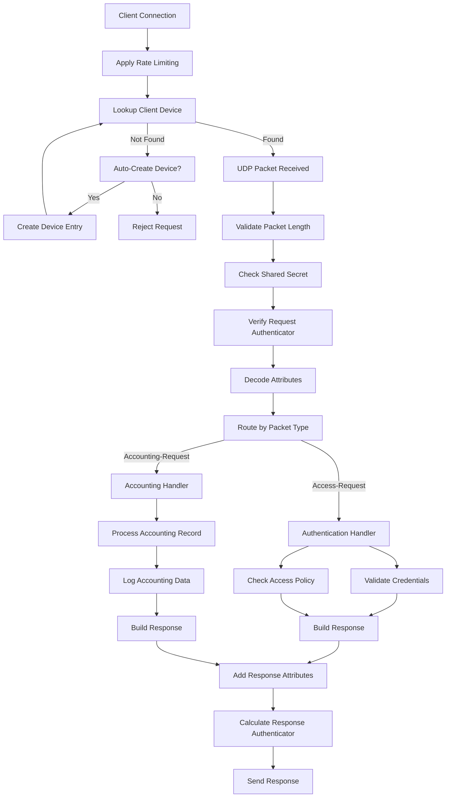

# RADIUS Packet Flow

## Packet Flow Details

### 1. Connection Handling (server.py:200-300)
- Listens on UDP ports 1812 (authentication) and 1813 (accounting)
- Applies per-IP rate limiting to prevent abuse (using token bucket algorithm)
- Looks up device configuration by source IP address (UDP source IP, no PROXY protocol support)
- Handles auto-creation of device entries for unknown clients when enabled
- Validates packet length and structure (minimum 20 bytes for RADIUS header)
- Verifies client IP against configured RADIUS clients
- Validates shared secret for message integrity (per device group)

### 2. Request Processing (server.py:300-500)
- Parses RADIUS packet header (code, identifier, length, authenticator)
- Validates Request Authenticator for Accounting-Request (RFC 2866)
- Decodes attributes based on their types
- Handles message integrity checks (Message-Authenticator)

### 3. Authentication Flow (Access-Request)
- Extracts username and password
- Supports multiple authentication methods:
  - PAP (Password Authentication Protocol)
  - CHAP (Challenge-Handshake Authentication Protocol)
  - MS-CHAPv1/v2 (Microsoft extensions)
- Validates credentials against authentication backends
- Applies access policies and authorization rules

### 4. Accounting Flow (Accounting-Request)
- Processes accounting records with status types:
  - START: Session initiation
  - INTERIM-UPDATE: Periodic updates
  - STOP: Session termination
  - ACCOUNTING-ON/OFF: NAS status changes
- Logs accounting data to configured backends
- Tracks session duration and resource usage

### 5. Response Generation
- Builds appropriate response packet:
  - Access-Accept: Authentication successful
  - Access-Reject: Authentication failed
  - Access-Challenge: Additional authentication required
  - Accounting-Response: Acknowledgment
- Includes requested service attributes
- Calculates Response Authenticator

## Security Features
- **Message Integrity**: Verified through Request Authenticator and Message-Authenticator (RFC 3579)
- **Shared Secrets**: Managed at the device group level
- **Rate Limiting**:
  - Token bucket algorithm for request rate limiting
  - Configurable via `rate_limit_requests` and `rate_limit_window`
  - Per-source-IP enforcement
  - Automatic cleanup of expired rate limit entries
- **Device Management**:
  - Auto-creation with configurable default groups
  - Per-device shared secrets
  - IP-based access control
- **Authentication Methods**:
  - PAP (Password Authentication Protocol)
  - CHAP (Challenge-Handshake Authentication Protocol)
  - MS-CHAPv1/v2 (Microsoft extensions)
- **No PROXY Protocol**: Unlike TACACS+, RADIUS does not support PROXY protocol (UDP limitation)

## Error Handling
- Invalid packet rejection
- Malformed attribute detection
- Timeout handling
- Comprehensive logging
- Graceful degradation

## Performance Considerations
- Stateless UDP protocol
- Connectionless operation
- Minimal per-packet processing
- Efficient attribute encoding
- Thread-safe operations

## RADIUS-Specific Details
- Uses MD5 for message authentication (as per RFC 2865)
- Supports vendor-specific attributes (VSAs)
- Handles packet fragmentation
- Compatible with RADIUS accounting (RFC 2866)

## Device Management
- **Device Lookup**: Client devices are looked up by IP address from the device store
- **Auto-Creation**: Unknown devices can be automatically registered with configurable defaults
  - Enabled via `auto_register` setting (default: true)
  - Uses `default_device_group` for new devices (default: "default")
  - Generates device names in format `auto-<IP>` (e.g., `auto-192.168.1.1`)
- **Device Groups**: Devices can be grouped for easier management and policy application
- **Shared Configuration**: Common settings like RADIUS secrets can be defined at the group level

## Integration with TACACS+
- Shares authentication backends with TACACS+ server
- Unified device and user management through the device store
- Common policy framework for access control
- Consolidated logging and monitoring across protocols
- Shared rate limiting infrastructure for consistent security policies
