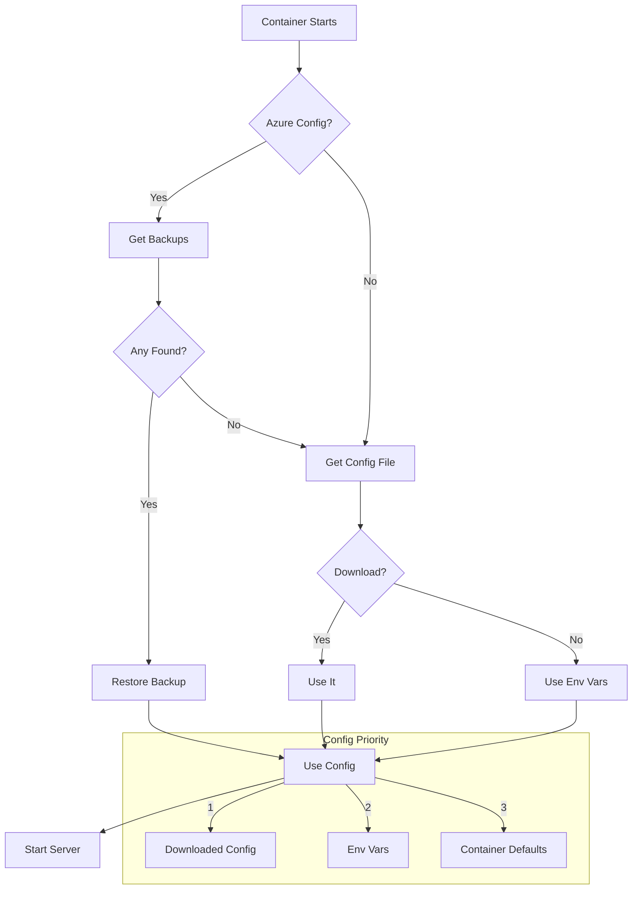

# Container Startup with Azure Storage - Quick Start

## What Changed?

The container now automatically handles:
- ✅ Backup restoration from Azure Storage on startup
- ✅ Configuration file download from Azure Storage
- ✅ Fallback to environment variables and defaults
- ✅ Smart config file selection

## Quick Setup

### 1. Minimal Setup (No Azure)

Works exactly as before - just start the container:

```bash
docker run -p 49:49 -p 8080:8080 tacacs-server:latest
```

### 2. With Azure Backup/Config (Recommended)

Set environment variables for Azure Storage:

```bash
docker run \
  -e AZURE_STORAGE_ACCOUNT=mystorageaccount \
  -e AZURE_ACCOUNT_KEY=your-key \
  -e AZURE_STORAGE_CONTAINER=tacacs-backups \
  -p 49:49 -p 8080:8080 \
  tacacs-server:latest
```

On startup, the container will:
1. Try to restore from latest backup
2. If no backup, try to download config file
3. If neither exist, use defaults

### 3. Docker Compose

```yaml
version: '3.8'

services:
  tacacs:
    image: tacacs-server:latest
    ports:
      - "49:49"
      - "8080:8080"
    environment:
      # Azure credentials
      AZURE_STORAGE_ACCOUNT: mystorageaccount
      AZURE_ACCOUNT_KEY: ${AZURE_KEY}
      AZURE_STORAGE_CONTAINER: tacacs-backups
      
      # Server config
      ADMIN_USERNAME: admin
      ADMIN_PASSWORD: ${ADMIN_PASS}
    volumes:
      - tacacs-data:/app/data
      - tacacs-logs:/app/logs

volumes:
  tacacs-data:
  tacacs-logs:
```

## Environment Variables

### Required for Azure Integration

```bash
AZURE_STORAGE_ACCOUNT=mystorageaccount
AZURE_STORAGE_CONTAINER=tacacs-backups
```

### Authentication (choose ONE)

```bash
# Option 1: Account Key
AZURE_ACCOUNT_KEY=your-key

# Option 2: SAS Token
AZURE_SAS_TOKEN=?sv=2021...

# Option 3: Connection String
AZURE_CONNECTION_STRING=DefaultEndpoints...

# Option 4: Managed Identity (Azure only)
AZURE_USE_MANAGED_IDENTITY=true
```

## Startup Behavior



## Testing

### Test Without Orchestration

```bash
docker run tacacs-server tacacs-server --skip-startup-orchestration
```

### Check Startup Logs

```bash
docker logs tacacs-container 2>&1 | grep -A 20 "Container Startup"
```

You should see:
```
============================================================
TACACS+ Server Container Startup
============================================================

Azure storage environment variables detected
Connecting to Azure storage to check for backups...
```

## Common Scenarios

### First Startup (No Backup)
```
No backups found in Azure storage
Attempting config download from Azure...
No config file in Azure storage or download failed
Using container default config: /app/config/tacacs.container.ini
```
✅ **Normal** - Server starts with defaults

### Restored from Backup
```
Found latest backup: backup-20241113.tar.gz
Downloading backup from Azure...
✓ Backup restored successfully from Azure storage
Using config: /app/config/tacacs.container.ini
```
✅ **Perfect** - All data restored

### Config Downloaded
```
No backups found in Azure storage
✓ Config file downloaded from Azure storage
Using config: /app/config/tacacs.azure.ini
```
✅ **Good** - Using cloud config

## Troubleshooting

### Azure Connection Fails
```
Failed to restore from Azure backup: AuthenticationError
```
➡️ Check credentials and permissions

### No Azure Variables
```
Missing Azure env vars: AZURE_STORAGE_ACCOUNT
Azure storage not configured, skipping cloud recovery
```
➡️ This is normal if not using Azure

### Libraries Missing
```
azure-storage-blob not installed, skipping Azure backup restore
```
➡️ Rebuild image with Azure dependencies

## Migration Guide

### From Old Container
1. No changes needed if not using Azure
2. To enable Azure: Just add env vars
3. Old command line args still work

### Adding Azure to Existing Deployment

**Step 1:** Create Azure storage
```bash
az storage container create \
  --name tacacs-backups \
  --account-name mystorageaccount
```

**Step 2:** Create manual backup first (optional)
```bash
# Via web UI: Backup → Create Backup
# Or upload existing backup to Azure
```

**Step 3:** Update deployment with env vars
```yaml
environment:
  AZURE_STORAGE_ACCOUNT: mystorageaccount
  AZURE_ACCOUNT_KEY: your-key
  AZURE_STORAGE_CONTAINER: tacacs-backups
```

**Step 4:** Restart container
```bash
docker-compose restart tacacs
```

## Security Tips

1. ✅ Use **managed identity** in Azure
2. ✅ Store keys in **secrets** (not plain env vars)
3. ✅ Use **SAS tokens** with minimal permissions
4. ✅ Enable Azure Storage **private endpoints**
5. ✅ Rotate credentials regularly

## Further Reading

- Full docs: `docs/CONTAINER_STARTUP.md`
- Azure backup: `docs/BACKUP.md`
- Configuration: `docs/CONFIGURATION.md`
