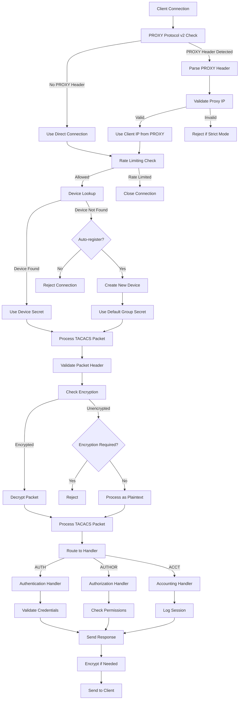

# TACACS+ Packet Flow



## Packet Flow Details

### 1. Connection Handling (server.py:450-650)
- Accepts new TCP connections
- Handles PROXY Protocol v2 header if enabled
  - Only PROXY Protocol v2 is supported (v1 is not supported)
  - Must be explicitly enabled in server configuration
  - Validates source IP against allowed proxy networks
- Applies rate limiting per client IP
  - Configurable limits for authentication attempts
  - Separate limits for different request types (AUTH, AUTHOR, ACCT)
- Enforces maximum connections per IP
  - Prevents connection exhaustion attacks
  - Configurable maximum concurrent connections

### 2. Device Resolution (server.py:650-800)
- Looks up device by client IP or proxy network
  - First checks direct IP match
  - Then checks proxy network ranges if enabled
- Handles auto-registration of unknown devices if enabled
  - Can assign to default device group
  - Supports custom attributes for new devices
- Resolves device group and TACACS secret
  - Secrets are stored per device group
  - Supports fallback to default group
- Validates device status and access permissions

### 3. Packet Processing (server.py:800-1000)
- Reads and validates TACACS header (12 bytes)
  - Validates version (must be 0xc for TACACS+)
  - Validates packet type (AUTH, AUTHOR, ACCT)
  - Validates sequence number
- Enforces maximum packet size limits
  - Configurable maximum packet size
  - Protects against memory exhaustion
- Handles packet encryption/decryption
  - Uses MD5 for packet encryption
  - Validates packet authentication

### 4. PROXY Protocol Support
- Only PROXY Protocol v2 is supported
- Must be explicitly enabled in configuration
- Source IP validation is enforced
- Example configuration:
  ```yaml
  tacacs:
    enable_proxy_protocol: true
    allowed_proxy_networks: ["192.168.1.0/24"]
  ```

### 5. Error Handling
- Detailed logging of protocol errors
- Graceful handling of malformed packets
- Configurable timeouts for slow clients
- Rate limiting to prevent brute force attacks

## Security Considerations
- Always use PROXY Protocol behind a trusted proxy
- Configure appropriate rate limits for your environment
- Monitor logs for suspicious activity
- Consider network-level encryption (IPsec) if TLS is not available
- Regularly rotate TACACS+ shared secrets
- Tracks session state
- Handles packet sequence numbers

### 4. Encryption Handling (server.py:800-1000)
- Validates encryption requirements
- Decrypts packet body using device/group secret
- Handles late device lookup if needed
- Enforces encryption policy

### 5. Request Routing (server.py:1000-1200)
- Routes to appropriate handler based on packet type:
  - **AUTH**: Authentication requests
  - **AUTHOR**: Authorization requests
  - **ACCT**: Accounting requests

### 6. Response Generation (server.py:1000-1200)
- Encrypts response if needed
- Updates session state
- Handles single-connect flag
- Sends response back to client

### 7. Cleanup (server.py:1200-1400)
- Tracks active connections
- Cleans up session data
- Handles connection timeouts
- Logs connection closure

## Security Features
- Per-IP rate limiting
- Configurable encryption requirements
- Strict proxy IP validation
- Session tracking and cleanup
- Secure secret handling
- Connection limits

## Error Handling
- Invalid packet rejection
- Timeout handling
- Resource cleanup
- Comprehensive logging
- Graceful degradation

## Performance Considerations
- Connection pooling
- Session caching
- Efficient memory usage
- Non-blocking I/O
- Thread-safe operations