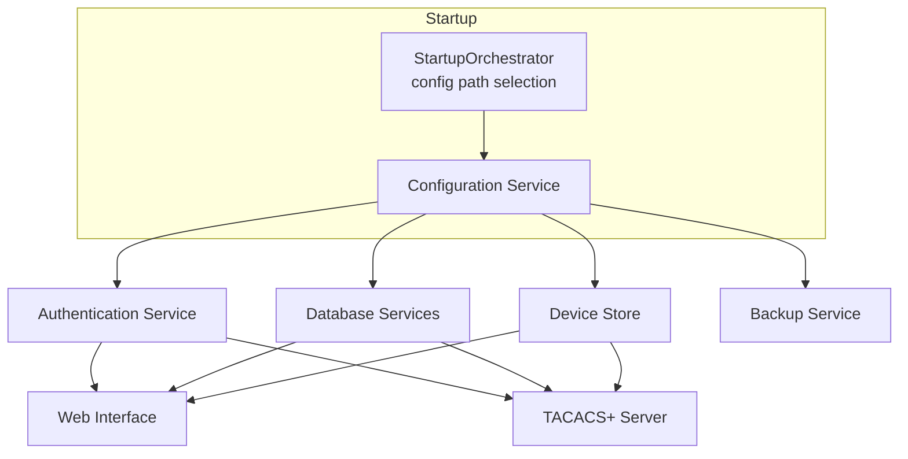

# Server Startup Process

## Container Startup Orchestration (0-5000ms)

### Phase 0: Pre-startup Recovery
- Checks for Azure Storage configuration (see `docs/CONTAINER_STARTUP.md`)
- Restores from latest backup if available (`StartupOrchestrator.restore_from_azure_backup`)
- Downloads configuration from cloud storage when no backup is restored (`StartupOrchestrator.download_config_from_azure`)
- Validates minimum required settings (`StartupOrchestrator.validate_minimum_config`)
- Determines which config file to use (`StartupOrchestrator.determine_config_path`)

### 1. Configuration Loading (0-100ms)
- Loads and validates configuration (from selected source)
- Initializes configuration store
- Sets up logging
- Validates all configuration values

### 2. Core Services (100-500ms)
- **Authentication Service**: Sets up authentication backends
- **Database Services**: Initializes SQLite connections
- **Backup Service**: Verifies backup locations
- **Device Store**: Loads devices and default device group; honors `devices.auto_register`
- **TACACS+ Server**: Binds to network ports

### 3. Web Services (500-1000ms)
- **Web Server**: Starts FastAPI application
- **API Endpoints**: Registers all routes
- **Admin Interface**: Initializes frontend assets
- **WebSocket**: Sets up real-time channels

### 4. Background Services (1000ms+)
- **Scheduler**: Starts scheduled jobs
- **Monitoring**: Begins collecting metrics
- **Housekeeping**: Starts cleanup tasks

## Service Dependencies

## Configuration Overrides

### Environment Variables
- `TACACS_CONFIG`: Path to config file
- `ADMIN_USERNAME`: Web admin username
- `ADMIN_PASSWORD_HASH`: Bcrypt hash for web admin login
- `ADMIN_PASSWORD`: Plaintext admin password (hashed at startup if `ADMIN_PASSWORD_HASH` is not set; recommended only for development)

### Command Line Arguments
- `--config`: Path to config file
- `--port`: Web server port
- `--host`: Bind address
- `--debug`: Enable debug mode

## Error Handling

### Startup Errors
- Missing configuration: Exits with error code 1
- Port in use: Tries next available port
- Permission issues: Checks and suggests fixes

### Runtime Recovery
- Automatic reconnection for databases
- Graceful degradation of features
- Fallback to safe defaults

## Performance Considerations
- Lazy loading of non-essential components
- Background initialization of heavy services
- Progressive enhancement of features
