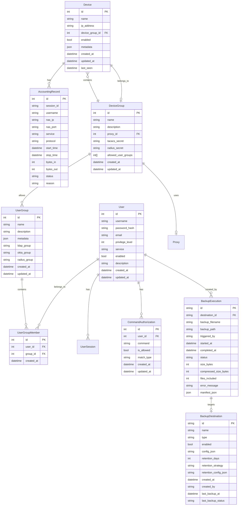

# TACACS+ Server Database Schema

## Overview

This document describes the database schema for the TACACS+ Server. The schema is designed to support user authentication, device management, command authorization, accounting, and backups.

Schemas are defined with SQLAlchemy models and maintained via Alembic migrations. On startup, each SQLite-backed store attempts to run Alembic; if migrations are unavailable, it falls back to `Base.metadata.create_all`.

## Entity Relationship Diagram



## Table Descriptions

### User Management

#### User
Stores user account information.

| Column | Type | Description |
|--------|------|-------------|
| id | Integer | Primary key |
| username | String | Unique username |
| password_hash | String | Hashed password |
| email | String | User's email address |
| privilege_level | Integer | TACACS+ privilege level (0-15) |
| service | String | Primary service profile |
| enabled | Boolean | Whether the account is enabled |
| description | String | User description |
| created_at | DateTime | When the user was created |
| updated_at | DateTime | When the user was last updated |

#### UserGroup
Groups users for easier permission management and links to external identity providers.

| Column       | Type    | Description                                       |
|--------------|---------|---------------------------------------------------|
| id           | Integer | Primary key                                       |
| name         | String  | Group name                                       |
| description  | String  | Group description                                |
| metadata     | JSON    | Arbitrary metadata (includes privilege_level)    |
| ldap_group   | String  | Linked LDAP group DN or name (optional)          |
| okta_group   | String  | Linked Okta group ID or name (optional)          |
| radius_group | String  | Linked RADIUS group name/identifier (optional)   |
| created_at   | DateTime| When the group was created                       |
| updated_at   | DateTime| When the group was last updated                  |

#### UserGroupMember
Maps users to groups.

| Column | Type | Description |
|--------|------|-------------|
| id | Integer | Primary key |
| user_id | Integer | Foreign key to User |
| group_id | Integer | Foreign key to UserGroup |
| created_at | DateTime | When the membership was created |

### Device Management

#### Device
Stores network device information.

| Column | Type | Description |
|--------|------|-------------|
| id | Integer | Primary key |
| name | String | Device name |
| ip_address | String | Device IP address or CIDR |
| device_group_id | Integer | Reference to device group |
| enabled | Boolean | Whether the device is enabled |
| metadata | JSON | Custom metadata (location, model, etc.) |
| created_at | DateTime | When the device was added |
| updated_at | DateTime | When the device was last updated |
| last_seen | DateTime | When the device was last seen |

#### DeviceGroup
Groups devices and defines authentication settings.

| Column | Type | Description |
|--------|------|-------------|
| id | Integer | Primary key |
| name | String | Group name |
| description | String | Group description |
| proxy_id | Integer | Optional proxy ID for this group |
| tacacs_secret | String | TACACS+ shared secret |
| radius_secret | String | RADIUS shared secret |
| allowed_user_groups | Integer[] | List of user group IDs with access |
| created_at | DateTime | When the group was created |
| updated_at | DateTime | When the group was last updated |

### Command Authorization

#### CommandAuthorization
Defines command-level authorization rules.

| Column | Type | Description |
|--------|------|-------------|
| id | Integer | Primary key |
| user_id | Integer | Foreign key to User |
| command | String | Command pattern to match |
| is_allowed | Boolean | Whether the command is allowed |
| match_type | String | Type of matching (exact, prefix, regex) |
| created_at | DateTime | When the rule was created |
| updated_at | DateTime | When the rule was last updated |

### Backup System

#### BackupExecution
Tracks each backup run, its status, and where the archive was stored.

| Column | Type | Description |
|--------|------|-------------|
| id | String | Execution ID (UUID) |
| destination_id | String | Foreign key to backup destination |
| backup_filename | String | Archive filename |
| backup_path | String | Remote/local path of stored archive |
| triggered_by | String | Who/what triggered the backup (e.g., manual:admin) |
| started_at | DateTime (tz) | When the backup started |
| completed_at | DateTime (tz) | When the backup completed (if any) |
| status | String | running / completed / failed |
| size_bytes | Integer | Total size of backed-up content |
| compressed_size_bytes | Integer | Size of the archive (post compression/encryption) |
| files_included | Integer | Count of files in the archive |
| error_message | Text | Failure details if status=failed |
| manifest_json | Text | JSON manifest of backup contents |

#### BackupDestination
Defines where backups are stored and retention policy.

| Column | Type | Description |
|--------|------|-------------|
| id | String | Destination ID (UUID) |
| name | String | Human-friendly name |
| type | String | Destination type (local, sftp, ftp, azure, etc.) |
| enabled | Boolean | Whether the destination is active |
| config_json | Text | JSON-serialized destination config |
| retention_days | Integer | Default retention window |
| retention_strategy | String | Strategy name (e.g., simple) |
| retention_config_json | Text | Strategy-specific config JSON |
| created_at | DateTime (tz) | When the destination was created |
| created_by | String | Actor who created the destination |
| last_backup_at | DateTime (tz) | Timestamp of last backup to this destination |
| last_backup_status | String | Status of last backup (success/failed) |

### Accounting

#### AccountingRecord
Stores TACACS+ accounting records.

| Column | Type | Description |
|--------|------|-------------|
| id | Integer | Primary key |
| session_id | String | Unique session identifier |
| username | String | Authenticated username |
| nas_ip | String | Network Access Server IP |
| nas_port | String | NAS port number |
| service | String | Service type (shell, ppp, etc.) |
| protocol | String | Protocol used |
| start_time | DateTime | When the session started |
| stop_time | DateTime | When the session ended |
| bytes_in | Integer | Bytes received |
| bytes_out | Integer | Bytes sent |
| status | String | Session status |
| reason | String | Reason for session end |

## Indexes

- `idx_user_username` - On `User(username)` for fast username lookups
- `idx_device_ip` - On `Device(ip_address)` for fast IP lookups
- `idx_session_id` - On `AccountingRecord(session_id)` for session tracking
- `idx_command_auth` - On `CommandAuthorization(user_id, command)` for auth checks

## Notes

- All tables include `created_at` timestamps for auditing
- Soft deletes are implemented using `is_active` flags where appropriate
- Foreign key constraints ensure referential integrity
- Indexes are optimized for common query patterns

## Schema Changes

When making changes to the database schema:

1. Create a new migration file
2. Update this documentation
3. Test the migration on a development database
4. Include rollback instructions in the migration

---

*Last Updated: November 1, 2025*

## Migration / Schema Changes

Schema changes are handled via Alembic. Configuration lives in `alembic.ini` (root) with migration scripts in `alembic/`. On startup, stores invoke `alembic upgrade head` against their SQLite URL; if Alembic is missing, the code falls back to `Base.metadata.create_all`.

Manual usage:

```bash
# Example for devices DB
ALEMBIC_DATABASE_URL=sqlite:///data/devices.db alembic upgrade head
# Downgrade one step
ALEMBIC_DATABASE_URL=sqlite:///data/devices.db alembic downgrade -1
```

Initial migration (`0001_device_schema_updates`) adds:
- `realm_id` (and proxy_network) to `device_groups`
- Device secrets (tacacs/radius), numeric network range columns, and a range index on `devices`
- Accounting log indexes for timestamp, username, session, and recent+timestamp
